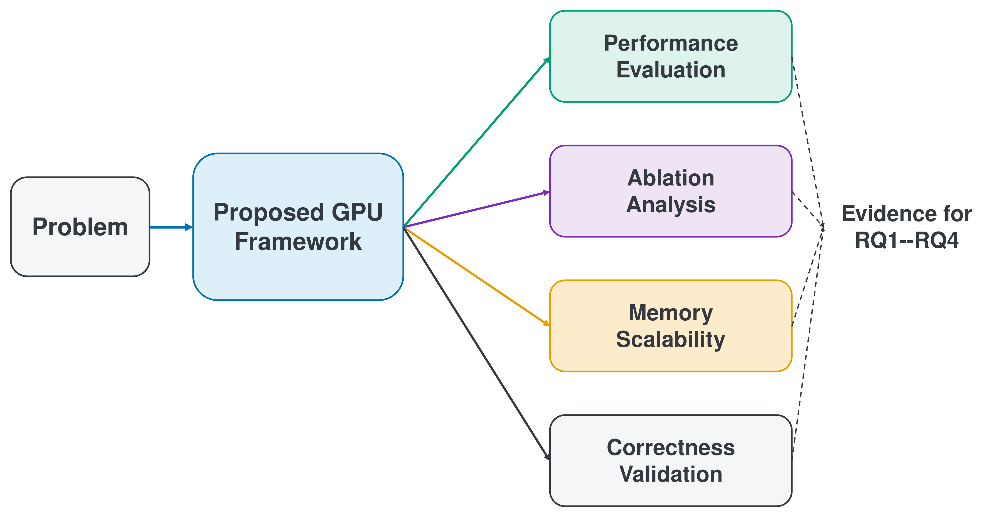

# Chapter 1 Introduction

## 1.1 Motivation

Graph analytics represents relationships among entities as vertices and edges, providing a foundation for revealing structures that are difficult to identify from individual entities alone. Identifying important vertices in a network directly supports structural understanding, vulnerability analysis, and the analysis of information or traffic flow. Betweenness Centrality (BC) is a representative metric for this purpose. BC aggregates the fraction of shortest paths between other vertex pairs on which a vertex appears internally. It can therefore assess the importance of vertices that bridge different regions of the shortest-path structure, rather than considering only their number of connections [@brandes2001].

Exact all-sources BC is computationally expensive. For an unweighted graph, the Brandes algorithm performs Breadth-First Search (BFS) from each source vertex to determine distances and shortest-path counts. It then accumulates dependencies in reverse BFS-level order and adds the contribution of that source to the BC vector. Repeating this Forward BFS and Backward Dependency Accumulation for every vertex gives the general time complexity $O(|V|(|V|+|E|))$ [@brandes2001]. Efficient execution must therefore exploit parallelism both across and within sources, rather than only accelerate the processing of one source.

GPUs provide a promising platform for accelerating this computation because they can process many sources, frontier vertices, and edges in parallel. Prior studies have demonstrated exact GPU BC by combining source-level parallelism with vertex- or edge-level parallelism within BFS and dependency accumulation [@sariyuce2013; @mclaughlin2014]. Graph workloads, however, differ from regular dense-matrix computation. Frontier size varies by source and BFS level, while the degree distribution causes workload imbalance among threads or warps. The Backward phase also depends on the depth and successor counts of the shortest-path Directed Acyclic Graph (DAG). A fixed parallelization granularity may therefore not process every phase efficiently.

Increasing source-level parallelism also exposes memory-capacity constraints. Processing multiple sources concurrently requires source-local state for each source, including distance, shortest-path count, dependency, frontier, and traversal order. The amount of state grows approximately in proportion to batch size. A large batch may increase parallelism, but it also increases initialization work and the working set, thereby placing pressure on GPU memory capacity.

The NVIDIA GH200 Grace Hopper Superchip evaluated in this study connects the Hopper GPU's HBM3 (High Bandwidth Memory 3) and the Grace CPU's LPDDR5X (Low-Power Double Data Rate 5X) memory through coherent NVLink-C2C. The evaluated configuration has a nominal maximum HBM3 capacity of 96 GB, and the CPU and GPU can use a coherent memory model [@nvidiaGh200Product; @nvidiaGraceHopperInDepth]. CUDA (Compute Unified Device Architecture) Unified Memory (UM) provides managed allocation, page migration, and prefetch so that the CPU and GPU can access the same allocation [@nvidiaCudaProgrammingGuide; @nvidiaCudaRuntimeApi]. This configuration enables investigation of batch-dependent working-set placement across finite GPU-proximate HBM3 and CPU-side memory. UM does not provide unlimited additional physical capacity, however, and movement and placement incur costs.

For these reasons, an exact BC execution framework on GH200 cannot be evaluated by runtime alone. Evaluation must jointly examine computation that exposes substantial parallelism, the feasible batch range under finite memory, and the validity of BC vectors produced through different parallel and memory paths. This thesis integrates these concerns into four evaluation perspectives: performance, optimization contributions, memory scalability, and correctness and numerical behavior.

## 1.2 Problem Statement

This thesis designs a batch-based GPU execution framework for efficient exact all-sources BC on undirected, unweighted graphs and evaluates it on one GH200. The target is unnormalized, endpoint-excluded BC with every vertex used as a source; source sampling and approximation are not used. Each source requires BFS to construct the shortest-path structure, followed by backward dependency accumulation from deeper to shallower BFS levels.

The framework must combine source-level parallelism, which exploits independence among sources, with irregular parallelism within each source. BFS frontier size depends on graph structure, source, and level. Skew in the degree distribution changes the adjacency-scan work per vertex and causes workload imbalance among threads or warps. In the Backward phase, the number of successors per vertex and the level width also determine the available parallelism. The BFS traversal direction, mapping between sources and CUDA blocks, and cooperative granularity of dependency accumulation must therefore form one coherent execution flow.

Processing multiple sources concurrently as a batch explicitly exposes source-level parallelism. Source-local state, however, grows with the source batch, creating a trade-off between batch size and GPU memory capacity. State initialization for each batch, synchronization between BFS and Backward levels, global BC accumulation, and synchronization for buffer reuse also create overhead beyond the principal computation. Increasing batch size does not necessarily reduce these relative costs because exceeding capacity or increasing contention can introduce other costs.

Discussion of capacity must distinguish the graph file from the runtime working set. This thesis did not adopt UM because the input graph file itself exceeded the nominal 96 GB HBM3 capacity. The on-disk input graph file, in-memory Compressed Sparse Row (CSR) graph storage, and final BC vector do not grow in proportion to source batch size. In contrast, distance, shortest-path count, dependency, frontier, and traversal order are source-local state and grow with the number of sources provisioned concurrently. This batch-dependent working set is the central capacity concern. Batches and sub-batches group only source vertices; they do not partition the graph. Sequentially processing every group covers all sources while preserving the graph topology and exact BC definition.

This thesis organizes the problem into the following four perspectives.

**Performance.** This perspective examines whether the principal fixed-`b512` implementation provides effective end-to-end performance on the evaluated graphs. In this thesis, PathMerge denotes the retained evaluation snapshot of a third-party implementation obtained from the upstream `gobardhanm/path-merging-bc` repository [@pathmergeRepo]. The snapshot was not confirmed as the original paper authors' official implementation, and its upstream license was not independently confirmed. The related publication, upstream repository, retained snapshot, and evaluated comparator are distinct. The evaluated snapshot is an external comparator, not ground truth. Conclusions are limited to that snapshot, environment, graph set, and tuning conditions and are not generalized to PathMerge as a whole. PathMerge receives graph-wise batch tuning, whereas GPU_Opt uses a fixed configuration. Representative values are medians, and speedup is a median-to-median comparison. This asymmetry is an explicit comparison condition.

**Optimization Contributions.** This perspective separates the observed contributions of Hybrid BFS, Warp-Cooperative Accumulation, Dual-Stream Execution, and the Block Kernel. Because initialization, computation, global accumulation, and synchronization interact, these elements are evaluated as components of a common BC execution framework. This thesis does not claim to have invented them independently. Their effects may depend on graph structure, so causal interpretations are not extended beyond the measured scope.

**Memory Scalability.** This perspective examines how device-only allocation, UM, and source sub-batching affect feasible batch size and performance when managing state that grows with the source batch. The focus is control of the resident working set, not partitioning of graph storage. Feasibility and runtime are treated separately, and a failed condition is not represented as a zero-second performance value.

**Correctness and Numerical Behavior.** Improvements in performance or capacity are insufficient for exact BC unless the complete output vector is valid. This perspective therefore validates the full BC vector rather than only its maximum value. It distinguishes comparisons with an independent reference from consistency across different batches, memory paths, or implementations. For outputs produced by different floating-point update orders, agreement under a mixed absolute-relative tolerance and byte identity are treated as separate decisions.

## 1.3 Research Questions

This thesis expresses the four perspectives from the preceding section as the following Research Questions (RQs).

**RQ1 Performance**

On the four evaluated graphs, is the block-based GPU_Opt implementation with a fixed batch size of 512 faster than the graph-wise tuned third-party PathMerge implementation?

Chapter 6: Performance Evaluation answers this question.

**RQ2 Optimization Contributions**

To what extent do Hybrid BFS, Warp-Cooperative Accumulation, Dual-Stream Execution, and the Block Kernel contribute to the observed performance?

Chapter 7: Ablation and Kernel Analysis answers this question.

**RQ3 Memory Scalability**

On the evaluated corrected 325557 graph, how do the memory-management approaches of GPU_Opt, GPU_Opt_Pure, and GPU_Opt_Pure_Chunked affect the feasible batch size and the observed memory constraints?

Chapter 8: Memory Scalability answers this question.

**RQ4 Correctness and Numerical Behavior**

To what extent do the BC vectors produced by the proposed implementations agree with an independent reference and across different memory paths, and what numerical-representation and provenance limitations remain?

Chapter 9: Correctness and Numerical Behavior answers this question.

Figure 1.1 presents the relationship among the research target, common GPU execution framework, and four evaluation dimensions. The flow proceeds from the Problem to the common framework. It then branches into Performance Evaluation, Ablation Analysis, Memory Scalability, and Correctness Validation, which provide evidence for RQ1 through RQ4. Chapters 6 through 9 report the results for these dimensions separately.

**Figure 1.1: Overview of the research questions, proposed GPU execution framework, and evaluation dimensions.**

<!-- editable source: docs/thesis/figures/editable/thesis_figure_library.pptx slide 1 (library ID F01; a separate namespace from canonical result figure F1). Typesetting assets: docs/thesis/figures/exported/figure_1_1_thesis_overview.{svg,pdf}; regenerate with scripts/export_conceptual_figures.py. -->

## 1.4 Contributions

This thesis limits its contributions to the following four items.

**Contribution 1: Integrated GPU Execution Framework.** This thesis designed and implemented a batch-based GPU execution framework for exact BC on undirected, unweighted graphs by grouping multiple sources. The common framework integrates block-based source assignment, Hybrid BFS, Warp-Cooperative Accumulation, Dual-Stream Execution, and global BC accumulation. The contribution is their integration into a coherent all-sources BC computation flow, not a claim of priority for any individual element.

**Contribution 2: Performance Evaluation against a Tuned GPU Comparator.** This thesis compared fixed-`b512` block-based GPU_Opt with third-party PathMerge using a graph-wise tuned batch size on email-EuAll and roadNet-PA/TX/CA. Based on a median-to-median comparison on one GH200, fixed-`b512` block-based GPU_Opt was 1.31×–3.17× faster than the graph-wise tuned third-party PathMerge implementation on these evaluated graphs. This statement defines the complete scope of the central performance claim.

**Contribution 3: Component-Level Analysis.** This thesis conducted a factorial ablation of Hybrid BFS (H), Warp-Cooperative Accumulation (W), and Dual-Stream Execution (A), together with a forced comparison of the Block Kernel. Within the limited evaluation scope, which included the corrected 325557 graph, Hybrid BFS and Dual-Stream Execution showed the principal observed contributions. The effect of Warp-Cooperative Accumulation was graph-dependent. Chapter 7 reports the complete values and evaluation scope.

**Contribution 4: Memory Scalability and Numerical-Boundary Analysis.** This thesis evaluates GPU_Opt, GPU_Opt_Pure, and GPU_Opt_Pure_Chunked consistently as memory-management variants of one common execution framework, not as three independent proposals. It compares the feasibility boundaries of device-only memory, UM, and source sub-batching and shows that the reachable batch range differs among the approaches. It also separates full-vector validation against an independent reference from cross-implementation consistency. The Tier A and Tier B comparisons passed within the mixed tolerance but were not byte-identical. Results from the former malformed input remain historical evidence and are separated from the current conclusion based on the corrected input.

## 1.5 Scope and Limitations

The main performance evaluation is limited to one NVIDIA GH200 and four graphs: email-EuAll and roadNet-PA/TX/CA. GPU_Opt, which uses UM, is the principal implementation for RQ1. The primary PathMerge comparator is a third-party implementation and carries the associated provenance limitations. Supplementary baselines, including Sequential, OpenMP, and cuGraph, consist primarily of small-scale legacy results. They do not constitute a fully unified seven-implementation comparison that includes the current block implementation.

Evaluations for RQ2, RQ3, and the part of RQ4 that use the corrected 325557 graph are limited to that one graph. In particular, the targeted memory-scalability conditions have small samples and do not establish a general performance ranking among the approaches. The H/W/A ablation and kernel comparison for RQ2 also apply only to their respective measured graph sets. Their observed contributions do not directly provide a causal decomposition of the RQ1 road-network results.

The correctness evidence has two tiers of different strength. Tier A provides full-vector validation against an independent Sequential CPU reference on three small graphs. Tier B provides cross-implementation consistency on the corrected 325557 graph across different batches, memory paths, and implementations, including PathMerge; it is not independent ground truth. All 13 comparisons across both tiers passed within the mixed tolerance but were not byte-identical. Mismatches and failure decisions from the former malformed input are historical evidence and are not used in the current conclusion based on the corrected input.

External validity is also limited. This thesis does not generalize its observations to other GPUs, unmeasured graphs, or multi-GPU systems. It does not claim that UM eliminates capacity constraints or that Chunked supports an unlimited batch size. Process RSS, physical HBM residency, host residency, and total full-run migration bytes were not collected. The corrected 325557 graph is a deterministic internal reconstruction, but its original generation seed and complete upstream original remain unknown. Chapter 10 discusses threats to validity in detail, including this provenance limitation.

## 1.6 Thesis Organization

**Chapter 2: Background.** This chapter explains the definition of BC, the Brandes algorithm, parallelism in BC computation, the CUDA execution model, and the GH200 memory architecture. It also organizes the computational, capacity, and numerical challenges addressed in this thesis.

**Chapter 3: Related Work.** This chapter reviews exact BC, GPU-based BC computation, direction-optimizing BFS, PathMerge and GPU baselines, and Unified Memory and out-of-core processing. It positions how this thesis integrates established elements and defines the scope of their evaluation.

**Chapter 4: Proposed GPU Execution Framework.** This chapter presents the design of source batching, block-based source assignment, Hybrid BFS, dependency accumulation, Dual-Stream Execution, and the memory-management variants. It describes GPU_Opt, GPU_Opt_Pure, and GPU_Opt_Pure_Chunked as variations of the common framework.

**Chapter 5: Experimental Methodology.** This chapter defines the research questions, experimental environment, graph datasets, evaluated implementations, parameter settings, statistical procedures, and PathMerge tuning procedure. It also defines the ablation, memory-scalability, correctness-validation, reproducibility, and methodological limitations.

**Chapter 6: Performance Evaluation.** This chapter presents the main performance comparison between fixed-`b512` GPU_Opt and tuned third-party PathMerge and answers RQ1. It reports runtime, speedup, throughput, and supplementary baseline results together with the evaluation-scope limitations.

**Chapter 7: Ablation and Kernel Analysis.** This chapter analyzes the observed contributions of Hybrid BFS, Warp-Cooperative Accumulation, and Dual-Stream Execution through the H/W/A ablation. It also presents the forced shared/block comparison and phase breakdown and answers RQ2.

**Chapter 8: Memory Scalability.** This chapter distinguishes static graph storage from the batch-dependent working set and evaluates the targeted feasibility boundaries of GPU_Opt, GPU_Opt_Pure, and GPU_Opt_Pure_Chunked. It presents source sub-batching and measurement limitations and answers RQ3.

**Chapter 9: Correctness and Numerical Behavior.** This chapter separately evaluates the Tier A independent CPU reference and Tier B corrected-graph cross-implementation consistency. It clarifies the role of PathMerge, historical malformed-input evidence, and the corrected graph's provenance limitation and answers RQ4.

**Chapter 10: Discussion.** This chapter integrates the results of RQ1 through RQ4 to discuss performance and graph characteristics, the performance-capacity trade-off, implications for GH200, and threats to validity. It distinguishes observations from unverified interpretations and presents directions for future work.

**Chapter 11: Conclusion.** This chapter summarizes the research problem, proposed framework, evaluation results, and answers to the four Research Questions. It consolidates the contributions within the evaluated scope and the remaining limitations concerning generalization, capacity, correctness, and provenance.

<!--
Source notes (internal, not reader-facing):
- Chapter/section structure and organization descriptions: docs/thesis/writing/plan.md and writing/japanese/02_background.md through 11_conclusion.md.
- Motivation citations reuse the audited primary keys in Chapters 2 and 3: brandes2001, sariyuce2013, mclaughlin2014, nvidiaGh200Product, nvidiaGraceHopperInDepth, nvidiaCudaProgrammingGuide, and nvidiaCudaRuntimeApi.
- PathMerge provenance and comparator scope: references.bib:pathmergeRepo, SOURCE_AUDIT.tsv:S08, writing/japanese/03_related_work.md, and writing/japanese/05_experimental_methodology.md.
- RQ1 headline (fixed b512, tuned comparator, median/median, 1.31--3.17x): result/tables/thesis/T2_main_performance.tsv and result/CLAIMS.md current status.
- RQ2 current corrected-325557 wording: result/tables/thesis/T3_ablation_summary.tsv and result/ablation/corrected_325557/. The corrected result is not used in RQ1.
- RQ3 graph-file/working-set distinction and feasibility scope: result/tables/thesis/T4_memory_scalability.tsv, raw_data/corrected_325557/job_2404743/implementation_manifest.tsv, and writing/japanese/08_memory_scalability.md.
- RQ4 tiering and non-byte identity: result/tables/thesis/T5_correctness_summary.tsv and writing/japanese/09_correctness_and_numerical_behavior.md.
- Current corrected conclusion follows result/CLAIMS.md. The older malformed-input CORE_FAIL is retained only as historical evidence.
- Figure 1.1 is exported from the editable figure library (slide 1, library ID F01) by scripts/export_conceptual_figures.py; the library ID namespace F01--F15 is distinct from the canonical result figure namespace F1--F7.
-->
