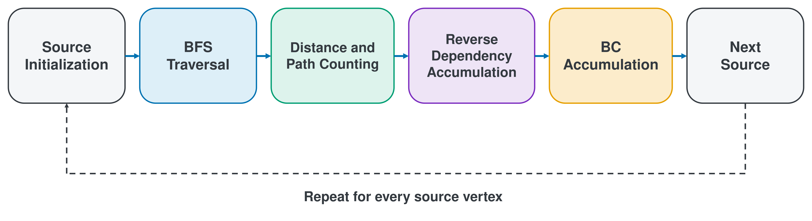
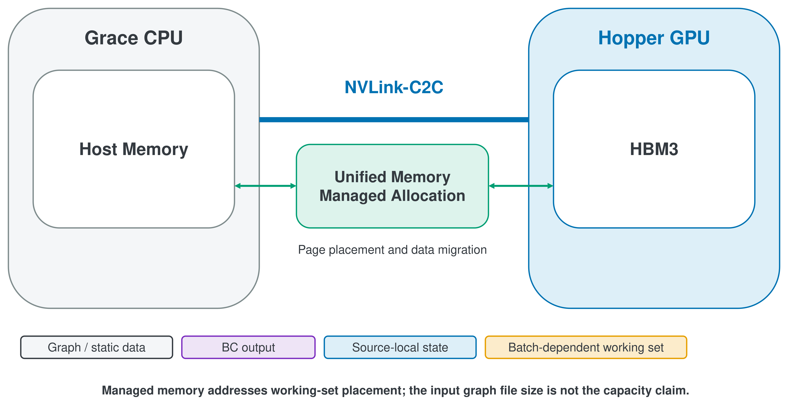

# Chapter 2 Background

This chapter reviews the Betweenness Centrality (BC), Brandes algorithm, parallelism in BC computation, CUDA execution model, and NVIDIA GH200 memory architecture needed to understand this study. It covers general definitions and technical background. Chapter 4 describes the specific design of the proposed batch-based GPU execution framework.

## 2.1 Graphs and Betweenness Centrality

Let a graph be denoted by $G=(V,E)$. Here, $V$ is a finite set of vertices, and $E$ is a set of edges. Let $n=|V|$ be the number of vertices and $m=|E|$ the number of edges. In a directed graph, an edge is an ordered pair $(u,v)$ directed from $u$ to $v$. In an undirected graph, an edge $\{u,v\}$ has no direction, and the adjacency relation between $u$ and $v$ is symmetric. The inputs processed in this study are undirected graphs.

A path from vertex $s$ to vertex $t$ is a vertex sequence $p=(v_0,v_1,\ldots,v_k)$ such that $v_0=s$, $v_k=t$, and an edge connects each pair of consecutive vertices. In an unweighted graph, the path length is the number of edges $k$. A shortest path is a path of minimum length among the paths connecting $s$ and $t$, and its length is the distance $d(s,t)$. A directed graph permits only paths that follow edge directions. An undirected graph also permits a path to be traversed in the reverse direction.

Let $\sigma_{st}$ be the total number of shortest paths from $s$ to $t$. Let $\sigma_{st}(v)$ be the number of these shortest paths that pass through a vertex $v$, other than $s$ and $t$, as an internal vertex. If $t$ is unreachable from $s$, the contribution of that vertex pair is defined as 0. Therefore, for a vertex pair with $\sigma_{st}>0$, the ratio $\sigma_{st}(v)/\sigma_{st}$ represents the fraction of uniformly counted shortest paths that pass through $v$.

Directed BC that excludes endpoints can be defined over ordered source--target pairs as follows [@brandes2001].

$$
C_B^{\mathrm{dir}}(v)
=
\sum_{\substack{
s,t\in V\\
s\ne t\\
s\ne v\\
t\ne v
}}
\frac{\sigma_{st}(v)}{\sigma_{st}}.
$$

This expression excludes pairs for which $v=s$ or $v=t$. Consequently, merely being the source or target does not add a contribution to BC. Another definition includes contributions from endpoints, but this study does not use that definition.

In an undirected graph, the reversed shortest paths $(s,t)$ and $(t,s)$ represent the same unordered vertex pair. When ordered pairs are counted from every source, the two directions make identical contributions to each internal vertex. Undirected BC that removes this duplicate counting is expressed using the following $1/2$ correction.

$$
C_B^{\mathrm{undir}}(v)
=
\frac{1}{2}
\sum_{\substack{
s,t\in V\\
s\ne t\\
s\ne v\\
t\ne v
}}
\frac{\sigma_{st}(v)}{\sigma_{st}}.
$$

The factor $1/2$ corrects the duplicate counting of $(s,t)$ and $(t,s)$ in an undirected graph. The implementation in this study also accumulates dependencies corresponding to ordered pairs with every vertex as a source. It applies $1/2$ when adding each source contribution to the global BC vector.

Normalization is an additional scaling that makes value ranges comparable across graphs with different numbers of vertices. For $n>2$ with endpoints excluded, directed BC based on ordered pairs and undirected BC with $1/2$ applied to the ordered-pair sum can be normalized as follows.

$$
\widehat{C}_B^{\mathrm{dir}}(v)
=\frac{C_B^{\mathrm{dir}}(v)}{(n-1)(n-2)},
\qquad
\widehat{C}_B^{\mathrm{undir}}(v)
=\frac{C_B^{\mathrm{undir}}(v)}{(n-1)(n-2)/2}.
$$

The BC used in this study is undirected, unweighted, exact all-sources, unnormalized, and endpoint-excluded. Specifically, the implementation computes $C_B^{\mathrm{undir}}$ without applying the normalization above. Directedness is determined by the graph representation supplied to the experiment, not by the provenance of the input data. For example, if originally directed data are symmetrized during preprocessing, the computation target is an undirected graph. These conditions align with the evaluation settings in Chapter 5 and the aggregation procedures of Sequential, GPU_Opt, and PathMerge.

The definitions above apply to a general $G=(V,E)$ and do not assume that $E$ is a simple graph without self-loops or parallel edges. As an experimental exception, 1 of the inputs in this study, the corrected 325557 graph, retains self-loops and duplicate adjacency pairs during evaluation. Section 5.3 describes this input structure and the scope of the RQs that it affects.

**Table 2.1: Symbols used in this thesis.**

| Symbol | Meaning |
|---|---|
| $G=(V,E)$ | Graph with vertex set $V$ and edge set $E$ |
| $n=|V|$ | Number of vertices |
| $m=|E|$ | Number of edges |
| $s,t$ | Source and target vertices |
| $d(s,t)$ | Shortest-path distance from $s$ to $t$ |
| $d_s(v)=d(s,v)$ | Shortest-path distance from source $s$ to vertex $v$ |
| $\sigma_{st}$ | Number of shortest paths from $s$ to $t$ |
| $\sigma_{st}(v)$ | Number of shortest paths from $s$ to $t$ that contain $v$ as an internal vertex |
| $\sigma_s(v)=\sigma_{sv}$ | Number of shortest paths from source $s$ to vertex $v$ |
| $P_s(w)$ | Predecessors of $w$ in the shortest-path DAG rooted at $s$ |
| $\delta_s(v)$ | Dependency of source $s$ on vertex $v$ |
| $C_B^{\mathrm{dir}}(v)$ | Unnormalized directed betweenness centrality based on ordered pairs |
| $C_B^{\mathrm{undir}}(v)$ | Unnormalized undirected betweenness centrality with the $1/2$ correction |
| $\widehat{C}_B^{\mathrm{dir}}(v),\ \widehat{C}_B^{\mathrm{undir}}(v)$ | Normalized directed and undirected betweenness centrality |
| $S$ | Stack of vertices in nondecreasing BFS distance order (traversal stack; $S_s$ denotes the stack of source $s$) |
| $M_{\mathrm{work}}$ | Conceptual batch-dependent working-set size |
| $NS_{\mathrm{eff}}$ | Effective number of simultaneously active stream buffers |
| $\mathrm{EffectiveBatch}$ | Number of sources provisioned per effective stream buffer |
| $M_{\mathrm{source}}$ | Source-local state size |

This thesis uses $\mathrm{Speedup}$ for speedup and does not reuse the symbol of the traversal stack $S$ (Section 5.6).

## 2.2 Brandes Algorithm

Directly evaluating the BC definition for every vertex pair requires the shortest paths of each pair to be enumerated separately. The Brandes algorithm shares the shortest-path DAG obtained from 1 source and accumulates the contributions of individual targets backward as dependencies [@brandes2001]. For an unweighted graph, it performs 2 phases for every source $s\in V$: Forward BFS and Backward Dependency Accumulation.

In the Forward phase, Breadth-First Search (BFS) starts from $s$. For each vertex $v$, it computes the distance $d_s(v)=d(s,v)$, shortest-path count $\sigma_s(v)=\sigma_{sv}$ from $s$ to $v$, and predecessor set $P_s(v)$ in the shortest-path DAG. Initially, $d_s(s)=0$ and $\sigma_s(s)=1$. The distance of every unvisited vertex is $-1$, and its path count is 0.

When BFS examines an edge $(v,w)$ and $w$ is unvisited, it sets $d_s(w)=d_s(v)+1$ and adds $w$ to the next frontier. If $d_s(w)=d_s(v)+1$, the edge belongs to the shortest-path DAG. In this case, $\sigma_s(v)$ is added to $\sigma_s(w)$, and $v$ is added to $P_s(w)$. If $w$ has multiple predecessors at the same level, their path counts are all accumulated.

Vertices removed from the BFS queue are stored in the traversal stack $S$. The order in $S$ is nondecreasing in distance. Popping $S$ from the end therefore processes vertices farther from the source first. This reverse order satisfies the dependencies of the Backward phase.

The vertex dependency $\delta_s(v)$ of source $s$ is computed from successors 1 level deeper than $v$ as follows.

$$
P_s(w)=\{v\in V\mid (v,w)\in E,\ d_s(w)=d_s(v)+1\},
$$

$$
\delta_s(v)
=
\sum_{w:\,v\in P_s(w)}
\frac{\sigma_s(v)}{\sigma_s(w)}
\left(1+\delta_s(w)\right).
$$

The term $1$ corresponds to target $w$ itself, while $\delta_s(w)$ represents contributions from targets beyond $w$. Processing levels from deep to shallow ensures that $\delta_s(w)$ on the right-hand side is already determined when used. Adding $\delta_s(w)$ to $C_B(w)$ for every $w\ne s$ incorporates all target contributions for source $s$ together. This procedure is repeated for every source. For an undirected graph, duplicate ordered pairs are finally corrected by the factor $1/2$.

**Algorithm 2.1: Brandes Algorithm for Unweighted Graphs**

```text
Input: Unweighted graph G = (V, E)
Output: Unnormalized, endpoint-excluded betweenness vector CB

1:  CB[v] <- 0 for every v in V
2:  for each source s in V do
3:      S <- empty stack
4:      P[w] <- empty list for every w in V
5:      sigma[w] <- 0 and dist[w] <- -1 for every w in V
6:      sigma[s] <- 1; dist[s] <- 0
7:      Q <- queue containing s
8:      while Q is not empty do
9:          v <- Q.pop()
10:         S.push(v)
11:         for each neighbor w of v do
12:             if dist[w] < 0 then
13:                 dist[w] <- dist[v] + 1
14:                 Q.push(w)
15:             end if
16:             if dist[w] = dist[v] + 1 then
17:                 sigma[w] <- sigma[w] + sigma[v]
18:                 P[w].append(v)
19:             end if
20:         end for
21:     end while
22:     delta[v] <- 0 for every v in V
23:     while S is not empty do
24:         w <- S.pop()
25:         for each v in P[w] do
26:             delta[v] <- delta[v] + (sigma[v] / sigma[w]) * (1 + delta[w])
27:         end for
28:         if w != s then CB[w] <- CB[w] + delta[w]
29:     end while
30: end for
31: if G is undirected then CB[v] <- CB[v] / 2 for every v in V
32: return CB
```

The Forward BFS and Backward phase for 1 source together process each vertex and edge of the shortest-path DAG at most a constant number of times. Their combined time complexity is therefore $O(|V|+|E|)$. The general time complexity of the unweighted Brandes algorithm over all $|V|$ sources is

$$
O\!\left(|V|(|V|+|E|)\right)
$$

[@brandes2001]. Only when $|E|=\Omega(|V|)$, as in a connected graph, can this expression be simplified to $O(|V||E|)$.

Storage for the standard source-by-source Brandes algorithm includes an $O(|V|+|E|)$ graph adjacency representation, $O(|V|+|E|)$ predecessor lists, and $O(|V|)$ arrays or structures for distance, path count, dependency, the queue, and the stack. Together, these require $O(|V|+|E|)$ working memory. Even if the input graph is conventionally excluded from auxiliary space, the predecessor lists can require up to $O(|V|+|E|)$. The algorithm-specific auxiliary space is therefore $O(|V|+|E|)$. The final BC vector requires $O(|V|)$ and is included in the same asymptotic bound.

Algorithm 2.1 is pseudocode for the standard Brandes algorithm. The GPU implementation in this study does not materialize predecessor lists directly. Instead, it determines next-level relations from distances and CSR adjacency and simultaneously retains state for multiple sources. These are implementation designs described in Chapter 4 and are distinct from the standard algorithm and its source-by-source space complexity in this section.

Figure 2.1 shows the processing stages for 1 source and the structure that repeats them for every source. The sequence consists of source initialization, BFS traversal, determination of distances and path counts, reverse-level dependency accumulation, and addition to BC. The same stages then repeat for the next source. This figure shows the structure of the standard algorithm. It does not include parallelization of the stages or concurrent execution across sources in the GPU implementation.



**Figure 2.1: Per-source stages of the Brandes algorithm and the loop over all source vertices.**

<!-- editable source: docs/thesis/figures/editable/thesis_figure_library.pptx slide 2 (library ID F02; a separate namespace from canonical result figure F2). Typesetting assets: docs/thesis/figures/exported/figure_2_1_brandes_algorithm.{svg,pdf}; regenerate with scripts/export_conceptual_figures.py. -->

## 2.3 Parallelism in BC Computation

Brandes-based BC offers several forms of parallelism with different granularities and synchronization requirements. Prior work on GPU BC also distinguishes coarse-grained source-level parallelism from fine-grained parallelism that distributes work over vertices or edges [@sariyuce2013; @mclaughlin2014].

Source-level parallelism executes the BFS and dependency accumulation of different sources concurrently. Each source has its own distance, $\sigma$, predecessor or traversal order, and $\delta$, so source-local computations can remain largely independent. Ultimately, however, every source contribution must be added to the same global BC vector. If concurrent sources update the same $C_B(v)$, the implementation needs a reduction, atomic operations, or source-specific partial sums followed by a merge.

Vertex-level parallelism concurrently processes vertices in the same BFS level or vertices in the same dependency level of the Backward phase. BFS has an ordering dependency between levels. The Backward phase must likewise determine $\delta$ for a deeper level before processing a shallower level. Thus, parallelism exists within a level, but synchronization is required between levels.

Edge-level parallelism distributes the adjacency lists of frontier vertices or the successor edges used in dependency computation across multiple threads. For a high-degree vertex, the edge scan of 1 vertex can be subdivided. Assigning many threads to low-degree vertices, however, increases the number of threads without edges to process. On a graph with a skewed degree distribution, workload imbalance across vertices changes thread or warp utilization.

Frontier-level parallelism concerns the active vertices in the current BFS frontier and the edges incident to them. Frontier size varies with the source, BFS level, connected component, and graph structure. During early traversal or in an elongated graph, a small frontier may provide little parallelism. When a frontier expands rapidly in the middle of a traversal, many edges can be processed concurrently. At the same time, contention and atomic updates to the same unvisited vertex may increase. This variability makes processing every level efficiently with one fixed thread layout difficult.

Batch-based source processing groups multiple sources into 1 batch and supplies source-level parallelism to the GPU as a regular execution unit. It is neither graph partitioning nor source sampling. As long as the batches are iterated to process every source, the definition of the computed BC remains unchanged. Even when individual sources have small frontiers, concurrent processing of other sources may supplement overall GPU parallelism.

Increasing the batch size also increases source-local state. Every source requires at least distance, shortest-path count, dependency, frontier, and traversal-order state. A larger batch may increase source-level parallelism, but it also consumes memory capacity, initialization work, resources for concurrent execution, and access to the global BC vector. A large batch does not necessarily provide higher performance. The appropriate granularity depends on graph structure, frontier evolution, degree skew, GPU resources, and source-local state capacity.

Atomic operations have several roles in this parallelization. During BFS, they uniquely establish the discovery of an unvisited vertex and accumulate $\sigma$ from multiple predecessors. They are also used to merge dependencies from all sources into the global BC vector. An atomic update makes a read--modify--write operation indivisible, but it does not fix the execution order of contending updates. Heavy contention at the same address can also cause serialization.

## 2.4 GPU Execution Model

In the basic CUDA model, the CPU side is called the host, and the CUDA-capable GPU side is called the device. The host program directs device-memory allocation and data movement and launches kernels for execution on the GPU. Many threads execute a kernel and are organized hierarchically into a grid, thread blocks, and threads [@nvidiaCudaProgrammingGuide].

A grid is the set of all blocks in 1 kernel launch. A thread block is a group of threads that execute the same kernel and can share fast shared memory and block-level synchronization. Because blocks are scheduled independently on the GPU, an ordinary kernel cannot assume an execution order among different blocks. A thread is the smallest program execution entity in the hierarchy and uses `threadIdx` and `blockIdx` to identify its assigned data.

Threads are normally executed in units of 32 called warps. Threads within a warp advance through instructions under the Single Instruction, Multiple Threads (SIMT) model. If lanes follow different paths at a conditional branch, the paths may need to execute separately, reducing the number of simultaneously active lanes. Warp shuffles, however, allow values to be exchanged among lanes without shared memory and support cooperative operations such as reduction [@nvidiaCudaProgrammingGuide].

The principal CUDA memory spaces are global memory, shared memory, and registers. Global memory is accessible to many threads on the device and has a large capacity, but access patterns and locality affect performance. Shared memory is on-chip memory shared within a block and is used for reuse and inter-thread exchange inside the block. Registers are generally private to each thread and hold local variables with low latency. Registers and shared memory are also finite resources that affect how many blocks can be resident concurrently [@nvidiaCudaProgrammingGuide].

Synchronization mechanisms must be distinguished by scope. A block-level barrier aligns threads in the same block and maintains consistency across phases that use shared data. Global dependencies among different blocks are generally constructed through kernel boundaries, the launch order of separate kernels, events, or related mechanisms. An atomic operation makes an update to a specific address indivisible, but it is not a barrier for an entire block or grid.

A CUDA stream is an ordered sequence of operations submitted from the host to the device. Command order is preserved within the same stream. Independent operations in different streams may execute concurrently when hardware resources and memory dependencies permit. Placing asynchronous memory operations, data transfers, and kernel execution in separate streams can enable overlap between transfer or initialization and computation. An asynchronous launch does not guarantee immediate completion or overlap. Actual overlap depends on device capability, copy engines, memory type, available resources, and synchronization points [@nvidiaCudaProgrammingGuide; @nvidiaCudaRuntimeApi].

These concepts lead directly to the design in Chapter 4. The `1 block = 1 source` mapping in this study associates each block with source-local state and uses threads within that block to process the frontier and adjacency. Warp-Cooperative Accumulation distributes 1 vertex's successor scan and partial sums across warp lanes. Dual-Stream Execution uses 2 sets of state buffers and CUDA streams to attempt overlap between computation for one batch and initialization for the next. Source batching supplies multiple source blocks to the grid. Chapter 4 presents the details of these mappings, synchronization boundaries, and switching conditions.

## 2.5 GH200 Memory Architecture

The NVIDIA GH200 Grace Hopper Superchip integrates a Grace CPU and Hopper GPU in one superchip. The Hopper GPU uses on-package HBM3 as its principal device memory, while the Grace CPU uses CPU-side LPDDR5X memory. A coherent NVLink-C2C interface connects the two. NVIDIA product materials specify 900 GB/s for this interface and describe the coherent memory model between the CPU and GPU [@nvidiaGh200Product; @nvidiaGraceHopperInDepth].

HBM3 and CPU-side memory are not the same physical memory tier. HBM3 is finite on-package memory near the Hopper GPU, while CPU-side memory is finite physical memory on the Grace CPU side. NVLink-C2C and coherent addressing enable cooperation between them but do not equalize their capacities or access costs. A common address space visible to the CPU and GPU also does not mean that all data are resident in the same physical location.

NVIDIA's general product materials specify up to 96 GB of HBM3 for the target configuration [@nvidiaGraceHopperInDepth]. This is a nominal product specification. In contrast, the Chapter 5 environment record reports 97,871 MiB of device memory, approximately 102.0 decimal GB from a runtime total-memory query, and approximately 101.4 decimal GB free at run start. These values describe the same on-package HBM3 using different unit systems or acquisition methods; they are not separate regions that can be added. The free-memory value is an observation at run start, not a capacity guaranteed to remain available.

Device-memory allocation must also be distinguished from managed-memory allocation. A device allocation through `cudaMalloc` reserves a region in device memory for device use. The allocation can fail if the requested amount exceeds available device memory. A managed allocation through `cudaMallocManaged` participates in the Unified Memory (UM) address space and provides an address accessible from both the CPU and GPU. The CUDA runtime and driver manage its physical placement according to access, memory advice, prefetch, and related factors [@nvidiaCudaProgrammingGuide; @nvidiaCudaRuntimeApi].

Migration moves a page of managed data between CPU-side memory and GPU memory. On-demand movement may occur in response to a page fault, or the program may request prefetch toward a future access location through `cudaMemPrefetchAsync`. Prefetch is a mechanism for controlling data placement and latency. It does not guarantee that every page remains permanently resident at the requested location. Behavior varies with allocation, access patterns, concurrency, and available memory.

Oversubscription occurs when the managed working set intended for GPU use exceeds the device memory available at that time. Through NVLink-C2C and its coherent memory model, GH200 can use placement that includes Grace CPU memory [@nvidiaGraceHopperInDepth]. UM, however, does not provide unbounded additional physical capacity. HBM3, CPU-side physical memory, page-management overhead, and runtime resources are all finite. A job resource configuration or cgroup limit may also restrict usable host memory below the installed physical capacity. Thus, device-allocation failure, host-memory pressure, a cgroup OOM (Out of Memory) kill, or execution-time constraints can remain even when UM is used.

The central capacity concern in this study is the batch-dependent working set, not the graph-file size. The on-disk graph file, in-memory CSR topology, and final BC vector are static graph storage and do not scale with source batch size. In contrast, distance, $\sigma$, $\delta$, frontier, traversal stack, and level metadata are required for every source. Let $M_{\mathrm{source}}$ be the state size for 1 source, $NS_{\mathrm{eff}}$ the effective number of simultaneously provisioned stream buffers, and $\mathrm{EffectiveBatch}$ the number of sources in each buffer. The conceptual working set can then be expressed as follows.

$$
M_{\mathrm{work}}
\approx
NS_{\mathrm{eff}}
\times \mathrm{EffectiveBatch}
\times M_{\mathrm{source}}.
$$

This is a conceptual expression for understanding the code-derived allocation of source-local arrays. It is not a measured expression for process RSS, physical HBM residency, host residency, or migration bytes. Static graph storage, the BC vector, allocator overhead, and runtime overhead add to the actual requirement. For a method that uses source sub-batching, the concurrently resident estimate uses the allocated `SUB_BATCH` rather than `EffectiveBatch`.

Therefore, UM is not adopted in this study because of the size of the on-disk graph file. The relevant quantity is the working set that grows when state for many sources is provisioned concurrently. UM provides options for managed placement, migration, and prefetch for this finite working set. Its effectiveness and cost depend on the workload and resource configuration and cannot be generalized without measurement. Chapter 4 describes the allocation policy, Chapter 5 defines the environment and capacity-evaluation method, and Chapter 8 reports the observed boundaries.

Figure 2.2 shows the relationships among the components described in this section. Host memory on the Grace CPU and HBM3 on the Hopper GPU are distinct, finite physical regions connected by NVLink-C2C. Managed allocation provides regions whose page placement and migration are managed across this architecture. The figure distinguishes graph and static data, BC output, source-local state, and the batch-dependent working set. It thereby shows that capacity concerns the working set rather than input graph-file size. The figure presents conceptual physical-placement relationships, not measured residency or migration volume for a specific execution.



**Figure 2.2: GH200 memory hierarchy: Grace CPU host memory and Hopper GPU HBM3 connected by NVLink-C2C, with managed allocation governing page placement and migration.**

<!-- editable source: docs/thesis/figures/editable/thesis_figure_library.pptx slide 3 (library ID F03; a separate namespace from canonical result figure F3). Typesetting assets: docs/thesis/figures/exported/figure_2_2_gh200_memory_hierarchy.{svg,pdf}; regenerate with scripts/export_conceptual_figures.py. -->

## 2.6 Challenges Addressed in This Thesis

Challenge 1 is that exact all-sources BC repeats BFS with every vertex as a source. Even though 1 source takes linear time, the general time complexity over all sources is $O(|V|(|V|+|E|))$. Under the condition $|E|=\Omega(|V|)$, this expression simplifies to $O(|V||E|)$. Independence among sources can be exploited, but every source still requires its own shortest-path state and Backward phase.

Challenge 2 is that the available parallelism and efficiency of Forward BFS change during traversal. A frontier can be small or large depending on the source and level. Top-down traversal expands outgoing edges from the current frontier. Bottom-up traversal searches from unvisited vertices for connections to the frontier. The preferable direction depends on the relationship between the frontier and unvisited region, making one fixed direction poorly suited to diverse phases [@beamer2012]. Direction switching itself also adds decisions, frontier-representation management, and additional scan overhead. Hybrid BFS is therefore not necessarily beneficial on every graph.

Challenge 3 is irregularity in Backward Dependency Accumulation. The number of successors per vertex depends on the degree and shortest-path DAG. An adjacency scan for a high-degree vertex can be distributed across multiple threads or warp lanes. For a low-degree vertex, however, part of the cooperative group may have no work. Differences in degree distribution and BFS-level width change the utilization of thread-per-vertex and warp-cooperative processing. Dependencies between levels also prevent the complete removal of ordering constraints.

Challenge 4 is the trade-off between source-level parallelism and memory capacity. Batch processing may increase parallelism by executing multiple sources concurrently. A larger batch, however, proportionally increases source-local distance, $\sigma$, $\delta$, frontier, and stack state. The number of concurrent sources desirable for performance must be balanced against the working set permitted by HBM3 and CPU-side memory. Neither a larger batch nor UM can be assumed to eliminate this trade-off or always improve performance.

Challenge 5 is overhead from initialization, computation, global accumulation, and synchronization. Resetting the state of every source, synchronizing BFS and Backward levels, and atomically updating global BC all incur costs beyond the arithmetic of BC. Asynchronous execution in multiple streams may overlap some initialization or memory operations with kernel execution. Synchronization points are still required to respect buffer-reuse dependencies and finite resources.

Challenge 6 is the numerical behavior of parallel execution. The computation of $\sigma$, $\delta$, and global BC includes many floating-point additions. Floating-point addition is not strictly associative, so changes in thread scheduling, atomic-update order, batch grouping, or the reduction tree can change rounding order for the same mathematical sum. Algorithmic equivalence therefore does not automatically imply byte-identical output. Correctness evaluation must separately examine the definition, complete vector, tolerance criterion, NaN/Inf values, and provenance.

These challenges are interdependent. Increasing a source batch changes both parallelism and state capacity, while thread and warp assignments affect both degree skew and the dependency phase. Stream overlap may hide initialization overhead but requires additional buffers. Chapter 4 presents the execution-framework design that addresses this background. This section identifies the challenges without anticipating conclusions about the effectiveness or performance of individual design elements.

<!--
Source notes (not reader-facing):

- Section 2.1 conditions were cross-checked against writing/japanese/05_experimental_methodology.md (Sections 5.3--5.5), src/baseline/sequential.cpp, src/baseline/omp.cpp, src/baseline/cugraph_bc.cu, src/baseline/pathmerge.cu, and include/proposed/brandes_kernels.cuh.
- Section 2.2 standard algorithm and complexity follow references.bib:brandes2001 and SOURCE_AUDIT.tsv:S01. Implementation-specific successor reconstruction is described only as a transition to Chapter 4.
- Sections 2.3--2.4 were cross-checked against writing/japanese/04_proposed_gpu_execution_framework.md, docs/thesis/04_method_design.md, include/proposed/brandes_kernels.cuh, and the CUDA primary-source audit entries S17--S20.
- Section 2.5 product claims follow references.bib:nvidiaGh200Product and nvidiaGraceHopperInDepth, audited in SOURCE_AUDIT.tsv:S15--S16. Run-environment distinctions follow result/environment/environment.md and result/tables/thesis/T6_experimental_environment.tsv.
- The working-set distinction follows writing/japanese/04_proposed_gpu_execution_framework.md, writing/japanese/05_experimental_methodology.md, result/datasets/graph_catalog.tsv, and the current corrected-input records summarized in Chapters 8--11. Historical malformed-input conclusions are not used.
- Figures 2.1 and 2.2 are exported from the editable figure library (slides 2 and 3; library IDs F02 and F03) by scripts/export_conceptual_figures.py. The library ID namespace F01--F15 is distinct from the canonical result figure namespace F1--F7. Chapter 2 uses exactly two figures.
-->
