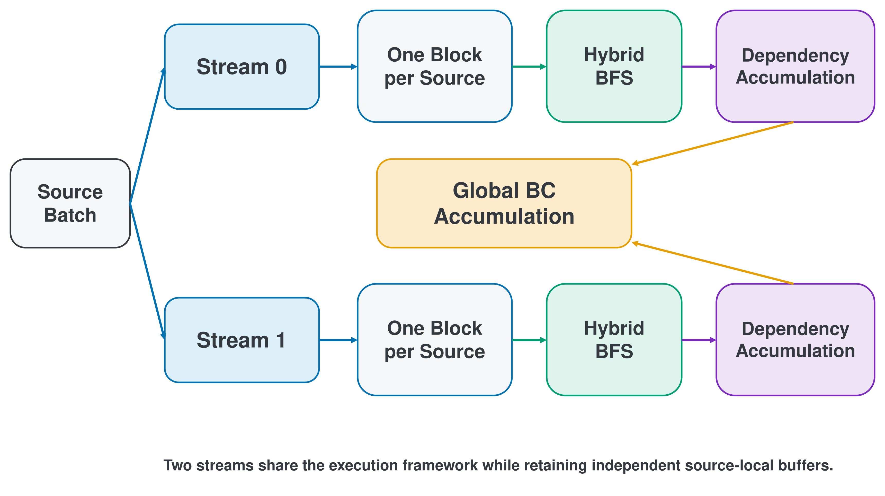
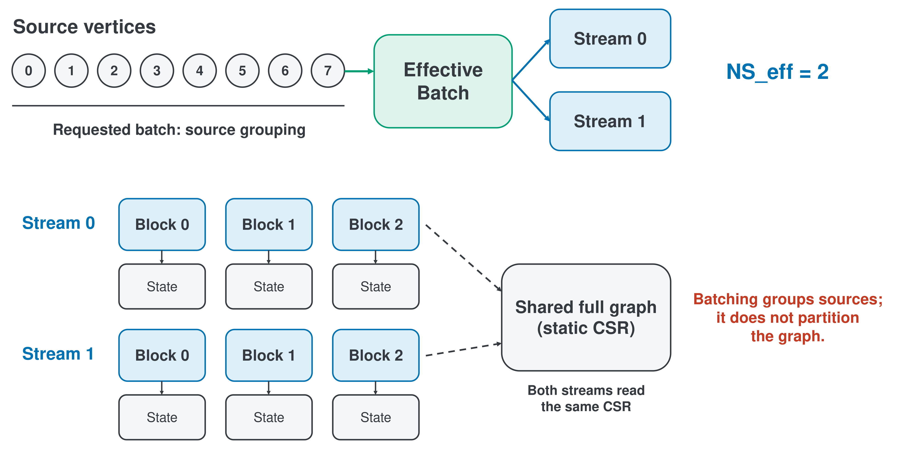
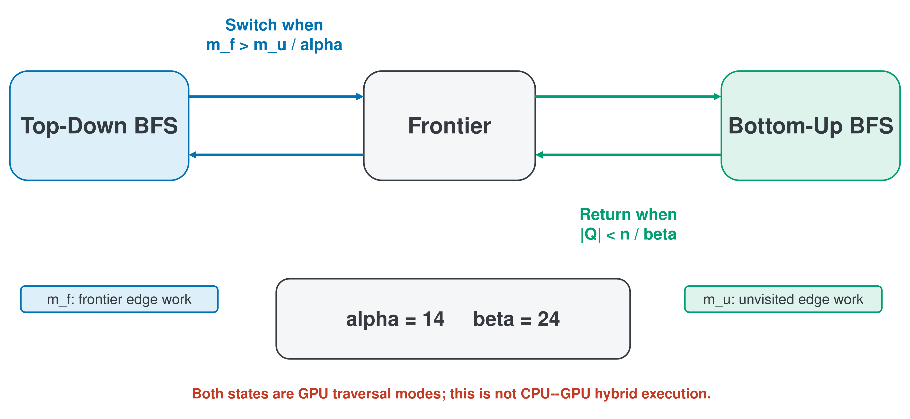
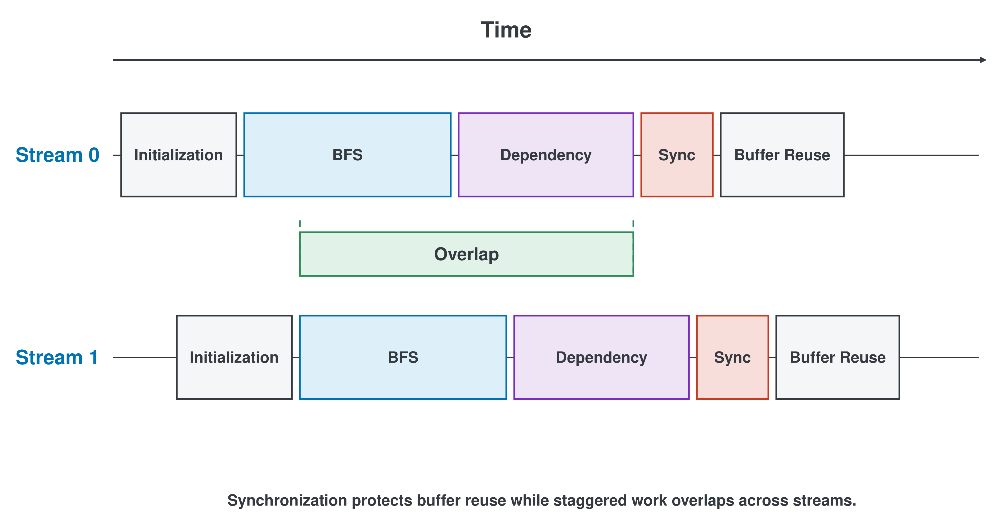
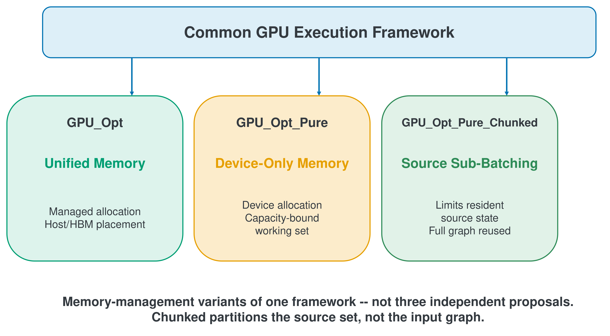

# Chapter 4 Proposed GPU Execution Framework

This chapter presents a batch-based GPU execution framework for exact all-sources Betweenness Centrality (BC) on undirected, unweighted graphs using the NVIDIA GH200. The framework integrates Hybrid BFS, block-based source processing, thread- and warp-cooperative dependency paths, Dual-Stream Execution, and source batching into one common implementation of the Brandes algorithm [@brandes2001]. GPU_Opt, GPU_Opt_Pure, and GPU_Opt_Pure_Chunked are not 3 independent methods; they are memory-management variants of this common framework.

This chapter focuses on design objectives and execution flow. Chapters 6 through 9 evaluate measured performance, component contributions, capacity boundaries, and numerical behavior, respectively. This thesis does not claim Hybrid BFS, warp-level processing, CUDA streams, or Unified Memory (UM) as individual inventions. Its contribution is their integration into a consistent GPU execution framework for BC, with interchangeable batching and memory-management approaches on the same computational flow.

## 4.1 Framework Overview

The first design objective is to expose the source-level parallelism in all-sources Brandes computation on the GPU. Every vertex in the input graph serves as a source vertex, and multiple sources are grouped into one batch. This source batching and the block-based source assignment described in Section 4.3 isolate state across sources while also exploiting vertex- and edge-level parallelism within each source.

The second objective is to accommodate parallelism that varies with graph structure and traversal phase. In the Forward phase, Hybrid BFS switches by level between top-down traversal from the frontier and bottom-up traversal from unvisited vertices toward the frontier. In the Backward phase, the framework selects a thread-per-vertex path for a low mean degree and a warp-cooperative path otherwise. The former assigns one thread to scan one vertex's adjacency list. The latter distributes an adjacency list across warp lanes and performs a shuffle reduction.

The third objective is to overlap the state initialization required for each batch with computation. The framework uses 2 CUDA streams and 2 sets of state buffers. While one stream runs BFS and dependency accumulation, the other can asynchronously initialize the next batch. A stream waits for the preceding work that used its buffer only when that buffer is reused.

The fourth objective is to change capacity management while retaining the computation kernels. BC capacity requirements cannot be explained by the on-disk graph-file size alone. The CSR topology and BC output are static graph storage. In contrast, distance, shortest-path count, dependency, frontier, and traversal-stack state are required for every source and grow with concurrent source count. Because this batch-dependent working set can exceed HBM capacity, the common framework provides three options. They are the main UM implementation, a device-only control, and a capacity-extension variant that reduces concurrent resident state through source sub-batches.

The fifth objective is to evaluate performance, components, capacity, and numerical behavior on the same processing framework. The 3 memory-management variants share exact BC over every source, the block-per-source mapping, Hybrid BFS, the Backward phase, and the undirected-graph accumulation convention. The variants can therefore be compared through explicit execution differences without replacing the complete algorithm.

The input is an undirected, unweighted graph $G=(V,E)$ with $n$ vertices and $m$ undirected edges. The graph is stored in CSR format. Its row pointer $R$ has $n+1$ elements, and its symmetric adjacency array $C$ has $2m$ elements. All sources share $R$ and $C$ as read-only static graph storage. The output is a length-$n$ vector $CB$ that stores unnormalized BC values.

For each source $s$, computation proceeds through state initialization, Forward BFS, Backward dependency accumulation, and global BC accumulation. Forward BFS computes the distance $d_s(v)$ and shortest-path count $\sigma_s(v)$ and records reached vertices in the stack $S_s$ by BFS level. The Backward phase traverses $S_s$ from deeper levels in reverse order and computes the dependency $\delta_s(v)$. Finally, every contribution except that of $s$ itself is added to $CB$. For an undirected graph, each contribution is divided by 2 to correct symmetric source--target duplication.

Figure 4.1 presents the common computation flow. Source batches are assigned to 2 streams. Within each stream, processing follows one-block-per-source assignment, Hybrid BFS, and dependency accumulation, after which both streams contribute to the shared global BC accumulation. The streams use the same execution framework but maintain independent source-local buffers. Section 4.7 and Figure 4.5 describe the interchangeable memory-management approaches.



**Figure 4.1: Overall GPU execution framework.**

<!-- editable source: docs/thesis/figures/editable/thesis_figure_library.pptx slide 4 (library ID F04). Typesetting assets: docs/thesis/figures/exported/figure_4_1_gpu_execution_framework.{svg,pdf}; regenerate with scripts/export_conceptual_figures.py. -->

Figures 4.1 through 4.5 are conceptual diagrams exported from the editable figure library. All in-figure text and captions are in English. The figures show design structures and contain no measured performance values.

An important property of this structure is that the memory approach does not change source semantics or the computational order of Brandes. Batches and sub-batches group source sets; they do not partition the graph. The outer loop processes every source in $V$. When sub-batching is used, `num_subs` iterations process every source in the requested batch. The framework therefore introduces neither source sampling nor approximate computation.

## 4.2 Batch-Based Source Processing

The outer loop divides all sources into batches of `BATCH_PER_STREAM` sources per stream. Let $s_{start}$ be the first source of an outer batch and $b$ its source count. Dynamic state for each source is separated by a `batch_idx × n` offset. The CSR topology and final $CB$ vector are shared across the batch and between streams. Section 4.3 describes the mapping between sources and CUDA blocks.

The principal state for each source $q$ comprises distance `d_d`, shortest-path count `d_sigma`, dependency `d_delta`, current and next frontiers `d_Q_curr` and `d_Q_next`, traversal order `d_S`, level boundaries `d_S_ends`, and final depth `d_depth`. The arrays `d_d`, both frontiers, and `d_S` contain $n$ `int` elements each. The arrays `d_sigma` and `d_delta` contain $n$ `double` elements each. Let $D_{est}$ be the estimated depth upper bound. The code-derived state size for one source is

$$
M_{\mathrm{source}}=32n+4D_{est}+8 \quad \mathrm{bytes}
$$

This value is an allocation size derived from array dimensions. It is not a measurement of process RSS, physical HBM residency, host residency, or migration bytes. The `PerSourceStateBytes` field in the retained manifest corresponds to $M_{\mathrm{source}}$ in this thesis.

This thesis distinguishes batch- and capacity-related terms as follows.

| Term | Definition |
|---|---|
| Graph File Size | On-disk size of the input graph representation |
| Static Graph Storage | CSR topology and the final BC vector, independent of source batch size |
| Batch-Dependent Working Set | Per-source state multiplied by the number of simultaneously provisioned or resident sources |
| Requested Batch | Source count requested by the user or selected by the default policy, per stream |
| Effective Batch | Source count actually used by the outer batch loop after implementation-side decisions |
| `SUB_BATCH` | Maximum source count processed by one sub-launch when a batch is split |
| `num_subs` | Number of sub-launches, $\lceil EffectiveBatch/SUB\_BATCH\rceil$ |
| `NS_eff` | Effective number of simultaneously active stream buffers; written $NS_{\mathrm{eff}}$ in this thesis |
| HBM Capacity | Finite on-package GPU memory capacity |
| Host Memory | Finite CPU-side physical memory, also subject to resource and cgroup limits |
| Unified Memory | Managed allocation and placement mechanism spanning CPU/GPU access; not additional physical capacity |

The requested batch is selected by the default policy or specified at runtime. The effective batch is the actual outer-loop processing unit. The final `curr_batch` can be smaller according to the number of remaining sources. `SUB_BATCH` limits the effective batch portion processed by one kernel launch, and `num_subs=1` means that no split occurs. `NS_eff` is normally 2 for in-capacity execution and becomes 1 on the oversubscription path to reduce the concurrently resident working set.

The principal GPU_Opt performance condition uses a requested batch of 512 and an effective batch of 512 per stream. It also uses 2 streams, `SUB_BATCH=512`, `num_subs=1`, and `NS_eff=2`. Thus, `b512` denotes the batch size handled by one stream, not the combined source count across both streams. For UM and Pure, the basic form of the batch-dependent allocation with 2 buffer sets is

$$
M_{\mathrm{work}}\approx NS_{\mathrm{eff}}\times \mathrm{EffectiveBatch}\times M_{\mathrm{source}}
$$

The concurrently resident estimate for Chunked uses `SUB_BATCH` in place of `EffectiveBatch`. Static or auxiliary regions, including the CSR topology, $CB$ vector, and runtime overhead, must be added separately to each expression.

Algorithm 4.1 shows batch processing in the common framework. The pseudocode covers both the normal 2-stream in-capacity path and optional sub-batch splitting. The concrete allocation, prefetch, and eviction behavior depends on the variant described in Section 4.7.

**Algorithm 4.1: Batch-Based All-Sources BC Processing**

```text
Input: CSR graph (R, C), source set V, requested batch B
Output: Betweenness-centrality vector CB

1:  Initialize CB to zero
2:  Select EffectiveBatch, SUB_BATCH, num_subs, and NS_eff
3:  Allocate stream-local state buffers using the selected memory variant
4:  for s_start = 0 to |V| - 1 step EffectiveBatch do
5:      stream_id <- (s_start / EffectiveBatch) mod NS_eff
6:      Wait only if the selected stream buffer is still in use
7:      curr_batch <- min(EffectiveBatch, |V| - s_start)
8:      for sub_offset = 0 to curr_batch - 1 step SUB_BATCH do
9:          sub_count <- min(SUB_BATCH, curr_batch - sub_offset)
10:         Prepare or reset source-local state asynchronously
11:         Launch HybridBFS for the current sources
12:         Prefetch the next sub-batch when supported
13:         Launch DependencyAccumulation for the current sources
14:         Accumulate source dependencies into CB
15:         Evict the current sub-batch when required
16:     end for
17: end for
18: Synchronize active streams and return CB
```

## 4.3 Block-Based Source Assignment

The current default BFS kernel assigns each source in a batch to one CUDA block. Thus, 1 block processes 1 source, and threads within the block cooperatively process that source's frontier and adjacent edges. For a batch containing $b$ sources, the block kernel is launched with a grid size of $b$. The block with `blockIdx.x=q` handles source $s=s_{start}+q$. This mapping prevents different blocks from sharing the same source-local state while allowing each block to exploit vertex- and edge-level parallelism within its source.

The current method always selects the block kernel by default. A former implementation automatically selected the shared-frontier kernel when `avg_deg < 5`, but that rule is no longer used. Forced shared/block selection remains available for reproducibility experiments but is not part of the normal selection rule. Accordingly, block-per-source in this chapter denotes the current default computation path. The former BFS-kernel rule is distinct from the `avg_deg < 8` thread/warp selection for the Backward phase in Section 4.5.

Figure 4.2 shows the grouping of the source set into effective batches and the assignment of one source to one CUDA block within each stream. The lower part shows that each block maintains distinct source-local state while both streams read the same static CSR. It also makes explicit that batches divide sources, not the graph.



**Figure 4.2: Batch-to-source mapping: sources are grouped into an effective batch per stream, each source is assigned to one CUDA block, and both streams read the same static CSR.**

<!-- editable source: docs/thesis/figures/editable/thesis_figure_library.pptx slide 5 (library ID F05). Typesetting assets: docs/thesis/figures/exported/figure_4_2_batch_source_mapping.{svg,pdf}; regenerate with scripts/export_conceptual_figures.py. -->

## 4.4 Hybrid BFS

Hybrid BFS is a direction-optimizing BFS that switches GPU traversal direction between top-down and bottom-up; it is not hybrid CPU--GPU execution [@beamer2012]. The switch occurs within a block for each source and each BFS level. Every source retains the current frontier `Q_curr`, next frontier `Q_next`, distance $d$, and shortest-path count $\sigma$.

On the top-down path, block threads divide the vertices in `Q_curr` and scan their adjacency lists. For an unvisited vertex $w$, `atomicCAS` establishes the distance $d_s(w)=depth+1$ and adds $w$ to `Q_next`. Because multiple parents can reach the same shortest-path level, `atomicAdd` accumulates $\sigma_s(w)$. This direction examines edges outward from the frontier.

On the bottom-up path, block threads divide the unvisited vertices and check whether their neighbors contain a reached vertex at the current level. The path sums the corresponding parent values of $\sigma$ and adds a vertex to the next frontier when the sum is positive. This direction aims to avoid repeatedly expanding the same adjacency region when the frontier is large.

Direction selection uses the approximate number of edges incident to the frontier, $m_f$, the approximate number remaining on the unvisited side, $m_u$, and the current frontier size $|Q|$. The current implementation uses $\alpha=14$ and $\beta=24$. It switches from top-down to bottom-up when

$$
m_f > \frac{m_u}{\alpha}
$$

and returns from bottom-up to top-down when

$$
|Q| < \frac{n}{\beta}.
$$

The ablation path with Hybrid BFS disabled processes every level top-down. These switching thresholds derive from established direction-optimizing BFS and were not individually invented in this study.

At the end of each level, the implementation appends the next frontier to `S` and records the cumulative end position in `S_ends`. `S` contains reached vertices in BFS order, while `S_ends` marks level boundaries. This record allows the Backward phase to compute dependencies from deeper levels using distances and adjacency lists without separately materializing predecessor lists. If traversal exceeds the estimated maximum depth, the implementation sets an overflow flag rather than continuing with invalid state.

Figure 4.3 illustrates traversal-direction switching in Forward BFS. The traversal moves between top-down and bottom-up states through the frontier. It uses $m_f > m_u/\alpha$ to switch and $|Q| < n/\beta$ to return. The values $\alpha=14$ and $\beta=24$ in the figure are the current implementation settings. Both states are GPU traversal modes, not hybrid CPU--GPU execution. Section 4.5 describes the computation-path selection in the Backward phase.



**Figure 4.3: Hybrid BFS state transition: direction switching between top-down and bottom-up traversal through the frontier, with the alpha and beta switching conditions.**

<!-- editable source: docs/thesis/figures/editable/thesis_figure_library.pptx slide 6 (library ID F06). Typesetting assets: docs/thesis/figures/exported/figure_4_3_hybrid_bfs.{svg,pdf}; regenerate with scripts/export_conceptual_figures.py. -->

## 4.5 Dependency Accumulation

After the Forward phase, computation moves backward one level at a time from the deepest level indicated by `S_ends` for each source $s$. It thereby computes Brandes dependencies. Define the neighboring vertices of $w$ at the next level as

$$
Succ_s(w)=\{v\mid (w,v)\in E,\ d_s(v)=d_s(w)+1\}.
$$

The dependency is then

$$
\delta_s(w)=\sum_{v\in Succ_s(w)}
\frac{\sigma_s(w)}{\sigma_s(v)}\left(1+\delta_s(v)\right).
$$

Vertices within the same level read only $\delta$ values from the next level. The implementation therefore synchronizes between levels while processing vertices within a level in parallel.

The current implementation selects between 2 computation paths according to mean degree. When the mean degree is below 8, it uses the thread-per-vertex path. Each thread in a block handles one vertex $w$ in the level and sequentially scans its adjacency list to compute the sum above. This path is designed to avoid assigning 32 lanes to one vertex when a small adjacency list would leave lanes unused.

When the mean degree is at least 8, the implementation uses the warp-cooperative path. One warp handles one vertex $w$. Lane $\ell$ scans adjacency entries $\ell,\ell+32,\ell+64,\ldots$. A warp shuffle reduces the partial sums from all lanes, and lane 0 stores $\delta_s(w)$. Multiple warps process different vertices in parallel. This thread/warp selection applies to the Backward phase. It is separate from the unused former `avg_deg < 5` rule for shared-frontier BFS.

After obtaining $\delta_s$ for each source, block threads traverse the vertex set by stride and use `atomicAdd` to add contributions for $v\neq s$ to global $CB[v]$. Atomic operations are required because blocks for multiple sources and both streams can update the same $CB[v]$. For an undirected graph, the update adds $\delta_s(v)/2$.

The framework does not assume that Warp-Cooperative Accumulation is always advantageous. It implements both thread and warp paths and selects between them by mean degree during normal execution. The ablation implementation can instead fix the selection at compile time. It thereby compares combinations of Hybrid BFS, Warp-Cooperative Accumulation, and Dual-Stream Execution within the same framework. Chapter 7 evaluates the observed contributions and their graph dependence.

## 4.6 Dual-Stream Execution

Normal in-capacity execution uses `NS=2` CUDA streams and 2 sets of source-state buffers. Outer batches are assigned round-robin to stream 0 and stream 1. Within each stream, state initialization precedes BFS, which precedes the Backward phase. No global synchronization is placed between streams. Consequently, kernel execution in one stream can overlap initialization through `cudaMemsetAsync` in the other stream.

On first use, the implementation asynchronously initializes the distance array to $-1$ and $\sigma$ and $\delta$ to 0. When a buffer can be reused for the same source-local range, a path can reset only reached vertices using the preceding `S` and level boundaries. Within the BFS kernel, only the source state $d_s(s)=0$, $\sigma_s(s)=1$, and the first frontier and stack elements are set. A single thread therefore does not perform an $O(n)$ initialization for every source.

Before reusing a buffer, the implementation waits only for the preceding Backward event on that stream. For example, it confirms completion of stream 0 before reusing stream 0's buffer but does not simultaneously synchronize stream 1. This local synchronization boundary prevents buffer conflicts while preserving possible overlap between streams.

Figure 4.4 is a conceptual timeline of the 2-stream pipeline. Time runs horizontally, and each stream proceeds through initialization, BFS, dependency processing, synchronization, and buffer reuse. Staggering the 2 stream intervals creates a possible overlap between computation in one stream and initialization in the other. The Overlap region is a conceptual candidate interval, not a measured overlap duration from a particular execution.



**Figure 4.4: Dual-stream timeline: staggered per-stream execution and the synchronization point that protects buffer reuse. The timeline is conceptual and is not a measured trace.**

<!-- editable source: docs/thesis/figures/editable/thesis_figure_library.pptx slide 7 (library ID F07). Typesetting assets: docs/thesis/figures/exported/figure_4_4_dual_stream_timeline.{svg,pdf}; regenerate with scripts/export_conceptual_figures.py. -->

Two streams are not used under every fixed condition. When the UM or Chunked path determines that the batch-dependent working set exceeds its HBM budget, it sets `NS_eff=1` to reduce concurrent resident state. The requested stream count `NS=2` must therefore be distinguished from the `NS_eff` used by a particular execution. The principal performance condition is in-capacity and uses a batch of 512 per stream, 2 streams, and `NS_eff=2`.

## 4.7 Memory Management Variants

The 3 variants share source scheduling and GPU kernels. They differ principally in the allocation and placement of the CSR, source-local state, and $CB$. Figure 4.5 shows their relationship. GPU_Opt uses Unified Memory, GPU_Opt_Pure uses device-only memory, and GPU_Opt_Pure_Chunked uses source sub-batching under the common execution framework. They are 3 memory-management variants of one framework, not 3 independent proposals. Chunked divides the source set, not the input graph.



**Figure 4.5: Memory-management variants of one common execution framework: Unified Memory, device-only memory, and source sub-batching.**

<!-- editable source: docs/thesis/figures/editable/thesis_figure_library.pptx slide 8 (library ID F08). Typesetting assets: docs/thesis/figures/exported/figure_4_5_memory_management_variants.{svg,pdf}; regenerate with scripts/export_conceptual_figures.py. -->

### 4.7.1 GPU_Opt

GPU_Opt is the main implementation and uses UM. It allocates the CSR topology, source-local state, and $CB$ as managed memory and applies read-mostly memory advice to the static CSR. When the CSR topology is smaller than a specified fraction of device memory, GPU_Opt prefetches it to the GPU. Otherwise, it makes host memory the preferred location while retaining GPU accessibility. This policy concerns placement of static graph storage, not the size of the on-disk graph file.

Source-local state is allocated as managed memory for the complete effective batch of each stream. In-capacity execution prepositions the state for 2 streams on the GPU and uses `SUB_BATCH=EffectiveBatch`, `num_subs=1`, and `NS_eff=2`. Under the principal performance condition, the value is 512 sources per stream.

When the dynamic allocation estimate for the requested batch exceeds the free-HBM budget at startup, GPU_Opt enters the oversubscription path. It sets `NS_eff=1` and determines `SUB_BATCH` from the HBM budget and index-safety bound. It prefetches the current sub-batch to the GPU before initialization, BFS, and the Backward phase. When applicable, it combines prefetch of the next sub-batch with current computation and evicts state that will not be reused to the host. The managed allocation itself still covers the complete effective batch. `SUB_BATCH` primarily identifies the source range processed and prefetched at one time.

UM is not used because the graph file exceeds nominal HBM3 capacity. The graph file, CSR topology, $CB$, and batch-dependent working set are distinct quantities. State for many concurrent sources can make the working set exceed device-memory capacity. GPU_Opt therefore provides managed placement and migration between finite HBM and host memory. UM does not increase physical memory and remains constrained by host memory, resource limits, cgroups, page migration, and runtime overhead. It is not positioned as completely avoiding OOM.

### 4.7.2 GPU_Opt_Pure

GPU_Opt_Pure is the device-only control. It places the CSR topology, source-local working arrays, and $CB$ used for BC computation in device memory through `cudaMalloc`. It does not use UM placement advice, prefetch, or eviction, and it allocates 2 sets of state for the complete effective batch per stream. BFS, dependency accumulation, block-per-source mapping, and 2-stream scheduling remain those of the common framework.

This approach provides an explicit memory path and a control for conditions in which the working set fits within HBM capacity. If the required full-batch device allocation exceeds available device memory, the allocation can fail. Because host memory is not used implicitly as a substitute for device allocation, Pure provides a reference for comparison with the UM capacity path. Pure is not an independent algorithmic proposal; it is a device-only memory-management control.

### 4.7.3 GPU_Opt_Pure_Chunked

Like Pure, GPU_Opt_Pure_Chunked places the principal BC arrays in device memory. However, it allocates physical source-local buffers for `SUB_BATCH` sources rather than the complete effective batch. It preserves the meanings of the requested and effective outer-loop batches. Within an effective batch, it performs `num_subs=\lceil EffectiveBatch/SUB\_BATCH\rceil` iterations. Every sub-batch reuses the start of the buffer and advances only the source offset.

`SUB_BATCH` is determined with both an available budget and an index-safety bound. The budget subtracts the CSR topology and $CB$ from a fixed fraction of free HBM. To keep the flattened index within the range of `int`, the implementation also applies

$$
SUB\_BATCH \le \left\lfloor\frac{INT\_MAX}{n}\right\rfloor.
$$

When the full working set for the requested batch is classified as over capacity, the implementation sets `NS_eff=1`. It thereby limits the concurrently resident estimate to approximately $\texttt{SUB\_BATCH}\times M_{\mathrm{source}}$. Splitting a batch does not create graph partitioning, source sampling, or approximate BC because all sources are processed in sequence.

Chunked is designed to control the resident working set explicitly and extend the batch range that can be tested. Feasibility still depends on the `SUB_BATCH` buffer, static storage, index range, device runtime, execution time, and other finite resources. This thesis therefore does not claim that Chunked supports an unlimited requested batch or avoids OOM under every condition.

## 4.8 Expected Effects and Trade-Offs

This section retains an implementation summary while reviewing the expected effects and design trade-offs of the common execution framework. The components in the table are integrated into one implementation of all-sources BC and are not individual new inventions. Chapters 6 through 9 report the measured performance, component contributions, capacity boundaries, and numerical behavior.

**Table 4.1: Implementation summary of the proposed GPU execution framework.**

| Component | Current Implementation | Role |
|---|---|---|
| Graph Representation | Undirected, unweighted CSR | Shared static topology |
| Source Scheduling | Batched outer loop | Expose source-level parallelism |
| Source Assignment | One CUDA block per source | Isolate source state and enable intra-source cooperation |
| Forward Phase | Hybrid top-down / bottom-up BFS | Adapt traversal direction by BFS level |
| Backward Phase | Thread-per-vertex or warp-cooperative path | Adapt dependency accumulation granularity |
| Global Accumulation | Atomic update with undirected correction | Merge concurrent source contributions |
| Stream Pipeline | Two streams and double buffers in capacity | Overlap initialization and computation |
| Main Performance Setting | Batch 512 per stream, two streams, `NS_eff=2` | Fixed evaluation configuration |
| GPU_Opt | Unified Memory | Main implementation and managed-capacity path |
| GPU_Opt_Pure | Device memory | Device-only control |
| GPU_Opt_Pure_Chunked | Device sub-batch buffers | Resident working-set control and capacity extension |

In normal GPU_Opt execution, Hybrid BFS is enabled, and the block BFS kernel is always the default. The Backward phase selects thread-per-vertex below a mean degree of 8 and the warp-cooperative path otherwise. In-capacity execution assigns batches alternately to 2 streams with `NS_eff=2`. The oversubscription path prioritizes capacity control and uses `NS_eff=1`. The principal performance condition uses a batch of 512 per stream, 2 streams, `SUB_BATCH=512`, `num_subs=1`, and `NS_eff=2`.

Batch-based processing and block-based source assignment are designed to expose source-level parallelism while enabling cooperative processing of each source's frontier and adjacent edges within a block. Source-local state grows with the number of simultaneously provisioned sources. Increasing the batch therefore also increases the batch-dependent working set. Batch size must accordingly be treated as a capacity factor independent of graph-file size.

Hybrid BFS selects traversal direction according to frontier state at each BFS level. The thread/warp switch in the Backward phase selects dependency-accumulation granularity according to mean degree. The preferable path depends on graph structure and phase. Both mechanisms incur costs from direction switching, frontier management, atomic operations, or lane utilization. The framework does not assume that Warp-Cooperative Accumulation is always advantageous; Chapter 7 evaluates its contribution.

Dual-Stream Execution allows initialization and computation using different buffers to overlap, but in-capacity execution requires 2 sets of source-state buffers. The oversubscription path prioritizes capacity control and uses `NS_eff=1`, so dual-stream overlap is not always available.

The 3 memory-management variants allow placement and resident-working-set policies to be compared while retaining the same computation kernels. GPU_Opt can use UM placement and migration, but UM has finite HBM, host-memory, and runtime limits. GPU_Opt_Pure provides an explicit device-only control, but available device memory constrains its full-batch allocation. GPU_Opt_Pure_Chunked controls resident state through sub-batches but retains the costs of multiple launches and other finite resources. None of the variants therefore provides an unconditional capacity guarantee.

The methodological novelty of this study does not lie in individually inventing Hybrid BFS, warp processing, streams, or UM. The contribution is their integration into a GPU execution framework for BC centered on block-based source processing and batch scheduling. The framework also implements UM, device-only, and source-sub-batched memory management consistently on the same computational basis. This design supports evaluation of performance, components, capacity, and numerical behavior within one processing framework. Chapter 5 defines the evaluation methodology. Chapters 6 through 9 evaluate performance, components, capacity, and numerical behavior, respectively. Chapter 10 discusses their relationships and scope, and Chapter 11 presents the conclusions.

<!--
Source notes (not reader-facing):

Current implementation and checkpoint alignment
- Current relevant implementation files are identical to checkpoint 45352a344aaac463283a647467b790be9b45bfb8 (`git diff 45352a3 -- <relevant files>` was empty).
- Against `code_snapshots/phase_def_block_20260710`, `host_pure.cu`, `host_chunked.cu`, `host_ablation.cu`, `brandes_kernels.cuh`, and `common.hpp` are identical. Current `host_um.cu` adds default-off diagnostic switches and path counters; the normal compute path is unchanged.

Graph input and timing
- `src/core/graph.cpp:25-85`: `Graph::readGraph`, CSR input allocation and validation.
- `src/core/graph.cpp:92-97`: adjacency array and row-pointer accessors.
- `src/core/runner.cpp:136-155`: whole-implementation timing and GTEPS definition.

Common source mapping and kernels
- `include/proposed/brandes_kernels.cuh:11-18`: source-local batch offsets.
- `include/proposed/brandes_kernels.cuh:24-150`: `find_shortest_paths_opt`, Hybrid BFS, alpha/beta switching, frontier/stack recording.
- `include/proposed/brandes_kernels.cuh:156-233`: warp-cooperative and thread-per-vertex dependency accumulation.
- `include/proposed/brandes_kernels.cuh:260-296`: `brandes_bfs_kernel_opt`, `blockIdx.x` to source mapping.
- `include/proposed/brandes_kernels.cuh:300-350`: Backward kernels, global atomic accumulation, undirected division by two.
- Snapshot mirror: `code_snapshots/phase_def_block_20260710/include/proposed/brandes_kernels.cuh:24-350`.

GPU_Opt batching, streams, and Unified Memory
- `src/proposed/host_um.cu:121-135`: asynchronous initialization and two-stream double-buffering design.
- `src/proposed/host_um.cu:147-215`: enabled Hybrid BFS, state buffer layout, sub-batch prefetch/memset/eviction helpers.
- `src/proposed/host_um.cu:227-264`: graph-dependent launch settings, default block kernel, two streams.
- `src/proposed/host_um.cu:266-353`: per-source memory formula, requested batch, oversubscription, `SUB_BATCH`, `num_subs`, `NS_eff`, managed allocations.
- `src/proposed/host_um.cu:418-565`: outer batch/sub-batch loops, stream-local synchronization, reset/init, block BFS, thread/warp Backward selection, prefetch/eviction.
- `src/proposed/host_um.cu:650-718`: CSR managed allocation, read-mostly advice, topology placement, managed BC vector.
- Performance snapshot counterparts: `code_snapshots/phase_def_block_20260710/src/proposed/host_um.cu:220-549` and `:634-704` (line offsets differ because later default-off diagnostics are absent).

Pure and Chunked variants
- `src/proposed/host_pure.cu:92-157`: two-stream full-batch device allocations.
- `src/proposed/host_pure.cu:181-259`: batch loop, asynchronous reset/init, block BFS, thread/warp Backward selection.
- `src/proposed/host_chunked.cu:93-184`: two-stream design, HBM/index bounds, `SUB_BATCH`, `num_subs`, sub-batch-sized device allocations.
- `src/proposed/host_chunked.cu:205-306`: source sub-batch loop, buffer reuse, block BFS, thread/warp Backward selection.
- Snapshot mirrors: `code_snapshots/phase_def_block_20260710/src/proposed/host_pure.cu:92-259`; `code_snapshots/phase_def_block_20260710/src/proposed/host_chunked.cu:93-306`.

Ablation implementation
- `src/proposed/host_ablation.cu:90-125`: compile-time H/W/A implementation and one-/two-stream selection.
- `src/proposed/host_ablation.cu:165-210`: asynchronous initialization, Hybrid BFS, warp/thread Backward dispatch.

Saved execution metadata
- `raw_data/corrected_325557/job_2404743/implementation_manifest.tsv:2-12`: requested/effective batch, `SUB_BATCH`, `num_subs`, `NS_eff`, allocation estimates, and memory paths for the corrected-input evaluation.
- `raw_data/corrected_325557/job_2404743/MANIFEST.txt:1`: checkpoint 45352a344aaac463283a647467b790be9b45bfb8.
- `raw_data/corrected_325557/job_2406254/MANIFEST.txt:1`: same checkpoint for corrected-input ablation.
-->
