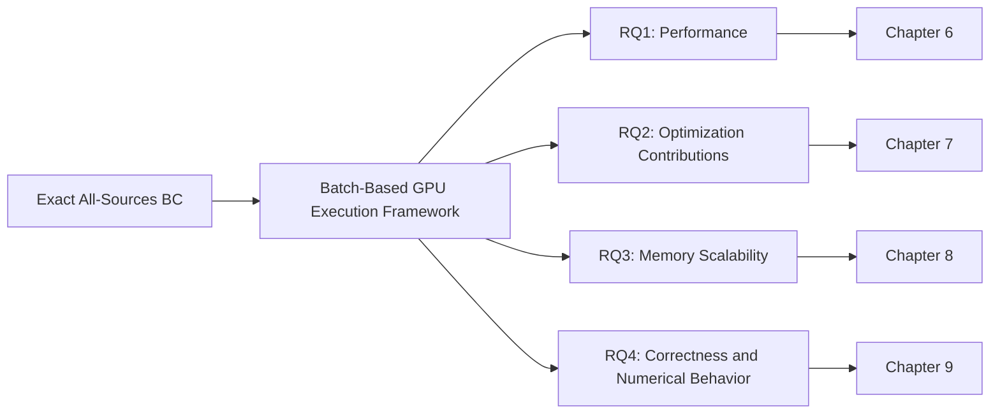

# Chapter 1 Introduction

## 1.1 Motivation

グラフ解析は、要素間の関係を vertex と edge として表現し、個々の要素だけでは捉えにくい構造を明らかにするための基盤である。ネットワーク内で重要な役割を担う vertex を特定することは、構造の理解、脆弱箇所の把握、および情報や交通の流れの分析に直結する。この目的で用いられる代表的な指標の一つが Betweenness Centrality（BC）である。BC は、ある vertex が他の vertex 対を結ぶ shortest path の内部に現れる割合を集約する。したがって、単純な接続数だけでなく、shortest-path structure において異なる領域を橋渡しする vertex の重要性を評価できる [@brandes2001]。

一方、厳密な all-sources BC の計算コストは大きい。非重みグラフに対する Brandes algorithm は、各 source から Breadth-First Search（BFS）を実行し、distance と shortest-path count を求める。続いて、BFS level の逆順に dependency を累積し、その source の寄与を BC vector へ加える。この Forward BFS と Backward Dependency Accumulation を全 vertex について反復するため、一般的な時間計算量は $O(|V|(|V|+|E|))$ となる [@brandes2001]。1 source の処理を効率化するだけでなく、source 間と source 内の並列性を同時に利用する必要がある。

GPU は、多数の source、frontier vertex、および edge を並列に処理できるため、この計算を高速化する有力な基盤である。先行研究は、source-level parallelism と、BFS・dependency accumulation 内の vertex-level または edge-level parallelism を組み合わせた exact GPU BC を示している [@sariyuce2013; @mclaughlin2014]。しかし、graph workload は規則的な密行列計算とは異なる。frontier size は source と BFS level によって変動し、degree distribution は thread や warp 間の workload imbalance を生む。Backward phase も shortest-path DAG（Directed Acyclic Graph; 有向非巡回グラフ）の深さと successor 数に依存する。したがって、固定した並列化粒度だけで各 phase を効率よく処理できるとは限らない。

さらに、source-level parallelism を増やすとメモリ容量の問題が顕在化する。複数 source を同時に処理するには、distance、shortest-path count、dependency、frontier、および traversal order などの source-local state を source ごとに保持しなければならない。この状態量は batch size にほぼ比例する。大きな batch は並列性を増やし得る一方、初期化量と working set を増加させ、GPU memory capacity を制約する。

本研究が対象とする NVIDIA GH200 Grace Hopper Superchip は、Hopper GPU の HBM3（High Bandwidth Memory 3）と Grace CPU の LPDDR5X（Low-Power Double Data Rate 5X）memory を coherent NVLink-C2C で接続する。対象構成の HBM3 は公称最大 96 GB であり、CPU と GPU は coherent memory model を利用できる [@nvidiaGh200Product; @nvidiaGraceHopperInDepth]。CUDA（Compute Unified Device Architecture）の Unified Memory（UM）は、managed allocation、page migration、および prefetch により、GPU と CPU から同じ allocation を扱う仕組みを提供する [@nvidiaCudaProgrammingGuide; @nvidiaCudaRuntimeApi]。この構成は、GPU に近い有限の HBM3 と CPU-side memory を組み合わせ、batch-dependent working set の配置を検討する機会を与える。ただし、UM は追加の無制限な物理容量ではなく、移動や配置の cost も伴う。

以上から、GH200 上の exact BC 実行基盤は、実行時間だけで評価できない。高い並列性を得る計算方式、有限メモリ内で実行可能な batch range、および異なる並列・メモリ経路が生成する BC vector の正確性を併せて検証する必要がある。本研究は、この三者を性能、最適化要因、memory scalability、correctness and numerical behavior の四つの評価観点として統合的に扱う。

## 1.2 Problem Statement

本研究の目的は、無向・非重みグラフに対する exact all-sources BC を GH200 上で効率よく実行する batch-based GPU execution framework を設計し、その性能、構成要素、容量特性、および数値的挙動を評価することである。計算対象は全 vertex を source とする非正規化 BC であり、source sampling による近似は行わない。各 source では shortest-path structure を構築する BFS が必要であり、その後に深い BFS level から浅い level へ backward dependency accumulation を行う。

この問題では、source 間の独立性を利用する source-level parallelism と、各 source 内の不規則な並列性を両立させなければならない。BFS の frontier size は graph structure、source、および level に依存する。degree distribution の偏りは、各 vertex の adjacency scan に必要な仕事量を変え、thread または warp 間の workload imbalance を生む。Backward phase においても、vertex ごとの successor 数と level 幅が並列度を左右する。このため、BFS の探索方向、source と CUDA block の対応、および dependency accumulation の協調粒度を一つの実行フローとして設計する必要がある。

複数 source を batch として同時処理すると、source-level parallelism を明示的に利用できる。一方、source-local state は source batch に比例して増えるため、batch size と GPU memory capacity の間に trade-off が生じる。また、各 batch の状態初期化、BFS level と Backward level の同期、global BC accumulation、および buffer 再利用の同期は、主要計算以外の overhead となる。batch size を増やせばこれらの相対 cost が必ず減るわけではなく、容量超過や競合によって別の cost が生じ得る。

容量を議論するときは、graph file と実行時 working set を区別する必要がある。本研究は、入力 graph file 自体が公称 96 GB の HBM3 を超えたため UM を用いたのではない。on-disk input graph file、in-memory CSR（Compressed Sparse Row）graph storage、および最終 BC vector は、source batch size に比例しない。これに対し、distance、shortest-path count、dependency、frontier、および traversal order は source-local state であり、同時に用意する source 数とともに増える。容量問題の中心は、この batch-dependent working set である。batch と sub-batch は source 集合の grouping であり、graph partition ではない。各 grouping を順に処理して全 source を計算するため、graph topology も BC の厳密性も維持される。

本研究の問題を、次の四つの観点に整理する。

**Performance.** 固定 b512 の主実装が、評価した graph 上で有効な end-to-end performance を示すかを検証する。比較対象として本研究が PathMerge と呼ぶものは、評価用に保存した第三者実装であり、原著論文著者の公式実装とは確認されていない [@pathmergeRepo]。これは external comparator であって ground truth ではない。結論は保存した snapshot、評価環境、対象 graph、および調整条件に限定し、PathMerge 一般へ一般化しない。比較の公平性を高めるため、PathMerge には graph ごとの batch tuning を行い、GPU_Opt は固定条件、両者の代表値は median、speedup は median/median とする。この設定の非対称性も比較条件として明示する。

**Optimization Contributions.** Hybrid BFS、Warp-Cooperative Accumulation、Dual-Stream Execution、および Block Kernel が、観測された性能へどの程度寄与するかを分離して調べる。初期化、計算、global accumulation、および同期の相互作用があるため、個々の要素を独立に発明したと主張するのではなく、共通 BC execution framework 内の構成要素として評価する。効果は graph structure に依存し得るため、測定対象の外へ因果を拡張しない。

**Memory Scalability.** source batch に比例する state を、device-only allocation、UM、および source sub-batching で管理したとき、実行可能な batch size と performance がどう変わるかを調べる。ここでの中心は graph storage の分割ではなく、resident working set の制御である。容量到達性と実行時間を区別し、失敗条件を 0 秒の性能値として扱わない。

**Correctness and Numerical Behavior.** 性能や容量を改善しても、出力 BC vector 全体が妥当でなければ exact BC の実装として十分ではない。したがって、最大 BC のみではなく full-vector correctness を検証し、独立参照との比較と、batch・memory path・実装が異なる場合の consistency を区別する。floating-point update の順序が異なる出力については、mixed absolute-relative tolerance 内の一致と byte identity を別の判定として扱う。

## 1.3 Research Questions

本研究は、前節の四つの観点を次の Research Questions（RQs）として具体化する。

**RQ1 Performance**

評価した4グラフにおいて、固定b512のblock-based GPU_Optは、グラフごとに調整した第三者実装PathMergeより高速か。

この問いには Chapter 6: Performance Evaluation で回答する。

**RQ2 Optimization Contributions**

Hybrid BFS、Warp-Cooperative Accumulation、Dual-Stream ExecutionおよびBlock Kernelは、観測された性能にどの程度寄与するか。

この問いには Chapter 7: Ablation and Kernel Analysis で回答する。

**RQ3 Memory Scalability**

評価した修正版325557グラフにおいて、GPU_Opt、GPU_Opt_Pure、GPU_Opt_Pure_Chunkedのメモリ管理方式は、実行可能なbatch sizeと観測されたメモリ制約にどのような影響を与えるか。

この問いには Chapter 8: Memory Scalability で回答する。

**RQ4 Correctness and Numerical Behavior**

提案実装のBCベクトルは独立参照および異なるメモリ経路とどこまで一致し、どの数値表現・provenance制約が残るか。

この問いには Chapter 9: Correctness and Numerical Behavior で回答する。

Figure 1.1 は、研究対象、共通 GPU 実行基盤、および四つの評価軸の関係を示す概念図案である。本稿では独立した画像 asset を作成せず、図の論理構成だけを示す。

**Figure 1.1: Overview of the research questions, proposed GPU execution framework, and evaluation dimensions.**

## 1.4 Contributions

本研究の貢献は、次の四件に限定する。

**Contribution 1: Integrated GPU Execution Framework.** 無向・非重み graph の exact BC に対し、複数 source をまとめる batch-based GPU execution framework を設計・実装した。共通基盤は、block-based source assignment、Hybrid BFS、Warp-Cooperative Accumulation、Dual-Stream Execution、および global BC accumulation を統合する。これらの個別要素の初出を主張せず、all-sources BC の一貫した計算フローへ統合した点を貢献とする。

**Contribution 2: Performance Evaluation.** 固定 b512 の block-based GPU_Opt と、graph ごとに batch size を調整した第三者実装 PathMerge を、email-EuAll および roadNet-PA/TX/CA で比較した。代表値を median、speedup を median/median とした評価において、中心主張は次の範囲に限定される。固定b512のblock-based GPU_Optは、評価したemail-EuAllおよびroadNet-PA/TX/CAにおいて、グラフごとに調整した第三者実装PathMergeより1.31〜3.17倍高速だった。

**Contribution 3: Component-Level Analysis.** Hybrid BFS、Warp-Cooperative Accumulation、Dual-Stream Execution、および Block Kernel を対象に、H/W/A factorial ablation と forced kernel comparison を行った。修正版325557グラフを含む限定された評価範囲では、Hybrid BFS と Dual-Stream Execution が主要な観測寄与を示し、Warp-Cooperative Accumulation の効果は graph-dependent であった。個別の全数値と評価範囲は Chapter 7 で示す。

**Contribution 4: Memory Scalability and Numerical Analysis.** GPU_Opt、GPU_Opt_Pure、GPU_Opt_Pure_Chunked を、独立した三提案ではなく、共通実行基盤の memory-management variants として統一的に評価した。device-only memory、UM、および source sub-batching の feasibility boundary を比較し、到達可能な batch range が方式によって異なることを示した。さらに、独立参照による full-vector validation と cross-implementation consistency を分けて検証した。Tier A と Tier B の比較は mixed tolerance 内で PASS したが byte-identical ではない。旧 malformed input の結果は historical evidence として保持し、修正版に基づく current conclusion から分離した。

## 1.5 Scope and Limitations

本研究の主性能評価は、NVIDIA GH200 1 台と email-EuAll、roadNet-PA/TX/CA の 4 graph に限定される。RQ1 の主実装は UM を用いる GPU_Opt である。主要比較の PathMerge は第三者実装であり、その provenance 上の制約を伴う。Sequential、OpenMP、および cuGraph を含む supplementary baselines は主として小規模な legacy 結果である。現行 block implementation を含む完全に統一された 7 実装比較ではない。

RQ2、RQ3、および RQ4 のうち修正版325557グラフを対象とする評価は、その 1 graph に限定される。とくに memory scalability の targeted conditions は各条件が小標本であり、方式間の一般的な performance ranking を与えない。RQ2 の H/W/A ablation と kernel comparison も、それぞれ測定した graph 集合にのみ適用される。観測された寄与を RQ1 の road network 結果へ直接因果分解しない。

correctness evidence は強度の異なる二層からなる。Tier A は小規模 3 graph に対する独立 Sequential CPU reference との full-vector validation である。Tier B は修正版325557グラフにおける異なる batch、memory path、および PathMerge を含む cross-implementation consistency であり、independent ground truth ではない。両 tier の全 13 比較は mixed tolerance 内で PASS したが、byte-identical ではない。旧 malformed input で得られた不一致と失敗判定は historical evidence であり、修正版に基づく current conclusion には用いない。

外的妥当性にも制約がある。本研究の観測を他の GPU、未測定 graph、または multi-GPU system へ一般化しない。UM が容量制約を消去することも、Chunked が無制限な batch size を扱えることも主張しない。process RSS、physical HBM residency、host residency、および full-run migration byte total などの指標は取得していない。また、修正版325557グラフは決定的な内部再構成であるが、original generation seed と complete upstream original が不明である。この provenance limitation を含む詳細な妥当性への脅威は Chapter 10 で論じる。

## 1.6 Thesis Organization

**Chapter 2: Background.** BC の定義、Brandes algorithm、BC 計算に含まれる並列性、CUDA execution model、および GH200 memory architecture を説明する。さらに、本研究が扱う計算・容量・数値上の課題を整理する。

**Chapter 3: Related Work.** exact BC、GPU-based BC computation、direction-optimizing BFS、PathMerge と GPU baselines、および Unified Memory と out-of-core processing に関する研究を整理する。本研究が既存要素をどのように統合し、どの範囲を評価するかを位置づける。

**Chapter 4: Proposed GPU Execution Framework.** batch-based source processing、block-based source assignment、Hybrid BFS、dependency accumulation、Dual-Stream Execution、および memory-management variants の設計を示す。GPU_Opt、GPU_Opt_Pure、GPU_Opt_Pure_Chunked を共通基盤上の variation として説明する。

**Chapter 5: Experimental Methodology.** research questions、実験環境、graph datasets、評価実装、parameter settings、統計処理、および PathMerge tuning procedure を規定する。ablation、memory scalability、correctness validation、reproducibility、および方法上の制約も定義する。

**Chapter 6: Performance Evaluation.** 固定 b512 の GPU_Opt と tuned third-party PathMerge の主性能比較を示し、RQ1 に回答する。runtime、speedup、throughput、および supplementary baseline results を、評価範囲の限定とともに報告する。

**Chapter 7: Ablation and Kernel Analysis.** H/W/A ablation により Hybrid BFS、Warp-Cooperative Accumulation、Dual-Stream Execution の観測寄与を分析する。forced shared/block comparison と phase breakdown を併せて示し、RQ2 に回答する。

**Chapter 8: Memory Scalability.** static graph storage と batch-dependent working set を区別し、GPU_Opt、GPU_Opt_Pure、GPU_Opt_Pure_Chunked の targeted feasibility boundary を評価する。source sub-batching と測定上の限界を示し、RQ3 に回答する。

**Chapter 9: Correctness and Numerical Behavior.** Tier A の independent CPU reference と Tier B の corrected-graph cross-implementation consistency を分けて評価する。PathMerge の役割、historical malformed-input evidence、および修正版 graph の provenance limitation を明示し、RQ4 に回答する。

**Chapter 10: Discussion.** RQ1〜RQ4 の結果を横断して、性能と graph characteristics、performance-capacity trade-off、GH200 上での含意、および threats to validity を論じる。観測事実と未検証の解釈を区別し、今後の課題を示す。

**Chapter 11: Conclusion.** 研究課題、提案基盤、評価結果、および四つの Research Questions への回答を要約する。評価範囲内の貢献と、一般化・容量・正確性・provenance に残る制約を整理する。

<!--
Source notes (internal, not reader-facing):
- Chapter/section structure and organization descriptions: docs/thesis/writing/plan.md and writing/japanese/02_background.md through 11_conclusion.md.
- Motivation citations reuse the audited primary keys in Chapters 2 and 3: brandes2001, sariyuce2013, mclaughlin2014, nvidiaGh200Product, nvidiaGraceHopperInDepth, nvidiaCudaProgrammingGuide, and nvidiaCudaRuntimeApi.
- PathMerge provenance and comparator scope: references.bib:pathmergeRepo, SOURCE_AUDIT.tsv:S08, writing/japanese/03_related_work.md, and writing/japanese/05_experimental_methodology.md.
- RQ1 headline (fixed b512, tuned comparator, median/median, 1.31--3.17x): result/tables/thesis/T2_main_performance.tsv and result/CLAIMS.md current status.
- RQ2 current corrected-325557 wording: result/tables/thesis/T3_ablation_summary.tsv and result/ablation/corrected_325557/. The corrected result is not used in RQ1.
- RQ3 graph-file/working-set distinction and feasibility scope: result/tables/thesis/T4_memory_scalability.tsv, raw_data/corrected_325557/job_2404743/implementation_manifest.tsv, and writing/japanese/08_memory_scalability.md.
- RQ4 tiering and non-byte identity: result/tables/thesis/T5_correctness_summary.tsv and writing/japanese/09_correctness_and_numerical_behavior.md.
- Current corrected conclusion follows result/CLAIMS.md, "Gate W7.4". The older malformed-input CORE_FAIL is retained only as historical evidence.
- Figure 1.1 is a concept-only Mermaid draft; no independent image asset was created.
-->
