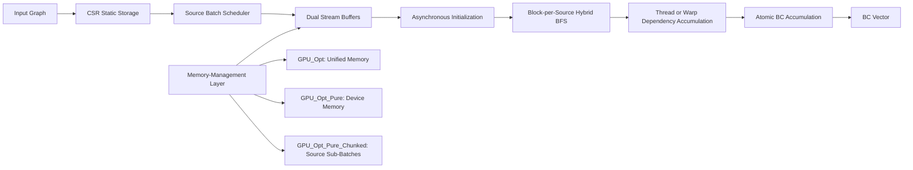
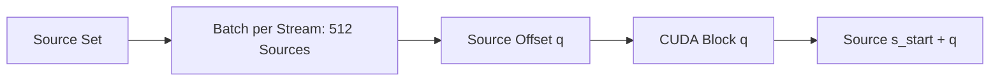
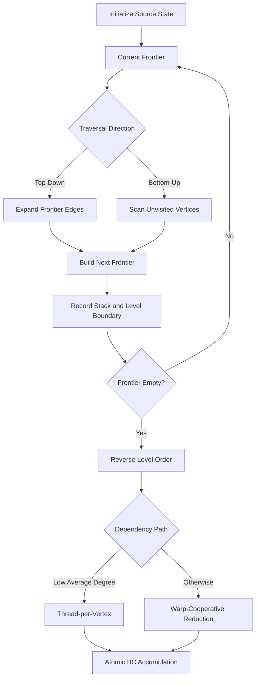
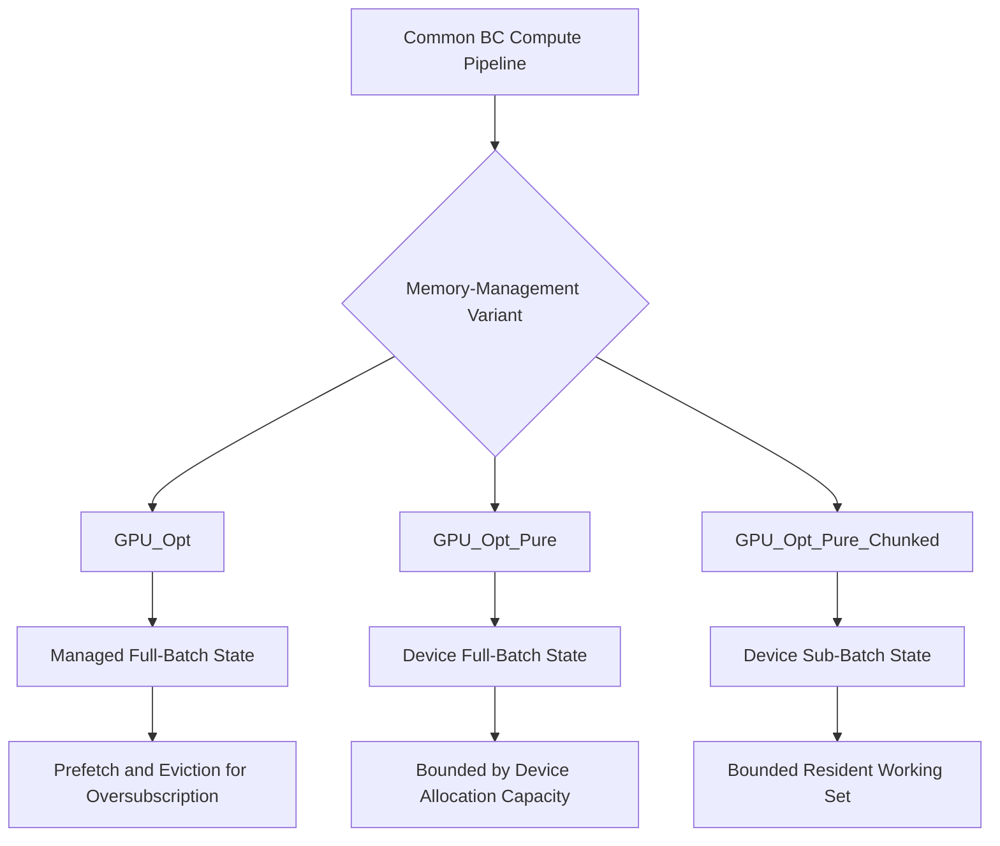

# Chapter 4 Proposed GPU Execution Framework

本章では、無向・非重みグラフに対する exact all-sources Betweenness Centrality（BC）を NVIDIA GH200 上で実行するための、batch-based GPU execution framework を示す。本研究の中心は、Hybrid BFS、block 単位の始点処理、依存度計算における thread/warp 協調経路、Dual-Stream Execution、および source batching を、Brandes アルゴリズム [@brandes2001] の一つの共通実行基盤へ統合した点にある。GPU_Opt、GPU_Opt_Pure、GPU_Opt_Pure_Chunked は互いに独立した 3 手法ではなく、この共通基盤の memory-management variants である。

本章は設計目的と処理フローを対象とする。性能、各構成要素の寄与、容量境界、数値的挙動の実測結果は、それぞれ Chapter 6 から Chapter 9 で評価する。Hybrid BFS、warp-level processing、CUDA streams、Unified Memory（UM）を個別の発明として主張しない。本研究の貢献は、既存の要素技術を BC 計算向けの一貫した GPU 実行基盤へ統合し、同じ計算フロー上でバッチ処理と複数のメモリ管理方式を差し替え可能にしたことである。

## 4.1 Framework Overview

本実行基盤の第 1 の設計目標は、全始点 Brandes 計算に存在する source-level parallelism を GPU 上で明示的に利用することである。入力グラフの全頂点を source とし、複数 source を一つの batch にまとめる。この source batching と 4.3 節で述べる block-based source assignment により、source 間の状態を分離しながら、source 内の頂点・辺並列性も利用できる。

第 2 の目標は、グラフ構造と探索 phase によって変化する並列性へ対応することである。Forward phase では、frontier から辺を展開する top-down traversal と、未訪問頂点から frontier 側を探索する bottom-up traversal をレベル単位で切り替える Hybrid BFS を用いる。Backward phase では、低い平均次数に対する thread-per-vertex path と、それ以外に対する warp-cooperative path を使い分ける。前者は 1 thread が 1 頂点の隣接を走査し、後者は 1 warp の lane が隣接リストを分担して shuffle reduction を行う。

第 3 の目標は、batch ごとに必要となる状態初期化を計算と重畳することである。2 本の CUDA stream と 2 組の状態 buffer を用い、ある stream が BFS と dependency accumulation を実行している間に、もう一方の stream が次 batch の非同期初期化を進められる構造とする。同じ buffer を再利用するときだけ、その buffer を使用した直前の処理完了を待つ。

第 4 の目標は、計算カーネルを保ったまま容量管理を変更できるようにすることである。BC の容量問題は、disk 上の graph file size だけでは説明できない。CSR topology と BC output は static graph storage である一方、距離、最短経路数、依存度、frontier、探索順 stack などは source ごとに必要であり、同時処理する source 数に比例して増える。この batch-dependent working set が HBM capacity を超え得るため、UM を用いる主実装、device memory のみを用いる対照実装、source sub-batch によって同時 resident 量を抑える容量拡張実装を、共通基盤上の選択肢として用意する。

第 5 の目標は、性能、構成要素、容量、数値的挙動を同一の処理基盤で評価可能にすることである。3 つの memory-management variants は、全 source を処理する exact BC、block-per-source の対応、Hybrid BFS、Backward phase、および無向グラフの集計規約を共有する。これにより、アルゴリズム全体を別物へ置き換えず、実行方式の差を明示して比較できる。

入力は、頂点数を $n$、無向辺数を $m$ とする無向・非重みグラフ $G=(V,E)$ である。グラフは CSR 形式で保持し、row pointer $R$ は $n+1$ 要素、adjacency array $C$ は対称化された $2m$ 要素をもつ。$R$ と $C$ は全 source が共有して読み取る static graph storage である。出力は各頂点の非正規化 BC 値を格納する長さ $n$ の vector $CB$ である。

各 source $s$ の計算は、状態初期化、Forward BFS、Backward dependency accumulation、global BC accumulation の順に進む。Forward BFS は距離 $d_s(v)$ と最短経路数 $\sigma_s(v)$ を求め、到達頂点を BFS level 順に stack $S_s$ へ記録する。Backward phase は $S_s$ を深い level から逆順にたどり、依存度 $\delta_s(v)$ を計算する。最後に $s$ 自身を除く各頂点の寄与を $CB$ へ加算する。無向グラフでは source-target の対称な重複を補正するため、加算時に寄与を 2 で除する。

Figure 4.1 は、共通計算フローと memory-management layer の関係を示す作成予定の概念図案である。図の上段が全 variant に共通する処理、下段が差し替え可能なメモリ管理方式である。



**Figure 4.1: Overall Framework.**

本章で明示する Figure 4.1 から Figure 4.5 は作成予定の5つの図案であり、図内文字と caption 案はすべて英語とする。本段階では概念図案だけを示し、画像ファイルは生成しない。

この構造で重要なのは、メモリ方式が source の意味や Brandes の計算順序を変更しないことである。batch と sub-batch は source 集合の grouping であり、graph partition ではない。outer loop は $V$ の全 source を処理し、sub-batch を用いる場合も `num_subs` 回の反復によって要求 batch 内の全 source を処理する。したがって、source sampling や近似計算は導入しない。

## 4.2 Batch-Based Source Processing

全 source は outer loop で batch に分けられ、1 stream 当たり `BATCH_PER_STREAM` 個ずつ処理される。outer loop の開始 source を $s_{start}$、当該 batch の source 数を $b$ とする。各 source の動的状態は `batch_idx × n` の offset で分離され、CSR topology と最終 $CB$ vector は batch 内および stream 間で共有される。source と CUDA block の具体的な対応は 4.3 節で述べる。

source $q$ ごとに保持する主な状態は、距離 `d_d`、最短経路数 `d_sigma`、依存度 `d_delta`、現在・次 frontier の `d_Q_curr` と `d_Q_next`、探索順 `d_S`、level 境界 `d_S_ends`、最終 depth `d_depth` である。`d_d`、2 本の frontier、`d_S` は $n$ 要素の `int`、`d_sigma` と `d_delta` は $n$ 要素の `double` である。depth 上限の推定値を $D_{est}$ とすると、1 source 当たりの code-derived state size は

$$
M_{source}=32n+4D_{est}+8 \quad \mathrm{bytes}
$$

となる。この値は配列寸法から得た allocation size であり、実測した process RSS、physical HBM residency、host residency、migration bytes ではない。

本論文では、batch と容量に関する用語を次のように区別する。

| Term | Definition |
|---|---|
| Graph File Size | On-disk size of the input graph representation |
| Static Graph Storage | CSR topology and the final BC vector, independent of source batch size |
| Batch-Dependent Working Set | Per-source state multiplied by the number of simultaneously provisioned or resident sources |
| Requested Batch | Source count requested by the user or selected by the default policy, per stream |
| Effective Batch | Source count actually used by the outer batch loop after implementation-side decisions |
| `SUB_BATCH` | Maximum source count processed by one sub-launch when a batch is split |
| `num_subs` | Number of sub-launches, $\lceil EffectiveBatch/SUB\_BATCH\rceil$ |
| `NS_eff` | Effective number of simultaneously active stream buffers |
| HBM Capacity | Finite on-package GPU memory capacity |
| Host Memory | Finite CPU-side physical memory, also subject to resource and cgroup limits |
| Unified Memory | Managed allocation and placement mechanism spanning CPU/GPU access; not additional physical capacity |

requested batch は、既定 policy が選ぶ値または実行時指定値である。effective batch は outer loop が用いる実処理単位であり、末尾 batch の `curr_batch` は残り source 数に応じてさらに小さくなり得る。`SUB_BATCH` は effective batch を 1 回以上の kernel launch へ分けるときの上限であり、`num_subs=1` なら分割は発生しない。`NS_eff` は通常の in-capacity 実行では 2 であり、oversubscription 経路では同時 resident working set を抑えるため 1 になる。

GPU_Opt の主要性能条件は、1 stream 当たり requested batch 512、effective batch 512、2 streams、`SUB_BATCH=512`、`num_subs=1`、`NS_eff=2` である。したがって、b512 は 2 streams 全体を合わせた source 数ではなく、1 stream が受け持つ batch size を表す。2 組の buffer を考慮した batch-dependent allocation の基本形は、UM と Pure では

$$
M_{work}\approx NS_{eff}\times EffectiveBatch\times M_{source}
$$

である。Chunked の同時 resident estimate では `EffectiveBatch` の代わりに `SUB_BATCH` を用いる。いずれの式にも、CSR topology、$CB$ vector、runtime overhead などの static または補助領域が別途加わる。

Algorithm 4.1 に、共通基盤の batch 処理を示す。擬似コードは通常の 2-stream in-capacity 経路と、必要に応じた sub-batch 分割の双方を表す。具体的な allocation、prefetch、eviction の動作は 4.7 節の variant に依存する。

**Algorithm 4.1: Batch-Based All-Sources BC Processing**

```text
Input: CSR graph (R, C), source set V, requested batch B
Output: Betweenness-centrality vector CB

1:  Initialize CB to zero
2:  Select EffectiveBatch, SUB_BATCH, num_subs, and NS_eff
3:  Allocate stream-local state buffers using the selected memory variant
4:  for s_start = 0 to |V| - 1 step EffectiveBatch do
5:      stream_id <- (s_start / EffectiveBatch) mod NS_eff
6:      Wait only if the selected stream buffer is still in use
7:      curr_batch <- min(EffectiveBatch, |V| - s_start)
8:      for sub_offset = 0 to curr_batch - 1 step SUB_BATCH do
9:          sub_count <- min(SUB_BATCH, curr_batch - sub_offset)
10:         Prepare or reset source-local state asynchronously
11:         Launch HybridBFS for the current sources
12:         Prefetch the next sub-batch when supported
13:         Launch DependencyAccumulation for the current sources
14:         Accumulate source dependencies into CB
15:         Evict the current sub-batch when required
16:     end for
17: end for
18: Synchronize active streams and return CB
```

## 4.3 Block-Based Source Assignment

現行の既定 BFS カーネルでは、batch 内の各 source を一つの CUDA block に割り当てる。すなわち、1 block = 1 source であり、block 内の thread が当該 source の frontier と隣接辺を協調して処理する。当該 batch の source 数を $b$ とすると、block kernel は grid size を $b$ として起動される。`blockIdx.x=q` の block は source $s=s_{start}+q$ を担当する。この対応により、異なる block が同じ source-local state を共有せず、各 block は source 内の頂点・辺並列性を利用できる。

現行方式の既定は常に block kernel である。旧実装には `avg_deg < 5`、すなわち平均次数が 5 未満のとき shared-frontier kernel を選ぶ自動規則が存在したが、現在は使用していない。再現実験用の forced shared/block 切替は残されているものの、通常実行の選択則には含めない。したがって、本章でいう block-per-source は現行の既定計算経路を指す。この旧規則は BFS kernel の選択に関するものであり、4.5 節で述べる Backward phase の `avg_deg < 8` に基づく thread/warp 切替とは別である。

Figure 4.2 は、stream ごとの source batch から block kernel の CUDA block への対応を示す作成予定の概念図案である。



**Figure 4.2: Batch-to-Source Mapping.**

## 4.4 Hybrid BFS

Hybrid BFS は CPU と GPU を組み合わせる方式ではなく、GPU 上の BFS traversal direction を top-down と bottom-up の間で切り替える direction-optimizing BFS である [@beamer2012]。切替は source ごと、BFS level ごとに block 内で行う。各 source は現在 frontier `Q_curr`、次 frontier `Q_next`、距離 $d$、最短経路数 $\sigma$ を保持する。

top-down path では、block 内の thread が `Q_curr` の頂点を分担し、各頂点の adjacency list を走査する。未訪問頂点 $w$ に対して `atomicCAS` で距離 $d_s(w)=depth+1$ を確定し、`Q_next` へ追加する。同じ shortest-path level へ到達する複数の親があるため、$\sigma_s(w)$ は `atomicAdd` で累積する。この方向は frontier から外向きに辺を調べる。

bottom-up path では、block 内の thread が未訪問頂点を分担し、各頂点の隣接先に現在 level の到達済み頂点があるかを調べる。該当する親の $\sigma$ を合計し、正の和が得られた頂点を次 frontier へ追加する。この方向は、frontier が大きいときに同じ隣接領域を繰り返し展開することを避けることを意図する。

方向選択には、frontier に接続する辺数の近似 $m_f$、未探索側の残り辺数の近似 $m_u$、現在 frontier size $|Q|$ を用いる。現行実装は $\alpha=14$、$\beta=24$ とし、top-down から bottom-up へは

$$
m_f > \frac{m_u}{\alpha}
$$

のとき、bottom-up から top-down へは

$$
|Q| < \frac{n}{\beta}
$$

のときに切り替える。Hybrid BFS を無効にした ablation 経路では、全 level を top-down で処理する。切替閾値は既存の direction-optimizing BFS に基づくものであり、本研究が個別に発明したものではない。

各 level の終了時には、次 frontier を `S` へ追記し、累積終端位置を `S_ends` に記録する。`S` は到達頂点の BFS 順、`S_ends` は level の境界を表す。この記録により、Backward phase は predecessor list を別途 materialize せず、距離と adjacency list を用いて深い level から dependency を計算できる。推定した最大 depth を超えた場合は overflow flag を設定し、誤った状態のまま処理を継続しない。

Figure 4.3 は、Forward phase から Backward phase までの state transition を示す作成予定の処理フロー案である。



**Figure 4.3: Hybrid BFS State Transition.**

## 4.5 Dependency Accumulation

Forward phase の完了後、各 source $s$ について `S_ends` が示す最深 level から 1 level ずつ戻り、Brandes の dependency を計算する。頂点 $w$ の次 level にある隣接頂点集合を

$$
Succ_s(w)=\{v\mid (w,v)\in E,\ d_s(v)=d_s(w)+1\}
$$

とすると、依存度は

$$
\delta_s(w)=\sum_{v\in Succ_s(w)}
\frac{\sigma_s(w)}{\sigma_s(v)}\left(1+\delta_s(v)\right)
$$

で求める。同じ level 内の頂点は次 level の $\delta$ だけを参照するため、level 間では同期し、level 内では頂点を並列に処理できる。

現行実装は、平均次数に基づいて 2 つの計算 path を使い分ける。平均次数が 8 未満の場合は thread-per-vertex path を用いる。block 内の各 thread が level 内の頂点 $w$ を一つずつ受け持ち、その adjacency list を逐次走査して上式の和を計算する。隣接数が小さい場合に、1 頂点へ 32 lane を割り当てることによる lane の未使用を避ける意図がある。

平均次数が 8 以上の場合は warp-cooperative path を用いる。1 warp が 1 頂点 $w$ を受け持ち、lane $\ell$ は adjacency list の $\ell,\ell+32,\ell+64,\ldots$ 番目を走査する。各 lane の部分和を warp shuffle によって reduction し、lane 0 が $\delta_s(w)$ を格納する。頂点間は複数 warp で並列化される。この thread/warp 選択は Backward phase の規則であり、現在使用していない旧 shared-frontier BFS の `avg_deg < 5` 規則とは別物である。

各 source の $\delta_s$ が得られた後、block 内の thread は頂点集合を stride 走査し、$v\neq s$ の寄与を global $CB[v]$ へ `atomicAdd` する。複数 source の block および 2 streams が同じ $CB[v]$ を更新し得るため、global accumulation には atomic operation が必要である。無向グラフでは寄与 $\delta_s(v)/2$ を加算する。

Warp-Cooperative Accumulation は常に有利であると仮定しない。現行基盤は thread と warp の双方を実装し、通常経路では平均次数により選択する。また、ablation 用実装はこの選択を compile-time に固定し、Hybrid BFS、warp cooperation、Dual-Stream Execution の組合せを同じ基盤上で比較できる。観測された寄与と graph dependence は Chapter 7 で扱う。

## 4.6 Dual-Stream Execution

in-capacity の通常実行では、`NS=2` の CUDA streams と 2 組の source-state buffers を用いる。outer batch は stream 0 と stream 1 へ round-robin に割り当てられる。各 stream 内では、状態初期化、BFS、Backward phase の順序を保つ。一方、異なる stream 間には全体同期を置かないため、片方の stream の kernel execution と、他方の stream の `cudaMemsetAsync` による初期化を重畳できる。

初回利用時は、距離配列を $-1$、$\sigma$ と $\delta$ を 0 へ非同期初期化する。buffer を同じ source-local 範囲で再利用できる場合は、直前の `S` と level 境界を用い、到達済み頂点だけを reset する経路を選択できる。BFS kernel 内では source 自身について $d_s(s)=0$、$\sigma_s(s)=1$、初期 frontier と stack の 1 要素を設定するだけであり、source ごとの $O(n)$ 初期化を単一 thread に行わせない。

buffer を再利用する前には、その stream の直前 Backward event だけを待つ。例えば stream 0 の buffer を次に使う時点で stream 0 の完了を確認するが、stream 1 を同時に全体同期しない。この局所的な同期境界により、buffer の競合を防ぎながら stream 間の overlap を維持する。

Figure 4.4 は、2-stream pipeline の作成予定の timeline 案である。横方向は時間を表し、同じ列で上下に重なる区間は並行実行の候補である。

```text
Time      T0              T1              T2              T3
Stream 0  Init Batch 0    Compute Batch 0                  Init Batch 2
Stream 1                  Init Batch 1    Compute Batch 1
Buffer 0  Prepare         In Use                          Reuse After Event
Buffer 1                  Prepare         In Use
```

**Figure 4.4: Dual-Stream Timeline.**

2-stream は固定されたあらゆる条件で必ず使用されるわけではない。batch-dependent working set が HBM budget を超えると判定された UM および Chunked の経路では、同時 resident 量を抑えるため `NS_eff=1` とする。したがって、設計上の requested stream count `NS=2` と、当該実行で実際に用いる `NS_eff` を区別する。主要性能条件は in-capacity であり、1 stream 当たり batch 512、2 streams、`NS_eff=2` である。

## 4.7 Memory Management Variants

3 variants は共通の source scheduling と GPU kernels を共有し、主に CSR、source-local state、$CB$ の allocation と placement を変更する。Figure 4.5 は、その関係を示す作成予定の概念図案である。



**Figure 4.5: Memory Management Variants.**

### 4.7.1 GPU_Opt

GPU_Opt は UM を使用する主実装である。CSR topology、source-local state、$CB$ を managed allocation として確保し、静的な CSR には read-mostly の memory advice を与える。CSR topology が device memory の所定割合より小さい場合は GPU 側へ prefetch し、それ以外では host 側を preferred location としつつ GPU からアクセス可能にする。ここで対象としているのは static graph storage の配置方針であり、disk 上の graph file size そのものではない。

source-local state は 1 stream 当たり effective batch 全体に対して managed allocation される。in-capacity では 2 stream 分を GPU へ事前配置し、`SUB_BATCH=EffectiveBatch`、`num_subs=1`、`NS_eff=2` とする。主要性能条件では、この値が 1 stream 当たり 512 source である。

要求 batch に対応する dynamic allocation estimate が実行開始時の free HBM budget を超えると、GPU_Opt は oversubscription 経路へ入る。この経路では `NS_eff=1` とし、HBM budget と index-safety bound から `SUB_BATCH` を決める。現在の sub-batch を GPU 側へ prefetch して初期化・BFS・Backward を実行し、必要に応じて次 sub-batch の prefetch と現在の計算を組み合わせ、再利用しない state を host 側へ evict する。ただし、managed allocation 自体は effective batch 全体に対して行われ、`SUB_BATCH` は主に 1 回に処理・prefetch する source 範囲を表す。

UM を用いる理由は、graph file が HBM3 の公称容量を超えるからではない。graph file、CSR topology、$CB$ と、batch-dependent working set は別の量である。多数 source の状態を同時に確保する working set が device memory capacity を超え得るため、有限の HBM と host memory の間で managed placement と migration を利用できる実装を用意する。UM は物理メモリを増やす機構ではなく、host memory、resource limit、cgroup、page migration、runtime overhead の制約を受ける。したがって、OOM を完全に回避するとは位置づけない。

### 4.7.2 GPU_Opt_Pure

GPU_Opt_Pure は、BC 計算に用いる CSR topology、source-local working arrays、$CB$ を `cudaMalloc` による device memory に配置する対照実装である。UM の placement advice、prefetch、eviction を用いず、1 stream 当たり effective batch 全体の state を 2 組確保する。BFS、dependency accumulation、block-per-source mapping、2-stream scheduling は共通基盤と同じである。

この方式は memory path が明確であり、working set が HBM capacity 内に収まる条件の対照を提供する。一方、必要な full-batch device allocation が利用可能な device memory を超える場合、allocation は失敗し得る。host memory を device allocation の代替として暗黙に利用しないため、UM の容量経路と比較する基準になる。Pure の役割は独立したアルゴリズム提案ではなく、device-only memory-management control である。

### 4.7.3 GPU_Opt_Pure_Chunked

GPU_Opt_Pure_Chunked は、Pure と同様に BC の主要配列を device memory に置きながら、source-local state の実 buffer を effective batch 全体ではなく `SUB_BATCH` source 分だけ確保する容量拡張実装である。outer loop の requested/effective batch の意味は維持し、その内部を `num_subs=\lceil EffectiveBatch/SUB\_BATCH\rceil` 回に分割する。各 sub-batch は buffer の先頭を再利用し、source offset だけを進める。

`SUB_BATCH` は、free HBM の一定割合から CSR topology と $CB$ を差し引いた budget、および flattened index が `int` の範囲を超えないための

$$
SUB\_BATCH \le \left\lfloor\frac{INT\_MAX}{n}\right\rfloor
$$

という上限を考慮して決める。要求 batch に対する full working set が容量超過と判定された場合は `NS_eff=1` とし、同時 resident estimate を概ね `SUB_BATCH × M_source` に抑える。batch を分割しても全 source を順に処理するため、graph partition、source sampling、近似 BC にはならない。

Chunked の目的は、resident working set を明示的に制御し、試験可能な batch range を拡張することである。実行可能性は、`SUB_BATCH` buffer 自体、static storage、index range、device runtime、実行時間、その他の有限資源に依存する。したがって、requested batch を無制限に扱える、またはあらゆる条件で OOM を回避できるとは主張しない。

## 4.8 Expected Effects and Trade-Offs

本節では、Implementation Summary に相当する要約を残しながら、共通実行基盤に期待される効果と設計上の trade-off を整理する。表中の各要素は個別の新規発明ではなく、all-sources BC の一つの実装へ統合された構成要素である。性能、各構成要素の寄与、容量境界、数値的挙動の実測結果の詳細は Chapter 6 から Chapter 9 に委ねる。

**Table 4.1: Implementation summary of the proposed GPU execution framework.**

| Component | Current Implementation | Role |
|---|---|---|
| Graph Representation | Undirected, unweighted CSR | Shared static topology |
| Source Scheduling | Batched outer loop | Expose source-level parallelism |
| Source Assignment | One CUDA block per source | Isolate source state and enable intra-source cooperation |
| Forward Phase | Hybrid top-down / bottom-up BFS | Adapt traversal direction by BFS level |
| Backward Phase | Thread-per-vertex or warp-cooperative path | Adapt dependency accumulation granularity |
| Global Accumulation | Atomic update with undirected correction | Merge concurrent source contributions |
| Stream Pipeline | Two streams and double buffers in capacity | Overlap initialization and computation |
| Main Performance Setting | Batch 512 per stream, two streams, `NS_eff=2` | Fixed evaluation configuration |
| GPU_Opt | Unified Memory | Main implementation and managed-capacity path |
| GPU_Opt_Pure | Device memory | Device-only control |
| GPU_Opt_Pure_Chunked | Device sub-batch buffers | Resident working-set control and capacity extension |

実装上、通常の GPU_Opt は Hybrid BFS を有効にし、BFS kernel は常時 block を既定とする。Backward phase は平均次数 8 未満で thread-per-vertex、それ以外で warp-cooperative path を選ぶ。in-capacity では `NS_eff=2` で batch を 2 streams へ交互に投入し、oversubscription 経路では容量制御を優先して `NS_eff=1` とする。主要性能条件は 1 stream 当たり batch 512、2 streams、`SUB_BATCH=512`、`num_subs=1`、`NS_eff=2` である。

batch-based processing と block-based source assignment に期待される効果は、source-level parallelism を明示しながら、block 内で source-local な frontier と隣接辺を協調処理できることである。一方、source-local state は同時に用意する source 数に比例するため、batch を大きくすると batch-dependent working set も増える。したがって、batch size は graph file size とは独立した容量要因として扱う必要がある。

Hybrid BFS は BFS level ごとの frontier 状態に応じて traversal direction を選び、Backward phase の thread/warp 切替は平均次数に応じて dependency accumulation の粒度を選ぶ。ただし、いずれの経路が有利かは graph structure と phase に依存し、direction switching、frontier 管理、atomic operation、lane utilization の cost を伴う。Warp-Cooperative Accumulation が常に有利であるとは仮定せず、その寄与は Chapter 7 で評価する。

Dual-Stream Execution は、異なる buffer を用いる初期化と計算の overlap を可能にする一方、in-capacity では 2 組の source-state buffers を必要とする。容量制御が優先される oversubscription 経路では `NS_eff=1` とするため、常に dual-stream overlap が得られるとは限らない。

3 つの memory-management variants は、同じ計算カーネルのまま配置と resident working set の扱いを比較可能にする。GPU_Opt は UM による placement と migration を利用できるが、UM は無制限の容量ではなく、有限の HBM、host memory、runtime overhead の制約を受ける。GPU_Opt_Pure は device-only の明確な対照を与えるが、full-batch allocation は利用可能な device memory に制約される。GPU_Opt_Pure_Chunked は sub-batch により resident working set を制御するが、複数 launch と有限資源の制約を残す。このため、いずれの方式も無条件の容量保証とは位置づけない。

本研究の方法上の新規性は、Hybrid BFS、warp processing、streams、UM の個別発明ではない。貢献は、これらを block-based source processing と batch scheduling を中心とする BC 計算向け GPU 実行基盤へ統合したこと、同じ計算基盤上で UM、device-only、source-chunked のメモリ管理を統一的に実装したこと、そして性能、要因、容量、数値挙動を同一の処理基盤で評価可能にしたことである。以降の Chapter 5 は評価方法を定義し、Chapter 6〜9 はそれぞれ性能、構成要素、容量、数値的挙動を評価する。Chapter 10 はそれらの関係と適用範囲を考察し、Chapter 11 は結論をまとめる。

<!--
Source notes (not reader-facing):

Current implementation and checkpoint alignment
- Current relevant implementation files are identical to checkpoint 45352a344aaac463283a647467b790be9b45bfb8 (`git diff 45352a3 -- <relevant files>` was empty).
- Against `code_snapshots/phase_def_block_20260710`, `host_pure.cu`, `host_chunked.cu`, `host_ablation.cu`, `brandes_kernels.cuh`, and `common.hpp` are identical. Current `host_um.cu` adds default-off diagnostic switches and path counters; the normal compute path is unchanged.

Graph input and timing
- `src/core/graph.cpp:25-85`: `Graph::readGraph`, CSR input allocation and validation.
- `src/core/graph.cpp:92-97`: adjacency array and row-pointer accessors.
- `src/core/runner.cpp:136-155`: whole-implementation timing and GTEPS definition.

Common source mapping and kernels
- `include/proposed/brandes_kernels.cuh:11-18`: source-local batch offsets.
- `include/proposed/brandes_kernels.cuh:24-150`: `find_shortest_paths_opt`, Hybrid BFS, alpha/beta switching, frontier/stack recording.
- `include/proposed/brandes_kernels.cuh:156-233`: warp-cooperative and thread-per-vertex dependency accumulation.
- `include/proposed/brandes_kernels.cuh:260-296`: `brandes_bfs_kernel_opt`, `blockIdx.x` to source mapping.
- `include/proposed/brandes_kernels.cuh:300-350`: Backward kernels, global atomic accumulation, undirected division by two.
- Snapshot mirror: `code_snapshots/phase_def_block_20260710/include/proposed/brandes_kernels.cuh:24-350`.

GPU_Opt batching, streams, and Unified Memory
- `src/proposed/host_um.cu:121-135`: asynchronous initialization and two-stream double-buffering design.
- `src/proposed/host_um.cu:147-215`: enabled Hybrid BFS, state buffer layout, sub-batch prefetch/memset/eviction helpers.
- `src/proposed/host_um.cu:227-264`: graph-dependent launch settings, default block kernel, two streams.
- `src/proposed/host_um.cu:266-353`: per-source memory formula, requested batch, oversubscription, `SUB_BATCH`, `num_subs`, `NS_eff`, managed allocations.
- `src/proposed/host_um.cu:418-565`: outer batch/sub-batch loops, stream-local synchronization, reset/init, block BFS, thread/warp Backward selection, prefetch/eviction.
- `src/proposed/host_um.cu:650-718`: CSR managed allocation, read-mostly advice, topology placement, managed BC vector.
- Performance snapshot counterparts: `code_snapshots/phase_def_block_20260710/src/proposed/host_um.cu:220-549` and `:634-704` (line offsets differ because later default-off diagnostics are absent).

Pure and Chunked variants
- `src/proposed/host_pure.cu:92-157`: two-stream full-batch device allocations.
- `src/proposed/host_pure.cu:181-259`: batch loop, asynchronous reset/init, block BFS, thread/warp Backward selection.
- `src/proposed/host_chunked.cu:93-184`: two-stream design, HBM/index bounds, `SUB_BATCH`, `num_subs`, sub-batch-sized device allocations.
- `src/proposed/host_chunked.cu:205-306`: source sub-batch loop, buffer reuse, block BFS, thread/warp Backward selection.
- Snapshot mirrors: `code_snapshots/phase_def_block_20260710/src/proposed/host_pure.cu:92-259`; `code_snapshots/phase_def_block_20260710/src/proposed/host_chunked.cu:93-306`.

Ablation implementation
- `src/proposed/host_ablation.cu:90-125`: compile-time H/W/A implementation and one-/two-stream selection.
- `src/proposed/host_ablation.cu:165-210`: asynchronous initialization, Hybrid BFS, warp/thread Backward dispatch.

Saved execution metadata
- `raw_data/corrected_325557/job_2404743/implementation_manifest.tsv:2-12`: requested/effective batch, `SUB_BATCH`, `num_subs`, `NS_eff`, allocation estimates, and memory paths for the corrected-input evaluation.
- `raw_data/corrected_325557/job_2404743/MANIFEST.txt:1`: checkpoint 45352a344aaac463283a647467b790be9b45bfb8.
- `raw_data/corrected_325557/job_2406254/MANIFEST.txt:1`: same checkpoint for corrected-input ablation.
-->
