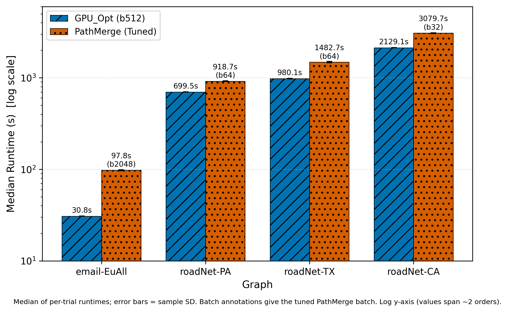
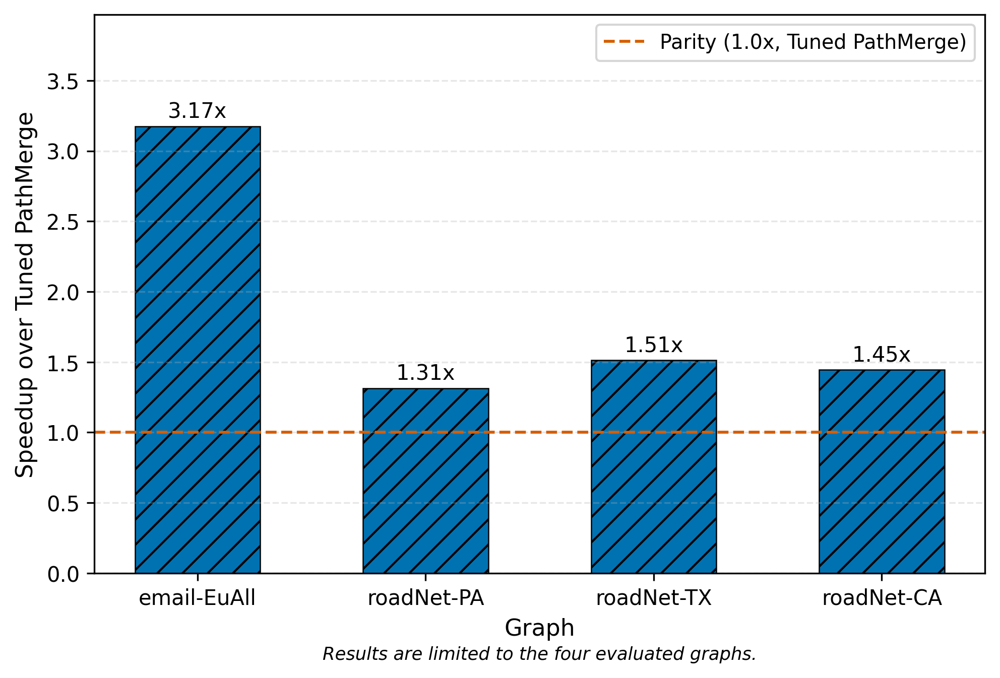
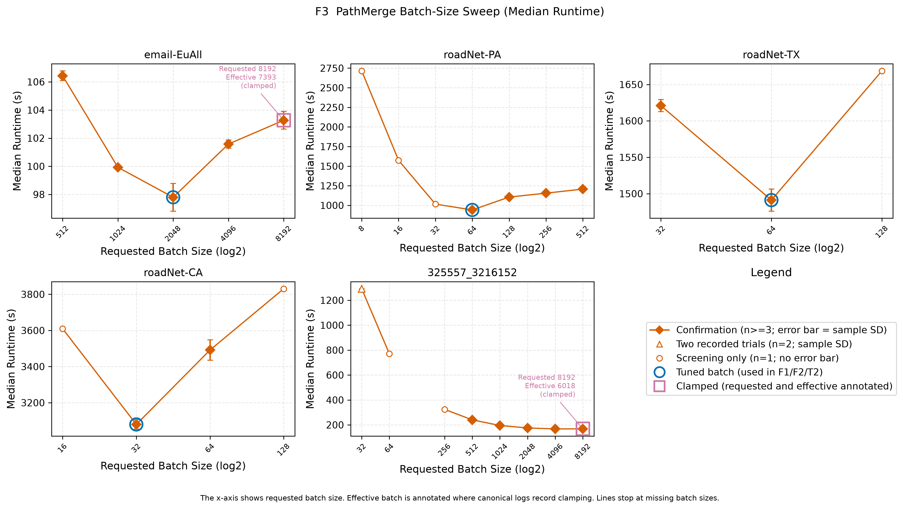

# Chapter 6 Performance Evaluation

本章では、RQ1（性能）に回答する。RQ1 は「評価した 4 グラフにおいて、固定バッチ b512 の block ベース GPU_Opt は、グラフごとに調整した第三者実装 PathMerge より高速か」である（5.1 節）。評価方法（計算機環境、グラフ、実行設定、計時・統計処理、tuning 手続き）はすべて Chapter 5 で規定したとおりであり、本章では新しい実験条件を導入しない。

主要比較は、提案するバッチ型 GPU 実行基盤の主実装 GPU_Opt（Unified Memory、常時 block カーネル、全グラフ共通の固定バッチ b512）と、グラフごとにバッチサイズを調整した tuned PathMerge である。対象は email-EuAll、roadNet-PA、roadNet-TX、roadNet-CA の 4 グラフに限定される。報告する指標は median 実行時間、GTEPS、speedup であり、集計はすべて 5.6 節の定義（主値 median、speedup は median 同士の比、GTEPS は全実装統一式）に従う。

本章で比較対象とする PathMerge は、Galliot（path-merging 型 BC アルゴリズム）[@zheng2023galliot; @zheng2023jsac] の第三者実装であり、上流リポジトリ `gobardhanm/path-merging-bc`（評価時 snapshot `9c231b46`）[@pathmergeRepo] を adapter 化して測定した（5.4 節）。これは原著論文著者による公式実装ではなく、external comparator であって ground truth ではない。したがって本章の結果は、評価に用いたこの実装・環境・4 グラフに限定され、PathMerge/Galliot アルゴリズム一般や原著者の公式実装への優劣を意味しない。

本章は観測された性能の記述に限定する。各最適化（Hybrid BFS、Warp-Cooperative Accumulation、Dual-Stream Execution、block カーネル）の寄与は Chapter 7、メモリ管理方式の容量特性は Chapter 8、BC 出力の数値的一致は Chapter 9、要因の総合的な考察は Chapter 10 で扱う。GPU_Opt_Pure および GPU_Opt_Pure_Chunked は同一実行基盤におけるメモリ管理方式のバリエーションであり（5.4 節）、独立した提案ではないため、その評価は主に Chapter 8 で行う。

## 6.1 Main Runtime Comparison

主性能比較の結果を Table 6.1 に、median 実行時間の比較を Figure 6.1 に示す。GPU_Opt（分子）は SourceSnapshotID `phase_def_block_20260710` における固定 b512（1 ストリーム当たり 512 ソース、in-capacity、要求・実効バッチとも 512、SUB_BATCH=512、num_subs=1、NS_eff=2）の測定である。PathMerge tuned（分母）は 5.7 節の手続きで確定したグラフ別バッチ（email-EuAll は b2048、roadNet-PA/TX は b64、roadNet-CA は b32）による測定である。試行数は GPU_Opt が email-EuAll で n=5・roadNet 各グラフで n=3、PathMerge が各 n=3 であり、warmup は行っていない（5.5 節、5.6 節）。

**Table 6.1: Main performance results on the four evaluated graphs. Times are medians over the recorded trials; Speedup = tuned-PathMerge median / GPU_Opt median; GTEPS = Nodes × Edges / Time_sec / 10^9 computed from the median time.**

| Graph | Nodes | Edges | GPU_Opt Batch | GPU_Opt Trials | GPU_Opt Median Time [s] | GPU_Opt GTEPS | PathMerge Tuned Batch | PathMerge Trials | PathMerge Median Time [s] | PathMerge GTEPS | Speedup |
|---|--:|--:|:--:|--:|--:|--:|:--:|--:|--:|--:|--:|
| email-EuAll | 265009 | 364481 | b512 | 5 | 30.81 | 3.14 | b2048 | 3 | 97.80 | 0.99 | 3.17 |
| roadNet-PA | 1088092 | 1541898 | b512 | 3 | 699.52 | 2.40 | b64 | 3 | 918.67 | 1.83 | 1.31 |
| roadNet-TX | 1379917 | 1921660 | b512 | 3 | 980.13 | 2.71 | b64 | 3 | 1482.68 | 1.79 | 1.51 |
| roadNet-CA | 1965206 | 2766607 | b512 | 3 | 2129.10 | 2.55 | b32 | 3 | 3079.72 | 1.77 | 1.45 |

<!-- canonical artifact: T2_main_performance (internal ID: T2); Nodes/Edges from T1_graph_metadata -->
> Source: `result/tables/thesis/T2_main_performance.tsv`; Nodes/Edges are the undirected counts of Table 5.3. GPU_Opt raw: `raw_data/main_performance/proposed_variants/<graph>/_run/job_2357334_20260711/results.tsv`. PathMerge raw: email-EuAll and roadNet-CA from `raw_data/tuning/pathmerge/<graph>/pathmerge_bc/job_multi_20260710/pathmerge_sweep_results.tsv`; roadNet-PA/TX from `raw_data/main_performance/seven_implementations/legacy_partial/large/no_gpu_opt/job_notrecorded_legacy/results_no_gpu_opt.tsv` (same-b64 legacy baseline, 6.3). The GPU_Opt batch is fixed at 512 sources per CUDA stream (dual-stream execution, NS_eff=2) on all four graphs.

評価した 4 グラフすべてにおいて、GPU_Opt の median 実行時間は tuned PathMerge より短かった。email-EuAll では 30.81 s 対 97.80 s であり、差が最も大きい。roadNet-PA/TX/CA では 699.52 s 対 918.67 s、980.13 s 対 1482.68 s、2129.10 s 対 3079.72 s であり、いずれも GPU_Opt が短い。

Figure 6.1 は同じ median 実行時間を絶対値で対比したものである。4 グラフの実行時間は約 31 s から約 3080 s まで 2 桁にわたるため、縦軸は対数軸（log scale）であり、単位は seconds である。email-EuAll の値が roadNet 系より 1 桁以上小さいが、対数軸によりいずれの棒も読み取れる。棒上の注記は tuned PathMerge の採用バッチ、エラーバーは標本標準偏差を示す。

**Figure 6.1: Median runtime of GPU_Opt (fixed b512) and tuned PathMerge on the four evaluated graphs. Bars show the median of per-trial runtimes; error bars show the sample standard deviation; annotations give the tuned PathMerge batch. The y-axis is logarithmic because the values span about two orders of magnitude.**

<!-- canonical artifact: main_runtime_comparison.{png,pdf,svg} (internal ID: F1); see result/figures/thesis/FIGURE_MANIFEST.tsv -->

roadNet 系 3 グラフは Nodes・Edges がこの順に増加するが（Table 6.1）、評価した範囲では、グラフ規模の増加によって GPU_Opt の優位が失われることはなかった。ただしこの観察は評価した roadNet 3 件に限られ、より大規模なグラフや他の構造のグラフへ一般化しない。

試行間のばらつきを Table 6.2 に示す。主値は median であり、mean・標本標準偏差（sample standard deviation、ddof=1）・min・max は補助値である（5.6 節）。標本標準偏差は各構成の median の約 0.2% から約 1.7%（最大は PathMerge の roadNet-TX）の範囲であった。また 4 グラフすべてで、GPU_Opt の最大試行時間は tuned PathMerge の最小試行時間より短く、試行単位でみても両者の実行時間域は重ならなかった。ただし各構成は n=3 または n=5 の小標本であり、有意差検定は実施していないため、統計的有意性の主張は行わない。単一の最速試行を代表値とすることもしない。

**Table 6.2: Trial-level runtime statistics of the main comparison. All times are in seconds; SD denotes the sample standard deviation (ddof=1).**

| Implementation (Batch) | Graph | n | Median [s] | Mean [s] | Sample SD [s] | Min [s] | Max [s] |
|---|---|--:|--:|--:|--:|--:|--:|
| GPU_Opt (b512) | email-EuAll | 5 | 30.81 | 30.81 | 0.061 | 30.75 | 30.91 |
| GPU_Opt (b512) | roadNet-PA | 3 | 699.52 | 700.49 | 1.695 | 699.50 | 702.45 |
| GPU_Opt (b512) | roadNet-TX | 3 | 980.13 | 983.66 | 6.352 | 979.85 | 990.99 |
| GPU_Opt (b512) | roadNet-CA | 3 | 2129.10 | 2127.38 | 4.021 | 2122.78 | 2130.25 |
| PathMerge tuned (b2048) | email-EuAll | 3 | 97.80 | 97.90 | 0.988 | 96.96 | 98.93 |
| PathMerge tuned (b64) | roadNet-PA | 3 | 918.67 | 923.26 | 9.593 | 916.82 | 934.28 |
| PathMerge tuned (b64) | roadNet-TX | 3 | 1482.68 | 1493.46 | 24.855 | 1475.81 | 1521.88 |
| PathMerge tuned (b32) | roadNet-CA | 3 | 3079.72 | 3083.85 | 25.511 | 3060.66 | 3111.18 |

<!-- provenance: recomputed from the same canonical raw TSVs as Table 6.1 (median/mean/SD cross-checked against docs/thesis/thesis_values.tsv) -->
> Source: computed from the per-trial `Time_sec` values in the canonical raw TSVs listed under Table 6.1. Median, mean, and sample SD agree with `docs/thesis/thesis_values.tsv`.

## 6.2 Speedup over Tuned PathMerge

speedup は 5.6 節の定義に従い、tuned PathMerge の median 実行時間を GPU_Opt の median 実行時間で割った比（median/median）である。mean を混在させた比は用いない。丸め前の値は email-EuAll が約 3.1743、roadNet-PA が約 1.3133、roadNet-TX が約 1.5127、roadNet-CA が約 1.4465 であり、本文および図表では小数第 2 位までを表示する。

**Figure 6.2: Speedup of GPU_Opt (fixed b512) over tuned PathMerge on the four evaluated graphs (median/median). The dashed line marks parity (1.0x) with tuned PathMerge.**

<!-- canonical artifact: main_speedup_over_tuned_pathmerge.{png,pdf,svg} (internal ID: F2) -->

Figure 6.2 に示すとおり、speedup は 4 グラフすべてで 1.0 を上回り、1.31 倍から 3.17 倍の範囲であった。最大は email-EuAll の 3.17 倍である。roadNet 系 3 グラフでは 1.31 倍（PA）、1.51 倍（TX）、1.45 倍（CA）であり、email-EuAll より小さいが、いずれも tuned PathMerge を上回った。

このバッチ設定は非対称である点に注意する（5.5 節、5.12 節）。分母の PathMerge にはグラフごとの調整（6.3 節）を許した一方、分子の GPU_Opt は全 4 グラフで固定 b512 であり、グラフごとの最速バッチ探索を行っていない。したがって上記の speedup は、GPU_Opt 側にグラフ別調整の利益を与えない設定での観測値である。固定バッチ以外の GPU_Opt 設定での性能は測定しておらず、本章では論じない。

この speedup が「1.31～3.17 倍」であるという主張は、評価した 4 グラフと評価した第三者実装 PathMerge（tuned）に限定される。評価していないグラフ、他の PathMerge 実装、他の計算機環境に対して、同じ倍率や優位性を主張しない。

## 6.3 PathMerge Batch-Size Sensitivity

本節では、比較の分母である PathMerge のバッチサイズ依存性と、tuned 設定および default 設定の区別を示す。tuning 手続き（screening と confirmation、掃引範囲 roadNet-PA b8–512 / roadNet-TX b32–128 / roadNet-CA b16–128 / email-EuAll b8–8192、バッチ毎の試行数 n=1–4）は 5.7 節で規定したとおりである。掃引の全数値は Appendix B に置く。

**Figure 6.3: PathMerge batch-size sweep: median runtime versus requested batch size (log2 axis) per graph. Circled markers denote the tuned batch used in the main comparison; marker styles encode the number of recorded trials per batch (n=1 screening, n=2, n>=3 confirmation with sample-SD error bars; see the in-figure legend); squares annotate recorded clamping of the effective batch.**

<!-- canonical artifact: pathmerge_batch_sweep.{png,pdf,svg} (internal ID: F3) -->

Figure 6.3 に示すとおり、PathMerge の median 実行時間は要求バッチサイズに依存し、最良バッチはグラフごとに異なった。掃引実測の最良は email-EuAll が b2048（97.80 s）、roadNet-PA/TX が b64、roadNet-CA が b32（3079.72 s）であった。roadNet-CA では PA/TX と同じ b64（掃引 median 3491.64 s、n=3）ではなく b32 が最良であり、PA/TX の最良バッチは CA へそのまま当てはまらなかった。email-EuAll の図中には b512–b8192 の掃引点を示しており、それ未満の要求バッチ（b8–b256、各 n=1 の screening）は大幅に長い実行時間（例えば b64 で 226.0 s）を記録した（Appendix B）。

要求バッチと実効バッチの区別（5.5 節）に関して、記録上の clamp は次の 2 件である。email-EuAll では要求 b8192 が HBM3 予算超過により実効 7393 へ縮小され、325557_3216152 では要求 b8192 が実効 6018 へ縮小された。いずれも保存ログの警告行に基づく記録であり、Figure 6.3 に注記されている。なお同図の 325557_3216152 panel は RQ1 の主性能比較の対象ではない。同グラフの掃引実測の最良は b4096 であり、この設定は Chapter 9 のメモリ経路比較で PathMerge の external comparator 設定として用いられる。

roadNet-PA/TX の分母には、5.7 節で述べた測定条件がある。両グラフでは掃引により最適バッチが既定と同一の b64 であることを確認した上で（掃引確認値の median は PA が 941.39 s（n=4）、TX が 1491.13 s（n=3））、最終的な分母には同一 b64 設定の legacy baseline 実測値（PA 918.67 s、TX 1482.68 s、checkpoint `oldtree_f05ec52_20260512`）を採用した。掃引確認値と最終採用値の差は欠損や矛盾ではなく、同一設定の別測定のうち速い方を分母とする保守的な採用であり、この選択は roadNet-PA/TX の speedup を過小方向に見積もる。この 2 グラフでは分子（`phase_def_block_20260710`）と分母（`oldtree_f05ec52_20260512`）の測定 checkpoint が異なる点も 5.7 節のとおりである。

default 設定と tuned 設定の区別を Table 6.3 に示す。本研究の中心主張（headline）は tuned PathMerge に対する 1.31～3.17 倍であり、default（既定 b64）に対する比は補助結果である。email-EuAll では default 比 7.15 倍に対し tuned 比 3.17 倍、roadNet-CA では default 比 1.64 倍に対し tuned 比 1.45 倍であり、tuned 比の方が小さい。roadNet-PA/TX は tuned バッチが既定と同一の b64 であるため両者は一致する。default 比を headline の倍率として用いることはしない。

**Table 6.3: Default (b64) and tuned PathMerge medians and the corresponding GPU_Opt speedups. The headline claim uses the tuned column only.**

| Graph | PathMerge Default b64 Median [s] | Speedup vs Default | Tuned Batch | PathMerge Tuned Median [s] | Speedup vs Tuned (headline) |
|---|--:|--:|:--:|--:|--:|
| email-EuAll | 220.39 | 7.15 | b2048 | 97.80 | 3.17 |
| roadNet-PA | 918.67 | 1.31 | b64 | 918.67 | 1.31 |
| roadNet-TX | 1482.68 | 1.51 | b64 | 1482.68 | 1.51 |
| roadNet-CA | 3499.03 | 1.64 | b32 | 3079.72 | 1.45 |

<!-- provenance: default/tuned separation from result/tables/final_speedup_tables.md (merge_final_tables.py); default n: email-EuAll 5, roadNet-PA/TX/CA 3 -->
> Source: `result/tables/final_speedup_tables.md`. Default b64 medians are legacy baseline measurements (`raw_data/main_performance/seven_implementations/legacy_partial/{medium,large}/no_gpu_opt/job_notrecorded_legacy/results_no_gpu_opt.tsv`; email-EuAll n=5, roadNet n=3). Tuned values as in Table 6.1.

GPU_Opt については、PathMerge に対して行ったようなグラフ別のバッチ掃引を実施していない。全 4 グラフで固定 b512 のみを測定しており（5.5 節）、この非対称性は 6.2 節で述べたとおり比較条件の一部である。なお、PathMerge の tuned バッチが既定 b64 と同一の BC ベクトルを出力すること（email-EuAll の b64 対 b2048、roadNet-CA の b32 対 b64）の全ベクトル検証は Chapter 9（9.3 節）で示す。

## 6.4 Throughput Analysis

throughput は 5.6 節で統一した GTEPS（$\mathrm{GTEPS} = n \cdot m / (T \cdot 10^{9})$）で報告する。ここで $n$・$m$ は Table 6.1 の Nodes・Edges（無向辺数）、$T$ は median 実行時間であり、GPU_Opt と PathMerge で同一のグラフ規模・同一の計時範囲（runner が計測する実装関数全体、5.6 節）・同一の式を用いる。表示精度は小数第 2 位で統一する。

Table 6.1 の GTEPS 列に示すとおり、GPU_Opt の GTEPS は 2.40（roadNet-PA）から 3.14（email-EuAll）、tuned PathMerge の GTEPS は 0.99（email-EuAll）から 1.83（roadNet-PA）の範囲であり、4 グラフすべてで GPU_Opt が高い。GTEPS は処理量 $n \cdot m$ を実行時間で正規化した指標であるため、同一グラフでは GTEPS が高いほど処理量当たりの実行時間が短いことを意味する。また同一グラフでは、丸め前の GTEPS 比は定義上 speedup と一致する（Table 6.1 の表示値は小数第 2 位へ丸めているため、表示値同士の除算は丸め誤差の範囲で speedup 列と異なり得る）。

GTEPS はグラフ間の比較指標としては限定的である。実行時間が最長の roadNet-CA でも GPU_Opt の GTEPS（2.55）は roadNet-PA（2.40）を上回るなど、GTEPS の大小は実行時間の大小と直結しない。また GTEPS は $n \cdot m$ に基づく正規化スループットであって、ハードウェアのメモリ帯域使用率や実効帯域と同一視できない。グラフ間の GTEPS 差の要因（次数分布や BFS 深さなど）は本章では断定せず、Chapter 10 で論じる。メモリ経路の実効帯域は環境上の補助測定として実験環境記録に保存しており、本章の GTEPS 値の要因説明には用いない。

## 6.5 Supplementary Baseline Results

補助 baseline（Sequential、OpenMP、cuGraph [@rapidsCugraph]）を含む多実装比較は、5.4 節で述べたとおり小規模グラフに限定された legacy 部分データであり、本節で全数値と制約を示す。この比較は次の 2 点で headline の主性能比較と異なる。第 1 に、medium/large 規模では Sequential/OpenMP/cuGraph の測定が存在しないため、現行 block 実装による全グラフ統一の 7 実装比較は提示できない。第 2 に、この legacy データに含まれる提案系実装は旧 shared カーネルで測定されており、Table 6.1 の現行 block 実装の値とは経路が異なるため、headline には使用しない。

**Table 6.4: Supplementary legacy small-graph baseline comparison (mean ± sample standard deviation over n=10 trials; legacy shared-kernel measurements from the old tree). `N/A` denotes a measurement that does not exist; it is not zero.**

| Graph | Sequential [s] | OpenMP [s] | cuGraph_BC [s] | GPU_Opt_Pure (legacy shared) [s] | PathMerge_BC [s] |
|---|--:|--:|--:|--:|--:|
| benchmark_7000_41459 | 5.63 ± 0.05 | 0.10 ± 0.00 | 1.12 ± 0.04 | 0.22 ± 0.01 | 0.41 ± 0.02 |
| benchmark_11023_62184 | 11.39 ± 0.08 | 0.16 ± 0.02 | 2.81 ± 0.08 | 0.25 ± 0.01 | 1.02 ± 0.03 |
| random (32212/101805) | 171.17 ± 2.60 | 3.36 ± 0.03 | 17.23 ± 0.43 | 0.90 ± 0.01 | 0.90 ± 0.01 |
| 56438_300801 | N/A | 13.35 ± 0.13 | 71.85 ± 1.36 | 2.02 ± 0.01 | 4.64 ± 0.01 |

<!-- provenance: result/main_performance/seven_implementations/legacy_partial/small/statistical_test_no_gpu_opt.md (mean±SD, n=10); raw: raw_data/main_performance/seven_implementations/legacy_partial/small/no_gpu_opt/job_notrecorded_legacy/results_no_gpu_opt.tsv -->
> Source: `result/main_performance/seven_implementations/legacy_partial/small/statistical_test_no_gpu_opt.md`. Aggregation is mean ± sample SD (n=10), as recorded in the legacy summary; no speedup is derived from this table. `GPU_Opt_Pure` here is the legacy shared-kernel measurement, not the current block implementation of Table 6.1. Sequential on 56438_300801 was not measured (prohibitive cost). `random` (32212 nodes / 101805 undirected edges) is a legacy-only small graph outside the catalog of Table 5.3.

この補助比較から読み取れる事実は次のとおりである。Sequential は、記録のある 3 グラフで GPU 実装よりおおむね 1～2 桁長い実行時間を要した。OpenMP は最小規模の benchmark_7000_41459 と benchmark_11023_62184 では GPU 実装（旧 shared 提案系・PathMerge）より短時間であった一方、random と 56438_300801 では GPU 実装より長時間であった。cuGraph は評価した 4 つの小規模グラフすべてで提案系（旧 shared）および PathMerge より長時間であったが、cuGraph の計時範囲は初期化を含む関数全体である点（5.4 節）に注意する。

この表は集計が mean ± 標本標準偏差（n=10）であり、headline の median 集計と異なるため、Table 6.1 と直接結合しない。また小規模グラフ限定の補助結果であり、medium/large 規模の実装間関係をこの表から外挿しない。

## 6.6 Answer to RQ1

以上より、RQ1 へ次のとおり回答する。評価した email-EuAll および roadNet-PA/TX/CA において、1 ストリーム当たり固定 b512 の block ベース GPU_Opt は、グラフごとにバッチサイズを調整した第三者実装 PathMerge（tuned）より、median 実行時間に基づいて 1.31～3.17 倍高速であった。最大の speedup は email-EuAll の 3.17 倍であり、roadNet 系 3 グラフでは 1.31～1.51 倍であった。GTEPS も同一条件・同一式の下で 4 グラフすべてにおいて GPU_Opt が高かった。

<!-- English version (plan.md 8.7): "On the four evaluated graphs, the fixed-batch block-based GPU_Opt implementation was 1.31x to 3.17x faster than the tuned third-party PathMerge implementation evaluated in this study." -->

この回答には次の限定が付く。

- 対象は評価した 4 グラフ（email-EuAll、roadNet-PA/TX/CA）に限定され、他のグラフへ一般化しない。
- 比較対象は評価した第三者実装 PathMerge（上流 `gobardhanm/path-merging-bc`）に限定され、PathMerge/Galliot アルゴリズム一般や原著者の公式実装に対する優劣を意味しない。
- GPU_Opt の値はグラフ別の最速バッチ探索を経ていない固定 b512 での観測であり、PathMerge 側のみグラフ別調整を行った非対称な設定での比較である。
- default（既定 b64）PathMerge に対する比（email-EuAll 7.15 倍、roadNet-CA 1.64 倍）は補助結果であり、headline は tuned 比である。
- 観測された性能差の原因、および各最適化の寄与の内訳は本章では扱わず、Chapter 7（ablation・kernel 分析）と Chapter 10（考察）で論じる。メモリ管理方式の容量特性は Chapter 8、BC 出力の数値的一致は Chapter 9 で扱う。
