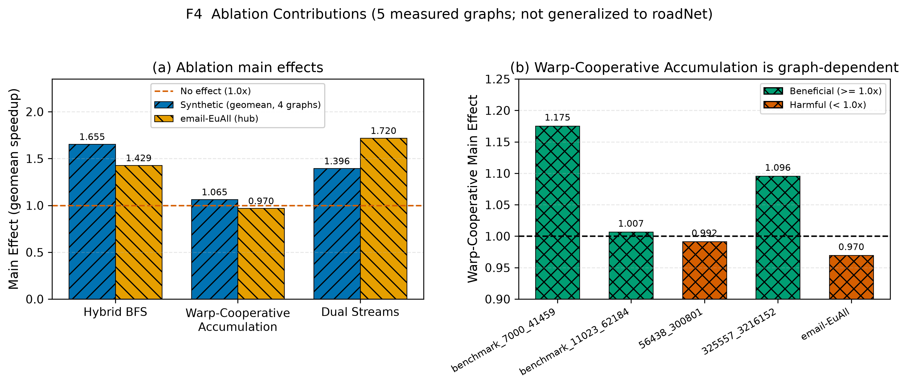
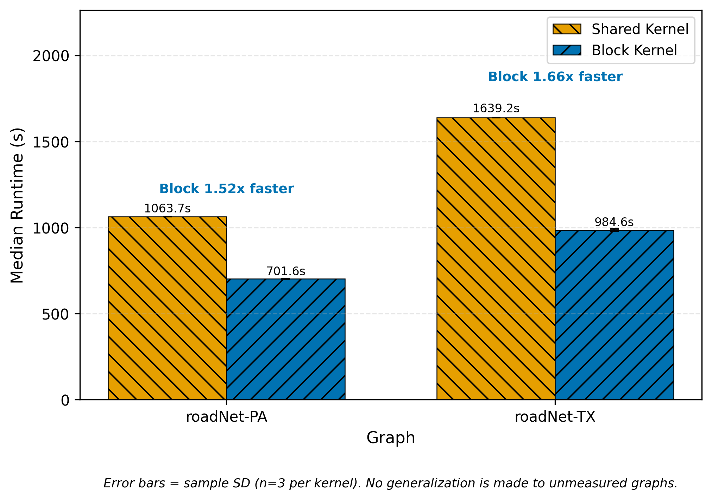
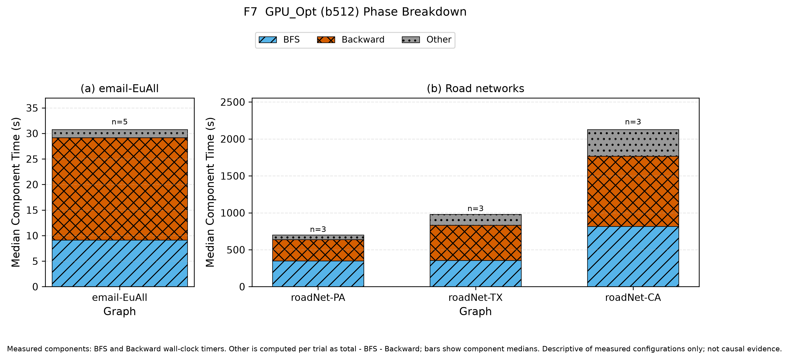

# Chapter 7 Ablation and Kernel Analysis

本章では、RQ2（最適化の寄与）に回答する。RQ2 は「Hybrid BFS、Warp-Cooperative Accumulation、Dual-Stream Execution、および block カーネルは、観測された性能にどの程度寄与するか」である（5.1 節）。評価方法は 5.8 節で規定した 2 つの手続き、すなわち H/W/A の 3 因子を切り替える factorial ablation と、BFS カーネルの forced shared/block 直接比較に従い、本章では新しい実験条件を導入しない。あわせて、観測された実行時間のフェーズ内訳（phase breakdown）を記述する。

本章の位置づけについて、最初に次を明確にする。本章は、Chapter 6 で観測した end-to-end speedup（1.31～3.17 倍）を一意に因果分解する章ではない。本章で扱う量は、(i) factorial design から計算した観測上の main effect、(ii) 個別構成の median 実行時間、(iii) フェーズ内訳の観測構成比、(iv) forced kernel 比較の実行時間比であり、これらは Chapter 6 の end-to-end speedup とは対象グラフも定義も異なる別個の観測量である。したがって、H/W/A の main effect を互いに加算したり、Chapter 6 の speedup に対する寄与率として解釈したりしない。観測された効果の原因に関する総合的な考察は Chapter 10 で行い、本章は観測結果の記述と、その適用範囲の明示に限定する。

## 7.1 Ablation Design

Ablation の対象は、提案実行基盤の 3 つの工夫である。Hybrid BFS（H）は、前向き探索において top-down と bottom-up を切り替える方向最適化 BFS である [@beamer2012]。Warp-Cooperative Accumulation（W）は、Backward（依存関係累積）phase を warp 協調（warp 内 shuffle 還元）で処理する方式である。Dual-Stream Execution（A）は、2 本の CUDA stream（NS=2）で次バッチの非同期初期化と計算を重畳するダブルバッファリングである。各因子の無効時（0）と有効時（1）の動作を Table 7.1 に示す。無効時の動作は実装（`src/proposed/host_ablation.cu`、`include/proposed/brandes_kernels.cuh`）から確認したものであり、H=0 は top-down 方向のみの BFS、W=0 は thread-per-vertex 方式の Backward カーネル、A=0 は単一 stream（NS=1）による同期的な初期化である。3 因子は CUDA カーネル内の実行時分岐ではなく C++ テンプレートによるコンパイル時分岐で切り替えられ、8 通りの構成それぞれが分岐のない専用カーネルとして実体化される。

**Table 7.1: Ablation factor definitions. Disabled/enabled behaviors are taken from the ablation implementation.**

| Factor | Disabled State (0) | Enabled State (1) | Target Phase |
|---|---|---|---|
| H (Hybrid BFS) | Top-down traversal only | Direction-optimizing top-down / bottom-up switching | Forward BFS |
| W (Warp-Cooperative Accumulation) | Thread-per-vertex accumulation kernel | Warp-cooperative accumulation (warp-level shuffle reduction) | Backward (dependency accumulation) |
| A (Dual-Stream Execution) | Single CUDA stream (NS=1), synchronous initialization | Two CUDA streams (NS=2), asynchronous initialization overlapped with computation (double buffering) | Batch initialization / kernel pipeline |

> Source: `src/proposed/host_ablation.cu`, `include/proposed/brandes_kernels.cuh`, `result/ablation/{synthetic_2354994,email_2354999}/SOURCE.md`.

測定した構成は、$\mathrm{H}\{0,1\} \times \mathrm{W}\{0,1\} \times \mathrm{A}\{0,1\}$ の全 8 構成（H0W0A0、H0W0A1、H0W1A0、H0W1A1、H1W0A0、H1W0A1、H1W1A0、H1W1A1）である。全 8 構成が生データ TSV に存在することを確認した。H0W0A0 がすべて無効の baseline、H1W1A1 が 3 工夫をすべて有効にした full 構成である。対象グラフと試行数は 5.8 節のとおり、合成グラフ 4 種（benchmark_7000_41459、benchmark_11023_62184、56438_300801、325557_3216152）で各構成 n=5（PBS job 2354994）、および email-EuAll で各構成 n=3（PBS job 2354999）である。全実行は固定バッチ b512（要求・実効とも 512、in-capacity；SUB_BATCH・num_subs はログに記録が無く `not_recorded`）、warmup なし、SourceSnapshotID `phase_def_block_20260710` で測定された。すべての試行を記録して破棄せず、主値は各構成の median であり、単一の最速試行を代表値としない（5.6 節）。なお、ablation 実行では BC ベクトルの比較を記録しておらず、その正確性水準は `none` である（5.10 節 Table 5.5）。

合成グラフ群と email-EuAll は分けて集計する。両者は次数分布と探索深さが対照的であり（5.3 節）、試行数も異なる（n=5 と n=3）ため、単一の集計に混合しない。合成 4 グラフは幾何平均で統合し、email-EuAll は単独で報告する。また、ablation は専用の測定シリーズであり、その絶対実行時間を Chapter 6 の主性能値と同一視しない。例えば email-EuAll の full 構成（H1W1A1）の median は本シリーズで 30.42 s であり、Table 6.1 の GPU_Opt の 30.81 s（別ジョブ 2357334 の測定）とは別の測定である。

各因子の寄与は主効果（main effect）で評価する。因子 $F \in \{\mathrm{H}, \mathrm{W}, \mathrm{A}\}$ の main effect は、残る 2 因子 $(G_1, G_2)$ の全 4 水準組合せにわたる、$F$ 無効時と有効時の median 実行時間比の幾何平均である。集計スクリプト（`scripts/summarize_ablation.py`）の定義に従い、グラフ $g$ に対して次式で計算する。

$$
\mathrm{ME}_g(F) = \left( \prod_{(b_1, b_2) \in \{0,1\}^2} \frac{T^{\mathrm{med}}_g(F{=}0,\, G_1{=}b_1,\, G_2{=}b_2)}{T^{\mathrm{med}}_g(F{=}1,\, G_1{=}b_1,\, G_2{=}b_2)} \right)^{1/4}
$$

ここで $T^{\mathrm{med}}_g(\cdot)$ は当該構成の median 実行時間である。$\mathrm{ME}_g(F) > 1$ は $F$ の有効化が median 実行時間を短縮したこと、$\mathrm{ME}_g(F) < 1$ は延長したことを意味する。合成グラフ群の要約値は、4 グラフの main effect の幾何平均

$$
\mathrm{ME}_{\mathrm{synth}}(F) = \left( \prod_{g \in \mathcal{G}_{\mathrm{synth}}} \mathrm{ME}_g(F) \right)^{1/4}
$$

である。本章の main effect 値は、丸め前の生データ TSV（`raw_data/ablation/`）から上式で再計算し、公式集計（`result/ablation/*/ablation_contributions.tsv`）と一致することを確認した上で、小数第 3 位へ丸めて表示する。

因子間の交互作用（interaction）については、本評価は正式な交互作用項の推定を行っていない。補助的な確認として、集計スクリプトは単独寄与（add-one：$T(\mathrm{H0W0A0})/T(F$ のみ有効$)$）と除外寄与（leave-one-out：$T(\mathrm{full}$ から $F$ のみ無効$)/T(\mathrm{H1W1A1})$）の相対差を交互作用の兆候として点検しており、全因子・全グラフでこの相対差は最大 9.2% と判定閾値 10% を下回った。ただしこれは限定的な点検であり、本章では 3 因子の効果が互いに独立であるとは断定しない。同じ理由から、main effect は加算可能な寄与配分ではなく、$\mathrm{ME}(\mathrm{H}) \cdot \mathrm{ME}(\mathrm{W}) \cdot \mathrm{ME}(\mathrm{A})$ が baseline から full までの改善率と一致することも保証されない。

観測された main effect の要約を Table 7.2 に、グラフ別の内訳を Figure 7.1 に示す。全 8 構成の median 実行時間と全試行値は Appendix C に置く。試行間ばらつきは小さく、生データから再計算した各構成の標本標準偏差（ddof=1）は、email-EuAll では median の 0.33% 以下、合成グラフ群では最大 3.2%（最小規模グラフ benchmark_7000_41459 の H0W0A1 構成、median 0.0442 s に対して 0.0014 s）であった。実行時間が秒オーダー以上の構成では、標本標準偏差は median の 1% 未満であった。

**Table 7.2: Observed main effects of the three ablation factors. Values are recomputed from the canonical raw TSVs and rounded to three decimals.**

| Dataset Group | H Main Effect | W Main Effect | A Main Effect | Trials per Configuration | Aggregation |
|---|--:|--:|--:|--:|---|
| Synthetic (4 graphs, geometric mean) | 1.655 | 1.065 | 1.396 | 5 | Median per configuration; factorial main effect; geometric mean across the 4 graphs |
| email-EuAll | 1.429 | 0.970 | 1.720 | 3 | Median per configuration; factorial main effect |

<!-- canonical artifact: T3_ablation_summary (internal ID: T3) -->
> Source: `result/tables/thesis/T3_ablation_summary.tsv`; recomputed from `raw_data/ablation/synthetic/job_2354994_20260710/ablation_results.tsv` and `raw_data/ablation/email-EuAll/job_2354999_20260710/ablation_results.tsv`; cross-checked against `result/ablation/{synthetic_2354994,email_2354999}/ablation_contributions.tsv` and `docs/thesis/thesis_values.tsv`.

**Figure 7.1: Per-factor main-effect speedups of the H/W/A factorial ablation on the four synthetic graphs and email-EuAll. Bars show the factorial main effect computed from configuration medians (synthetic: n=5 per configuration; email-EuAll: n=3 per configuration; fixed b512).**

<!-- canonical artifact: ablation_contributions.{png,pdf,svg} (internal ID: F4); see result/figures/thesis/FIGURE_MANIFEST.tsv. The in-figure title contains the internal ID; figures are not modified in this gate. -->

## 7.2 Effect of Hybrid BFS

Hybrid BFS（H）の main effect は、合成 4 グラフでそれぞれ 1.536（benchmark_7000_41459）、1.782（benchmark_11023_62184）、1.965（56438_300801）、1.395（325557_3216152）であり、幾何平均は 1.655 であった。email-EuAll では 1.429 であった。評価した 4 合成グラフにおいて、H は 3 因子の中で最大の観測 main effect を示した因子であり、測定した 5 グラフすべてで main effect は 1 を上回った。

この効果の phase 上の現れとして、ablation ログのフェーズ帰属（`ablation_summary.md`）では、単一 stream（A=0）構成間の比較で H の有効化が BFS 累積カーネル時間を一貫して短縮したことが観測された。例えば H0W0A0 から H1W0A0 への変更で、BFS 累積時間は email-EuAll で 33.72 s から 15.18 s へ、56438_300801 で 2.204 s から 0.651 s へ、325557_3216152 で 118.0 s から 69.57 s へ短縮された。これは、H の対象 phase が前向き BFS であるという設計（Table 7.1）と整合する観測である。ただし、この短縮量がグラフ間で異なる理由（次数分布や BFS 深さとの関係）の特定は本章では行わず、Chapter 10 で論じる。

以上の値は、評価した 4 合成グラフと email-EuAll における観測である。「合成グラフ一般」に対する効果を意味するものではなく、H/W/A の factorial ablation を実施していない roadNet-PA/TX/CA を含む未測定グラフへ一般化しない。

## 7.3 Effect of Warp-Cooperative Accumulation

Warp-Cooperative Accumulation（W）の main effect は、合成 4 グラフでそれぞれ 1.175（benchmark_7000_41459）、1.007（benchmark_11023_62184）、0.992（56438_300801）、1.096（325557_3216152）であり、幾何平均は 1.065 であった。すなわち合成グラフ群での W は小さい正の効果にとどまり、グラフ単位では 0.992 から 1.175 の範囲で、効果がほぼ中立のグラフ（benchmark_11023_62184、56438_300801）と明確に正のグラフ（benchmark_7000_41459、325557_3216152）が混在した。

email-EuAll では W の main effect は 0.970 であった。これは、W の有効化が median 実行時間を測定上約 3.1% 増加させる方向（$1/0.970 \approx 1.031$）であったことを意味する。この差は、各構成の試行間ばらつき（標本標準偏差は median の 0.33% 以下）より大きい観測差であるが、各構成 n=3 の小標本であり有意差検定は実施していないため、統計的有意性は主張しない。同時に、この差を測定誤差であると断定することもしない。本評価から言えるのは、email-EuAll では W が測定上わずかに不利な方向であった、という観測事実である。

フェーズ帰属でも同じ方向依存性が観測された。単一 stream（A=0）かつ H1 の構成間比較で、W の有効化は Backward 累積カーネル時間を 325557_3216152 では 54.39 s から 45.51 s へ短縮した一方、email-EuAll では 34.76 s から 36.91 s へ、56438_300801 では 1.335 s から 1.406 s へ増加させた。すなわち W の効果は大きさだけでなく符号もグラフに依存する。この理由（warp 内の負荷の均質性や次数分布との関係など）の断定は行わず、Chapter 10 で考察する。結論として、評価した 5 グラフの範囲で W の main effect は 0.970～1.175 に分布し、その効果は graph-dependent である。1.065 という合成 4 グラフの幾何平均を、W の普遍的な効果として解釈しない。

## 7.4 Effect of Dual-Stream Execution

Dual-Stream Execution（A）の main effect は、合成 4 グラフでそれぞれ 1.234（benchmark_7000_41459）、1.577（benchmark_11023_62184）、1.238（56438_300801）、1.576（325557_3216152）であり、幾何平均は 1.396 であった。email-EuAll では 1.720 であり、これは email-EuAll における 3 因子の中で最大の観測 main effect である。合成グラフ群でも A は H に次ぐ大きさの正の効果を示し、測定した 5 グラフすべてで main effect は 1 を上回った。

A=1 の構成では、フェーズ帰属における gap（wall time から BFS・Backward の累積カーネル時間の和を引いた残差）が負となることが全グラフで観測された。これは公式集計の注記のとおり、A=1（NS=2）では BFS・Backward の累積時間が 2 stream 分の合算となるためであり、負の gap は 2 本の stream のカーネル実行が時間的に重なって進行したことの観測証拠である。すなわち、A の効果が設計意図（初期化と計算の重畳）どおりの実行形態で現れていたことを示す。ただし、なぜ A の効果が email-EuAll で合成グラフ群より大きく観測されたのかという要因の特定は本章では行わず、Chapter 10 で論じる。

## 7.5 Shared and Block Kernels

本節では、BFS カーネルの shared-frontier 方式（shared）と 1 block = 1 source 方式（block）の直接比較を示す。5.8 節のとおり、この比較は環境変数 `BC_FORCE_BFS_KERNEL=shared|block` により各カーネルを強制実行した forced 比較であり、自動選択則の評価ではない。対象は roadNet-PA と roadNet-TX の 2 グラフ、設定はバッチ 512（SUB_BATCH=512、num_subs=1、in-capacity）、各カーネル n=3、warmup なし、集計は median（標本標準偏差併記）、SourceSnapshotID `phase_def_block_20260710`（PBS job 2354329、2354330）である。結果を Table 7.3 と Figure 7.2 に示す。

**Table 7.3: Forced shared/block BFS kernel comparison on roadNet-PA and roadNet-TX. Speedup = slower kernel median / faster kernel median. Max BC Match compares the maximum-BC index and value between the two kernels.**

| Graph | Shared Trials | Shared Median [s] | Block Trials | Block Median [s] | Faster Kernel | Speedup | Max BC Match |
|---|--:|--:|--:|--:|---|--:|---|
| roadNet-PA | 3 | 1063.71 | 3 | 701.57 | Block | 1.52 | Yes (index and value) |
| roadNet-TX | 3 | 1639.16 | 3 | 984.59 | Block | 1.66 | Yes (index and value) |

<!-- canonical artifact: kernel_selection_contributions.tsv (internal table ID: T-KSEL) -->
> Source: `raw_data/tuning/kernel_selection/{roadNet-PA,roadNet-TX}/gpu_opt_forced/job_{2354329,2354330}_20260710/kernel_selection_results.tsv`; medians and sample SDs cross-checked against `result/tuning/kernel_selection/<graph>/kernel_selection_contributions.tsv` (unrounded medians: PA 1063.712326 / 701.573311 s, speedup 1.516; TX 1639.164633 / 984.587390 s, speedup 1.665).

**Figure 7.2: Median runtime of the forced shared and forced block BFS kernels on roadNet-PA and roadNet-TX (n=3 per kernel per graph, fixed b512). Error bars show the sample standard deviation.**

<!-- canonical artifact: shared_vs_block_kernel.{png,pdf,svg} (internal ID: F6); the in-figure title contains the internal ID; figures are not modified in this gate. -->

観測結果は次のとおりである。roadNet-PA では shared の median 1063.71 s に対し block は 701.57 s であり、block が 1.52 倍高速であった。roadNet-TX では shared の 1639.16 s に対し block は 984.59 s であり、block が 1.66 倍高速であった。speedup は遅い側 median を速い側 median で割った比である。標本標準偏差は shared 側で 0.060 s（PA）・0.284 s（TX）、block 側で 3.574 s（PA）・7.260 s（TX）であり、block 側のばらつきが相対的に大きいものの、いずれも両カーネルの median 差（PA 約 362 s、TX 約 655 s）に対して十分小さい。

正確性については、shared と block の最大 BC の index と value が両グラフで一致した（roadNet-PA: index 557532、value 151395302679.08；roadNet-TX: index 400570、value 164495142042.45）。ただしこの比較の正確性水準は `max_bc_only`（5.10 節 Table 5.5）であり、最大 BC の一致は全 BC 要素の一致（full-vector correctness）の証明ではない。

現行実装のカーネル方針は次のとおりである。Chapter 6 で評価した GPU_Opt を含む現行実装は、BFS カーネルとして常に block カーネルを使用する。旧実装には平均次数に基づく自動選択則（avg_deg < 5 のとき shared を選ぶ規則）が存在したが、現在は使用していない。本節の forced 比較は現行の block 採用に対する設計根拠を roadNet-PA/TX の範囲で与えるものであり、旧選択則の正誤を評価するものではない。また、この比較結果は測定した 2 グラフに限定され、email-EuAll や合成グラフを含む未測定グラフにおける shared/block の優劣を含意しない。

## 7.6 Phase Breakdown

本節では、観測された実行時間のフェーズ内訳を記述する。2 種の資料を用いる。第 1 は、Chapter 6 の主性能測定（GPU_Opt、固定 b512、job 2357334）と同一実行の `phase_timing.log` から得た、headline 4 グラフの成分内訳である（Figure 7.3）。第 2 は、単一の nsys トレースによる GPU カーネル時間の構成比である。いずれも観測された時間配分の記述であり、フェーズ構成比を H/W/A の main effect の寄与率と同一視せず、性能差の因果の証拠としても扱わない。

Figure 7.3 の成分は、runner が計測する BFS wall と Backward wall、および Other である。Other は各試行の全体実行時間から BFS と Backward を引いた残差として定義され、初期化・CSR ロード・結果回収・ホスト側オーバヘッドを含む。GPU_Opt（Unified Memory 版）は H2D/D2H 転送や初期化を個別計測しないため、この内訳は計測成分に基づく分解であって、転送量まで含めた完全な内訳ではない。集計は成分ごとの試行 median（email-EuAll n=5、roadNet 各 n=3）である。

**Figure 7.3: Median phase components (BFS, Backward, Other) of GPU_Opt (fixed b512) on the four headline graphs. Other is the per-trial residual: total time minus BFS minus Backward (initialization, CSR load, copy-out, and host overhead). Components are medians over trials (email-EuAll n=5; roadNet-PA/TX/CA n=3).**

<!-- canonical artifact: phase_breakdown.{png,pdf,svg} (internal ID: F7); the in-figure title contains the internal ID; figures are not modified in this gate. -->

観測された median 成分は次のとおりである。email-EuAll では BFS 9.12 s、Backward 20.07 s、Other 1.60 s であり、Backward が最大成分（成分和の約 65%）であった。roadNet-PA では BFS 348.91 s、Backward 290.61 s、Other 62.60 s、roadNet-TX では BFS 355.43 s、Backward 477.56 s、Other 145.58 s、roadNet-CA では BFS 816.37 s、Backward 950.28 s、Other 362.46 s であり、road 系 3 グラフでは BFS と Backward が同程度のオーダー（成分和の約 36～50%）を占め、Other は約 9～17% であった。これらの構成比は、測定した b512 実行の記述であり、他のバッチ設定や他実装の内訳を代表しない。

カーネル単位の補助資料として、nsys による単一トレース（PBS job 2359175、トレース 1 回）の CUDA GPU カーネル時間集計では、Backward カーネル（`brandes_back_kernel_opt`）が 63.9%、BFS カーネル（`brandes_bfs_kernel_opt`）が 36.1% を占めた。この `ablation_H1W1A0` トレースの本測定は ablation バイナリの H1W1A0 構成であり、対象グラフは 56438_300801 である。ただし、同一 process 冒頭の untimed H1W1A1 warmup もtrace scopeに含むため、この構成比は本測定 H1W1A0 だけを分離した値ではなく、warmupを含む単一トレース全体の値である。また、GPU カーネル実行時間のみの比率であってホスト時間・転送時間を含まない。したがって、この値を全実験のフェーズ構成へ一般化しない。同ジョブには A 因子比較用の `ablation_H1W1A1` 別トレースも保存されているが、本章の定量値には用いない。

> Source: components from `raw_data/main_performance/proposed_variants/<graph>/_run/job_2357334_20260711/phase_timing.log` (medians recomputed; component sums agree with the Table 6.1 medians); kernel-time shares from `raw_data/profiling/job_2359175_20260711/ablation_H1W1A0.stats.txt` (CUDA GPU Kernel Summary; single trace including the untimed warmup run in the same process), target graph per `pbs_stdout.log` and `ablation_H1W1A0.console.log`.

## 7.7 Answer to RQ2

以上より、RQ2 へ次のとおり回答する。評価した 4 合成グラフ（benchmark_7000_41459、benchmark_11023_62184、56438_300801、325557_3216152）では、Hybrid BFS と Dual-Stream Execution がそれぞれ幾何平均 1.655 倍および 1.396 倍の主要な正の main effect を示した。email-EuAll では Dual-Stream Execution が 1.720 倍で最大であり、Hybrid BFS も 1.429 倍の正の効果を示した。一方、Warp-Cooperative Accumulation は合成グラフ群で幾何平均 1.065 倍にとどまり、email-EuAll では 0.970 倍と測定上約 3% 遅い方向であったため、その効果は graph-dependent である。カーネル方式については、roadNet-PA/TX の forced 比較で block カーネルが shared カーネルよりそれぞれ 1.52 倍・1.66 倍高速であり、両カーネルの最大 BC の index/value は一致した（`max_bc_only` 水準）。現行実装は block カーネルを常用しており、この forced 比較はその設計根拠を測定した 2 グラフの範囲で与える。

<!-- English version (plan.md 8.8): "Hybrid BFS and dual-stream execution provided the main observed improvements, whereas warp-cooperative accumulation was graph-dependent." -->

この回答には次の限定が付く。

- H/W/A の full factorial ablation は合成 4 グラフと email-EuAll に限定され、roadNet-PA/TX/CA では実施していない。roadNet における H/W/A の寄与を本章の値から推定しない。
- main effect は factorial design 上の観測量であり、加算可能な寄与率ではない。Chapter 6 の end-to-end speedup を main effect の和や積として説明しない。
- 因子間 interaction の正式な推定は行っておらず（補助的な点検で相対差は最大 9.2%）、3 因子の効果が独立であるとは断定しない。
- forced shared/block 比較は roadNet-PA/TX の 2 グラフに限定され、未測定グラフへ一般化しない。最大 BC の一致は full-vector correctness の証明ではない。
- フェーズ内訳（Figure 7.3 および nsys カーネル構成比）は特定の構成・グラフ・実行の観測構成比であり、speedup の寄与配分ではない。
- 観測された効果の原因（グラフ構造との因果関係、email-EuAll で A が大きい理由、W が email-EuAll で不利であった理由など）は本章では断定せず、Chapter 10 で考察する。評価した環境（GH200）・グラフ・条件の外側へは一般化しない。
