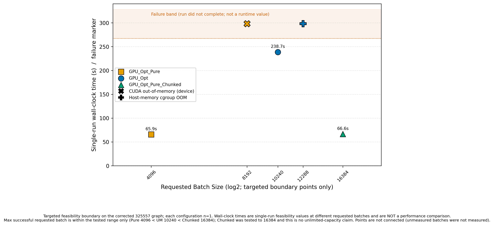

# Chapter 8 Memory Scalability

本章では、RQ3（メモリ容量拡張性）に回答する。RQ3 は「GPU_Opt、GPU_Opt_Pure、GPU_Opt_Pure_Chunked のメモリ管理方式は、実行可能なバッチサイズにどのような影響を与えるか」である（5.1 節）。中心となる評価指標は最高性能ではなく、要求バッチ（requested batch）に対する実行可否、最大成功バッチ、および最初に観測された failure/OOM である。対象は合成グラフ 325557_3216152（$|V|=325{,}557$、$|E|=3{,}216{,}152$）のみに限定し、他グラフ、他 GPU、他のホストメモリ構成へ容量境界を一般化しない。

本章では、実行可能性（execution feasibility）と数値的正確性（numerical correctness）を分離する。プロセスが終了して時間値または BC ベクトルを出力したことは execution feasibility の証拠であるが、それだけでは全 BC 要素の正確性を証明しない。逆に、正確性診断用の単一実行は性能測定ではない。本章の容量に関する中心結果は legacy feasibility sweep に基づき、current memory-path experiment は資源構成の影響と正確性の制約を診断する別系列として扱う。

## 8.1 Evaluation Scope

### 8.1.1 Research Question and Memory-Management Variants

比較する 3 方式は、3 つの独立したアルゴリズム提案ではない。いずれも Chapter 4 で述べる共通のバッチ型 GPU 実行基盤、Hybrid BFS、Backward phase、および source-level batch processing を用い、作業配列の配置と同時保持量だけを変更した memory-management variants である。Table 8.1 に各方式の役割を示す。

**Table 8.1: Memory-management variants of the common batch-based GPU execution framework.**

| Implementation | Memory Model | Capacity Mechanism | Primary Role | Expected Limitation |
|---|---|---|---|---|
| GPU_Opt | CUDA Unified Memory (`cudaMallocManaged`) | Managed allocation, prefetch/eviction, and HBM3 streaming with a reduced sub-batch under oversubscription | Main implementation and UM capacity path | Host-memory pressure, migration/page-fault overhead, and eventual allocation or process failure |
| GPU_Opt_Pure | Device-only allocation (`cudaMalloc`) | Full requested working set allocated in device memory | Device-only control | HBM3 capacity directly limits the allocatable batch |
| GPU_Opt_Pure_Chunked | Device-only allocation for one sub-batch at a time | Requested batch split into multiple sub-batches; only the sub-batch working set is resident | Capacity-extension variant | Additional sub-launches and finite device/host resources; no unlimited-capacity guarantee |

GPU_Opt が利用する Unified Memory（UM）は、単一の managed allocation に対して CPU/GPU 間のページ配置と migration を可能にし、prefetch によって配置先を事前指定できる [@nvidiaCudaProgrammingGuide]。GH200 は Grace CPU memory と HBM3 を coherent NVLink-C2C で接続し、GPU memory oversubscription を支援する [@nvidiaGh200Product; @nvidiaGraceHopperInDepth]。ただし、この機構は有限の HBM3 とホストメモリを利用するものであり、GPU_Opt が OOM しないことを意味しない。

### 8.1.2 Separation of the Two Experimental Series

本章の根拠には目的と資源構成が異なる 2 系列があるため、同一の OOM sweep として結合しない。

Series A（Legacy Feasibility Sweep）は、SourceSnapshotID `oldtree_f05ec52_20260512` の旧ツリーで 2026-05-12 に測定された。対象は 325557_3216152、方式は GPU_Opt、GPU_Opt_Pure、GPU_Opt_Pure_Chunked、要求バッチ候補は b512、b1024、b2048、b4096、b8192、b10240、b12288、b16384 である。成功点は各 n=5、主値は median であり、計時範囲は旧 runner が報告する full BC execution の `Time_sec`（実装関数全体のホスト制御と GPU 実行）である。GPU_Opt は b12288 の最初の失敗後に掃引を停止したため、この失敗点だけ n=1 であり、b16384 は同方式では未試行である。GPU_Opt_Pure と GPU_Opt_Pure_Chunked は b16384 まで各点 n=5 である。warmup status は方式別に確定した。GPU_Opt と GPU_Opt_Pure_Chunked は warmup なしである。一次根拠は実験時 snapshot `oldtree_f05ec52_20260512` に保存された実行スクリプト（`scripts/run_um_oversubscribe*.sh`）であり、warmup ループを持たず全 runner 実行を試行として記録する構造を持ち、保存ログの実行数が raw TSV の試行行数と 1:1（GPU_Opt 31/31、Chunked 40/40）で一致する。一方 GPU_Opt_Pure のログには試行 header が無く、その生成ドライバは snapshot に未収録のため、GPU_Opt_Pure の warmup status は `not_recorded` とする（ログ 40 実行 = TSV 40 試行で warmup なしと整合するが、証明とはしない）。

Series A のログは NVIDIA GH200 上で device memory の total 約 102.0 GB、`free_before` 約 101.4 GB（いずれも 10 進 GB）を記録する。一方、実使用ホストメモリ容量と PBS job ID は `not_recorded` であり、測定ラベルのみ `UMv2` と保存されている。保存された投入スクリプトは `select=1:ncpus=72`、group `gj17`、queue 指定 `regular-g` を含むが、実際に割り当てられた queue 名と完全な resource configuration は保存ジョブログから独立に確定できない。このため、本章では Series A の実使用 queue 名を実験条件として断定せず、ホストメモリ容量も推定しない。

Series A のメモリサイジング、managed/device allocation、prefetch/evict、`SUB_BATCH`、`num_subs` のコードは、後の checkpoint `phase_def_block_20260710` と文字単位で一致することが code-diff audit で確認されている。また、325557_3216152 は旧ヒューリスティクスでも block カーネルを選択する。しかし、この一致は current checkpoint で同じ境界を再測定したことを意味しない。旧セッションの software/runtime 条件を統一して再検証していないため、Series A の時間値は current block-kernel headline performance として採用せず、同一 legacy 系列内の記述的な performance–capacity 観測にのみ用いる。

Series B（Current Memory-Path Correctness Runs）は、主に異なるメモリ経路の BC ベクトルを診断する correctness-only 系列である。canonical run は SourceSnapshotID `memory_correctness_20260712`、PBS job `2368587.opbs`、各構成 n=1、warmup なしである。これに先行する UM b10240 OOM は SourceSnapshotID `memory_correctness_oom_20260712`、job `2368269.opbs`、一因子診断は `memory_diagnostic_20260713`、job `2369632.opbs` である。これらは host-memory-limited 100 GiB configuration で実行された。100 GiB は queue 名ではなくホストメモリ上限を表す resource configuration であり、実使用 PBS queue 名は Series B についても保存ログから独立に確定できない。

したがって、Series A で GPU_Opt b10240 が成功したことと、Series B の 100 GiB 構成で同じ要求バッチが OOM したことは直接の矛盾ではない。両者は checkpoint、目的、ホストメモリ条件が異なる。一方、この差が存在する以上、b10240 を安定した普遍的 OOM boundary とみなすこともできない。

### 8.1.3 Execution and Correctness Status

Series A の `SUCCESS` は、runner が exit 0 で完了し、時間・GTEPS・最大 BC の各出力を得たことを意味する。正確性水準は `max_bc_only` であり、全ベクトル比較ではない。GPU_Opt_Pure の失敗ログには `CUDA ... out of memory` が明記される。GPU_Opt b12288 は raw TSV で `OOM_OR_FAIL`、ログで exit 137 と記録され、完全な時間値を持たない。この点について CUDA OOM・host OOM kill・scheduler OOM のいずれの独立記録も存在しないため、原因を OOM と断定せず `OOM_OR_FAIL (exit 137)` と表記する。本章ではこの点を 0 s とせず `N/A` とし、明示的な CUDA OOM と原因未確定の process kill を区別する。これらの境界点に TIMEOUT は記録されていない。

Series B の execution success は、個別 runner の exit 0 と有効な全長 BC ベクトルの保存を意味する。PBS accounting の `Exit_status` は `not_recorded` であるため、PBS exit 0 とは表現しない。canonical job は 6 構成すべて runner success であったが、比較行列の不一致により script exit 1、formal overall status `CORE_FAIL` である。すなわち runner success と correctness PASS は別の状態である。

## 8.2 In-Capacity Performance

### 8.2.1 Memory Requirements of Batched BC

バッチ型 BC では、CSR topology と出力 BC ベクトルに加え、同時処理する source ごとの探索・累積状態を保持する。実装中の主要配列は、距離 `d_d`、現在および次の frontier queue `d_Q_curr`・`d_Q_next`、最短路数 `d_sigma`、依存度 `d_delta`、探索順スタック `d_S`、深さごとの終端 `d_S_ends`、および `d_depth` である。CSR の row offsets `R` と column indices `C`、出力 `CB` は source 数に比例しない resident data である一方、上記の探索状態は同時処理 source 数にほぼ比例する。

UM 版と Chunked 版の実装が sizing に用いる source 当たりの状態量は、次式でコード化されている。

$$
M_{\mathrm{state}} = |V|\left(3\,\mathrm{sizeof(int)} + 2\,\mathrm{sizeof(double)}\right)
 + |V|\,\mathrm{sizeof(int)}
 + (D_{\mathrm{est}}+1)\,\mathrm{sizeof(int)}
 + \mathrm{sizeof(int)} .
$$

最初の項は `d_d`、2 本の queue、`d_sigma`、`d_delta`、第 2 項は `d_S`、残る項は `d_S_ends` と `d_depth` に対応する。$D_{\mathrm{est}}$ は実装が平均次数から選ぶ深さ上限の推定値であり、平均次数 19.758 の 325557_3216152 では 256 の分岐が選ばれる。この式は allocation の resident byte を実測したものではなく、実装が batch sizing とログ表示に用いる estimate である。

2 stream を前提とする表示上の dynamic estimate は、実効バッチを $B_{\mathrm{eff}}$、定数 stream 数を $NS=2$ として $NS\,B_{\mathrm{eff}}M_{\mathrm{state}}$ で計算される。Series A のログでは b512、b1024、b2048、b4096、b8192、b10240、b12288 に対して、それぞれ 10.67、21.34、42.68、85.35、170.70、213.38、256.05 GB と表示された。この値は物理 HBM3 resident 量や process RSS の測定値ではない。oversubscription 判定後は `NS_eff=1` となるため、表示 estimate と実際に確保を試みる buffer-set 数も区別する必要がある。

GPU_Opt は topology、出力、動的状態を managed memory として確保し、in-capacity 時は GPU へ prefetch する。oversubscription 時は `SUB_BATCH` 単位に prefetch/evict しながら managed allocation を処理する。GPU_Opt_Pure は topology と全 batch 状態を device memory に確保し、CSR を host-to-device copy、結果を device-to-host copy する。GPU_Opt_Pure_Chunked も device-only であるが、全要求バッチではなく `SUB_BATCH` 分だけを確保して再利用する。この配置差により、UM では host memory の余裕と migration が、Pure/Chunked では同時 device allocation が execution feasibility に影響する。

### 8.2.2 Requested Batch, Effective Batch, and Sub-Batch

要求バッチは `BC_BATCH_OVERRIDE` で指定する 1 stream 当たりの source 数である。通常の自動設定では、実装が `free_mem` から safety margin を引いて batch を求め、1～512 に clamp する。しかし Series A/B の強制実験では、正の override がこの自動値を置換する。ログ中の `BATCH` または `batch_per_stream` が実行時の batch 値である。

本章で用いる実効バッチは、実際に runner が受理した要求バッチ全体を指す。Series A の GPU_Opt と GPU_Opt_Pure_Chunked、および Series B の対象構成では、ログに記録された要求値と実効値は等しく、要求バッチ自体の clamp は観測されなかった。GPU_Opt_Pure は独立した `effective_batch` field を出力しないため、canonical table に従って `Not Recorded` とする。ただし、各ログの `batch_per_stream` は override と同じ値であり、その値に基づく allocation の成功または失敗が記録されている。

`SUB_BATCH` は実効バッチのうち 1 回の kernel launch 群で処理する source 数であり、要求バッチの取り消しや縮小ではない。実装は oversubscription estimate、HBM3 budget、および index safety bound から `SUB_BATCH` を制限し、

$$
\mathrm{num\_subs}=\left\lceil\frac{B_{\mathrm{eff}}}{\mathrm{SUB\_BATCH}}\right\rceil
$$

として全要求バッチを処理する。in-capacity では `SUB_BATCH=B_eff`、`num_subs=1`、`NS_eff=2` である。325557_3216152 の oversubscription 条件では `SUB_BATCH=6596`、`NS_eff=1` が記録され、b8192～b12288 は `num_subs=2`、b16384 は `num_subs=3` となった。Pure にはこの sub-batch 機構がなく、該当値は `N/A` である。

### 8.2.3 Observed In-Capacity Runtime

Series A において 3 方式の全成功点の median を比較すると、各方式の最小 median はいずれも b1024 で観測された。GPU_Opt は 66.370263 s（sample SD 0.012619 s）、GPU_Opt_Pure は 67.087237 s（0.032702 s）、GPU_Opt_Pure_Chunked は 67.089539 s（0.012166 s）であり、各 n=5、`SUB_BATCH=1024`、`num_subs=1` の in-capacity 条件である。3 値は約 0.72 s の範囲にあり、この legacy 系列では memory model の違いによる大きな時間差は観測されなかった。

ただし、「best」は成功した要求バッチの median 実行時間が最小であることを意味し、maximum successful batch とは異なる。また、この観測は 325557_3216152、旧セッション、b1024 に限定される。GPU_Opt が Pure より常に高速であることも、Chunked が常に最速であることも意味せず、Chapter 6 の current block headline 値と直接比較しない。

## 8.3 Unified Memory Oversubscription

### 8.3.1 GPU_Opt and GPU_Opt_Pure

GPU_Opt は `cudaMallocManaged` で状態配列を確保する。in-capacity 時には full buffer を GPU へ prefetch し、oversubscription 時には `NS_eff=1` として `SUB_BATCH` ごとに GPU へ prefetch し、後続 sub-batch がある場合は処理済み範囲を host 側へ evict する。この経路は HBM3 容量を超える managed working set を実行可能にし得る一方、host memory、page migration、page fault、および allocation 自体の上限を受ける [@nvidiaCudaProgrammingGuide]。

対照の GPU_Opt_Pure は `cudaMalloc` により 2 stream 分の全 batch 状態を device memory へ直接確保する。失敗判定は、各 runner の非 0 終了と stderr の CUDA error、および raw TSV の status に基づく。Series A の b8192 以降では `CUDA ... out of memory` が各 5 試行で記録されたため、これらを明示的な device allocation OOM と分類する。OOM 行の TSV 上の `Time_sec=0` は失敗 marker にすぎず、本章の統計や図の runtime 値には含めない。

### 8.3.2 Legacy Feasibility Results

Series A の全 sweep 結果を Table 8.2 に示す。成功行の median と sample SD は raw TSV の `SUCCESS` 行だけから再計算した（ddof=1）。失敗行に median と SD は定義せず、`N/A` とする。Figure 8.1 は同じデータを可視化し、failure point を runtime 0 ではなく上部の status band に marker として配置している。

**Table 8.2: Complete legacy feasibility sweep on 325557_3216152. Runtime statistics exclude failed runs; `N/A` is not zero.**

| Implementation | Requested Batch | Effective Batch | Trials | Median Time [s] | Sample SD [s] | Status | Failure Reason | SUB_BATCH | Num Subs | NS_eff |
|---|--:|---:|--:|--:|--:|---|---|---:|---:|---:|
| GPU_Opt_Pure | 512 | Not Recorded | 5 | 77.735816 | 0.190452 | SUCCESS | None | N/A | N/A | Not Recorded |
| GPU_Opt_Pure | 1024 | Not Recorded | 5 | 67.087237 | 0.032702 | SUCCESS | None | N/A | N/A | Not Recorded |
| GPU_Opt_Pure | 2048 | Not Recorded | 5 | 67.636387 | 0.016771 | SUCCESS | None | N/A | N/A | Not Recorded |
| GPU_Opt_Pure | 4096 | Not Recorded | 5 | 68.341247 | 0.021261 | SUCCESS | None | N/A | N/A | Not Recorded |
| GPU_Opt_Pure | 8192 | Not Recorded | 5 | N/A | N/A | OOM | CUDA allocation out of memory | N/A | N/A | Not Recorded |
| GPU_Opt_Pure | 10240 | Not Recorded | 5 | N/A | N/A | OOM | CUDA allocation out of memory | N/A | N/A | Not Recorded |
| GPU_Opt_Pure | 12288 | Not Recorded | 5 | N/A | N/A | OOM | CUDA allocation out of memory | N/A | N/A | Not Recorded |
| GPU_Opt_Pure | 16384 | Not Recorded | 5 | N/A | N/A | OOM | CUDA allocation out of memory | N/A | N/A | Not Recorded |
| GPU_Opt | 512 | 512 | 5 | 76.869187 | 0.095769 | SUCCESS | None | 512 | 1 | 2 |
| GPU_Opt | 1024 | 1024 | 5 | 66.370263 | 0.012619 | SUCCESS | None | 1024 | 1 | 2 |
| GPU_Opt | 2048 | 2048 | 5 | 66.826969 | 0.012289 | SUCCESS | None | 2048 | 1 | 2 |
| GPU_Opt | 4096 | 4096 | 5 | 67.652155 | 0.010639 | SUCCESS | None | 4096 | 1 | 2 |
| GPU_Opt | 8192 | 8192 | 5 | 109.819164 | 0.122950 | SUCCESS | None | 6596 | 2 | 1 |
| GPU_Opt | 10240 | 10240 | 5 | 324.215055 | 12.191419 | SUCCESS | None | 6596 | 2 | 1 |
| GPU_Opt | 12288 | 12288 | 1 | N/A | N/A | OOM_OR_FAIL | Exit 137 (SIGKILL); cause not independently confirmed | 6596 | 2 | 1 |
| GPU_Opt_Pure_Chunked | 512 | 512 | 5 | 77.873676 | 0.125564 | SUCCESS | None | 512 | 1 | 2 |
| GPU_Opt_Pure_Chunked | 1024 | 1024 | 5 | 67.089539 | 0.012166 | SUCCESS | None | 1024 | 1 | 2 |
| GPU_Opt_Pure_Chunked | 2048 | 2048 | 5 | 67.622075 | 0.008687 | SUCCESS | None | 2048 | 1 | 2 |
| GPU_Opt_Pure_Chunked | 4096 | 4096 | 5 | 68.301362 | 0.004984 | SUCCESS | None | 4096 | 1 | 2 |
| GPU_Opt_Pure_Chunked | 8192 | 8192 | 5 | 70.652637 | 0.032192 | SUCCESS | None | 6596 | 2 | 1 |
| GPU_Opt_Pure_Chunked | 10240 | 10240 | 5 | 69.135375 | 0.024974 | SUCCESS | None | 6596 | 2 | 1 |
| GPU_Opt_Pure_Chunked | 12288 | 12288 | 5 | 68.553250 | 0.017877 | SUCCESS | None | 6596 | 2 | 1 |
| GPU_Opt_Pure_Chunked | 16384 | 16384 | 5 | 69.322278 | 0.014525 | SUCCESS | None | 6596 | 3 | 1 |

<!-- canonical artifact: T4_memory_scalability (internal ID: T4); augmented here with trial counts, sample SD, failure reason, and NS_eff from the same raw TSV/log inputs -->
> Source: `raw_data/memory_scalability/325557_3216152/{gpu_opt,gpu_opt_pure,gpu_opt_pure_chunked}/job_notrecorded_20260512/oversubscribe_results_*.tsv` and matching `um_experiment_*.log`; cross-checked against `result/tables/thesis/T4_memory_scalability.tsv` and `docs/thesis/thesis_values.tsv`.

**Figure 8.1: Median runtime and observed out-of-memory or failure status versus requested batch size in the legacy feasibility sweep on 325557_3216152. Successful points show the median of five trials with sample-SD error bars. Failure markers are placed in a separate status band and are not runtime values; marker shape distinguishes log-confirmed CUDA out-of-memory (X, GPU_Opt_Pure) from OOM_OR_FAIL with exit 137 and no independently confirmed cause (P, GPU_Opt b12288). GPU_Opt b12288 has one failed attempt because the sweep stopped.**

<!-- canonical artifact: memory_scalability_325557.{png,pdf,svg} (internal ID: F5); the in-figure title retains the internal ID -->

図中で GPU_Opt_Pure は b4096 まで runtime point を持ち、b8192 以降は failure marker となる。GPU_Opt は b4096 までは in-capacity であり、b8192 と b10240 では `SUB_BATCH=6596`、`num_subs=2`、`NS_eff=1` の HBM3 streaming が実行された。b12288 は exit 137 で停止した。GPU_Opt_Pure_Chunked は b8192 以降に manual chunking が有効となり、試験した最大の b16384 まで runtime point を持つ。

### 8.3.3 Maximum Successful Batch

最大成功要求バッチと最小 median のバッチを分離して Table 8.3 に要約する。ここで best batch は各方式の成功点のうち median が最小の点、maximum successful batch は試験した要求バッチのうち execution success が得られた最大点である。

**Table 8.3: Best-runtime and maximum-capacity points in the legacy feasibility sweep.**

| Implementation | Best Batch | Best Median Time [s] | Best Sample SD [s] | Maximum Successful Requested Batch | Maximum-Batch Median Time [s] | First Observed Failure Batch | Failure Type | Trials (Best / Boundary) | Checkpoint |
|---|--:|--:|--:|--:|--:|---:|---|---|---|
| GPU_Opt_Pure | 1024 | 67.087237 | 0.032702 | 4096 | 68.341247 | 8192 | CUDA OOM | 5 / 5 | oldtree_f05ec52_20260512 |
| GPU_Opt | 1024 | 66.370263 | 0.012619 | 10240 | 324.215055 | 12288 | OOM_OR_FAIL (exit 137) | 5 / 1 | oldtree_f05ec52_20260512 |
| GPU_Opt_Pure_Chunked | 1024 | 67.089539 | 0.012166 | 16384 | 69.322278 | Not Observed | None through b16384 | 5 / 5 | oldtree_f05ec52_20260512 |

> Source: recomputed from the canonical legacy feasibility TSVs; sample SD uses ddof=1. GPU_Opt_Pure_Chunked b16384 is the maximum tested success, not a measured capacity limit.

したがって、325557_3216152 と Series A の tested range における maximum successful requested batch の順序は、

$$
\mathrm{GPU\_Opt\_Pure}\ (4096)
< \mathrm{GPU\_Opt}\ (10240)
< \mathrm{GPU\_Opt\_Pure\_Chunked}\ (16384\ \mathrm{tested\ success})
$$

である。これは、device-only full-batch allocation に対して UM がより大きな要求バッチまで到達し、sub-batch allocation がさらに tested range を拡張したという execution feasibility の観測である。b4096、b10240、b16384 は普遍的容量限界ではない。特に b16384 の次の failure point は試しておらず、Chunked の真の OOM boundary は未測定である。

### 8.3.4 Performance-Capacity Trade-off

最大容量点の時間は、最小時間点と同じ意味を持たない。GPU_Opt_Pure は best b1024 の 67.087237 s に対し最大成功 b4096 が 68.341247 s（sample SD 0.021261 s）であった。GPU_Opt は best b1024 の 66.370263 s に対し、oversubscribed b8192 で 109.819164 s（0.122950 s）、最大成功 b10240 で 324.215055 s（12.191419 s）へ増加した。b8192 の各試行では prefetch cumulative time が約 17.49～17.57 s、b10240 では約 120.94～144.66 s と記録された。

以上は、UM の容量到達性と時間の間に trade-off が観測されたことを示す。ただし、prefetch cumulative time は full runtime の構成要素の一つであり、page fault や migration の全量を表さない。b10240 の時間増加を migration だけの因果効果と断定できない。さらに、これらは legacy timing であり、current block-kernel headline performance や Series B の correctness-only time と speedup を計算しない。

GPU_Opt_Pure_Chunked は best b1024 の 67.089539 s に対し、b8192～b16384 の median が 68.553250～70.652637 s の範囲、最大 tested b16384 が 69.322278 s（0.014525 s）であった。`num_subs` は b8192～b12288 の 2 から b16384 の 3 へ増加したが、実行時間は要求バッチに対して単調増加しなかった。全始点数は固定であり、batch size は始点の grouping を変えるため、sub-launch 数の増加だけから end-to-end time の単調な増加を仮定できない。本系列から言える主要な利点は、Chunked が最速であることではなく、device memory に同時保持する状態を `SUB_BATCH` に制限しながら b16384 を完走したことである。

## 8.4 Chunked Execution

### 8.4.1 Sub-Batch Allocation and Complete Execution

GPU_Opt_Pure_Chunked は、要求バッチ $B_{\mathrm{eff}}$ 全体の device buffer を確保せず、`SUB_BATCH` source 分の `d_d`、frontier queues、`d_sigma`、`d_S`、`d_S_ends`、`d_delta`、`d_depth` だけを `cudaMalloc` する。各 sub-batch は同じ buffer の先頭を再利用し、source offset を更新して BFS と Backward phase を実行する。このループを `num_subs` 回繰り返すことにより、要求バッチに含まれる全 source を処理する。したがって `SUB_BATCH<B_eff` は effective batch の clamp ではなく、同時 resident working set の制限である。

Series A の b16384 では、要求・実効バッチ 16384、`SUB_BATCH=6596`、`num_subs=3`、`NS_eff=1`、表示上の actual dynamic sub-batch allocation 68.72 GB が 5 試行すべてで記録された。これは chunking が実際に発生した条件での success であり、非 chunk 条件だけに基づく容量拡張主張ではない。Series B の canonical b16384 でも同じ `SUB_BATCH=6596` と `num_subs=3` で runner が完走し、有効な全長ベクトルを出力した。

一方、sub-batch allocation でも CSR topology、出力、runtime、ホスト資源は有限であり、未試行の要求バッチで OOM しない保証はない。b16384 は tested range の上端であって、無制限な OOM 回避の証拠ではない。

### 8.4.2 Capacity Extension within the Tested Range

観測された capacity extension は 2 段階に整理できる。第 1 に、Pure の全 batch device allocation は b8192 で明示的 CUDA OOM となったのに対し、UM は `NS_eff=1` と sub-batch streaming を用いて b8192 と b10240 を完走した。第 2 に、UM が b12288 で停止したのに対し、Chunked は device allocation を 6596 source 分へ制限して b12288 と b16384 を完走した。この順序は Series A の同一 legacy 環境内の相対比較として支持される。

ただし、UM と Chunked の優劣を一般化しない。UM は host memory を容量階層として利用できる一方、migration と host-memory pressure を受ける。Chunked は device resident 量を明示的に制御できる一方、複数 sub-launch の制御と再初期化を必要とする。どちらが適切かは graph、要求バッチ、GPU/host memory、runtime 条件に依存し、本章の 1 グラフから一般理論や他 GPU の容量予測を導かない。

### 8.4.3 Current Memory-Path Diagnostics

Series B の結果を Table 8.4 に示す。job `2368269.opbs` では PathMerge b4096 を先に実行して runner exit 0 と全長ベクトルを得た後、GPU_Opt b10240 が killed、runner exit 137 となった。stderr には要求・実効 b10240、`SUB_BATCH=6596`、`num_subs=2`、`NS_eff=1`、`dynamic(UM)=213.38 GB` が記録される。213.38 GB は logger が 2 stream 前提で表示する dynamic working-set estimate であり、実測 RSS、実測 host residency、または物理 HBM3 allocation ではない。出力 BC vector は空で、failure archive はこの実行を 100 GiB host-memory-limited configuration における OOM と分類する。OOM を 0 s の performance result として扱わない。

この失敗後の canonical job `2368587.opbs` は、UM b9792、UM b1024、Chunked b16384、Chunked b1024、Pure b1024、PathMerge b4096 の順に実行し、6 構成すべて runner exit 0、有効 vector を記録した。UM b9792 は要求・実効 9792、`SUB_BATCH=6596`、`num_subs=2`、`NS_eff=1` で完走した。ログ表示 `dynamic(UM)=204.04 GB` に対し、`NS_eff/NS=1/2` を反映した archive 上の managed-allocation estimate は 102.02 GB、`free_before` は 101.4 GB であり、HBM3 streaming と prefetch cumulative 33.1807 s を含む combined route evidence は `PASS` であった。ただし、これは migration byte の直接測定ではない。

**Table 8.4: Execution and correctness status of the current memory-path diagnostics on 325557_3216152.**

| Configuration | Checkpoint | PBS Job ID | Requested Batch | Effective Batch | SUB_BATCH | Num Subs | NS_eff | Execution Status | Correctness Status |
|---|---|---:|--:|--:|---:|---:|---:|---|---|
| GPU_Opt b10240 | memory_correctness_oom_20260712 | 2368269.opbs | 10240 | 10240 | 6596 | 2 | 1 | OOM (runner exit 137; empty vector) | Not Evaluated |
| GPU_Opt b9792 | memory_correctness_20260712 | 2368587.opbs | 9792 | 9792 | 6596 | 2 | 1 | Runner Success; Valid Vector | Stress FAIL vs b1024 (mismatch=6) |
| GPU_Opt b1024 | memory_correctness_20260712 | 2368587.opbs | 1024 | 1024 | 1024 | 1 | 2 | Runner Success; Valid Vector | Same-Batch PASS (mismatch=0; not byte-identical) |
| GPU_Opt_Pure_Chunked b16384 | memory_correctness_20260712 | 2368587.opbs | 16384 | 16384 | 6596 | 3 | 1 | Runner Success; Valid Vector | Stress FAIL vs b1024 (mismatch=6) |
| GPU_Opt_Pure_Chunked b1024 | memory_correctness_20260712 | 2368587.opbs | 1024 | 1024 | 1024 | 1 | 2 | Runner Success; Valid Vector | Same-Batch PASS (mismatch=0; not byte-identical) |
| GPU_Opt_Pure b1024 | memory_correctness_20260712 | 2368587.opbs | 1024 | 1024 | N/A | N/A | N/A | Runner Success; Valid Vector | Same-Batch PASS (mismatch=0; not byte-identical) |
| PathMerge b4096 | memory_correctness_20260712 | 2368587.opbs | 4096 | 4096 | N/A | 80 PathMerge Batches | N/A | Runner Success; Valid Vector | Undetermined (cross-implementation difference observed) |

> Source: `result/correctness/memory_paths/canonical_job_2368587/{execution_summary.tsv,comparison_matrix.tsv,FINAL_STATUS.txt}` and `failure/failed/oom/memory_correctness_2368269/correctness_summary.tsv`; failure state cross-checked against the archived raw stderr and job log.

同一 b1024 の UM、Pure、Chunked の 3 経路間比較は、事前設定した mixed absolute-relative tolerance（`abs_tol=1e-3`、`rel_tol=1e-6`）で 3 組とも mismatch 0 であった。ただし vector SHA256 は異なり、byte-identical ではない。これに対し、同一実装の stress comparison では GPU_Opt b9792 対 b1024、および Chunked b16384 対 b1024 が各 mismatch 6、最大相対誤差約 $2.23\times10^{-6}$ と $2.85\times10^{-6}$ で FAIL となり、影響 index の和集合は 8 頂点であった。

PathMerge b4096 は external comparator であり ground truth ではない。canonical job の PathMerge と提案 5 vector の cross-implementation comparison はすべて差を示し、不一致数は 11027～11030、最大相対差は約 $2.0\times10^{-3}$ であった。この差の正誤は未決定であり、提案実装または PathMerge のいずれかが誤りであるとは断定しない。先行 job `2368398.opbs` では PathMerge b4096 と Pure b1024 の比較差を検出した時点で fail-fast し、後続 Chunked/UM は未実行であったため、canonical matrix は後続 job `2368587.opbs` で取得された。

canonical の core comparison は same-batch 3 PASS、stress 2 FAIL、PathMerge cross diagnostic は 5 差であり、formal overall status は `CORE_FAIL` のままである。診断 job `2369632.opbs` では full memset 強制と `NS_eff=1` 強制の単独変更はいずれも b1024 CONTROL との差を生じず、原因は未確定である。これを浮動小数点誤差だけに帰属させない。以上より、本章の Series A capacity claim は execution feasibility に限定され、stress 条件の full-vector correctness が確立したとは主張しない。数値差の詳細は Chapter 9 で扱う。

## 8.5 Memory Migration and Profiling

### 8.5.1 Partial Unified Memory Trace

UM の配置挙動を補助的に観察するため、SourceSnapshotID `phase_def_block_20260710`、PBS job `2359175` で Nsight Systems trace を取得した。対象は 325557_3216152 の GPU_Opt b512、要求・実効・`SUB_BATCH` が 512、`num_subs=1`、`NS_eff=2` の in-capacity 実行である。trace は `--duration=25` により 25 秒で打ち切られ、対象 process の exit 143 は trace duration による終了である。したがって、これは full execution profile ではない。

25 秒部分 trace では、Unified Memory の host-to-device migration 27.918 MB、device-to-host migration 0.066 MB、CPU page faults 85、GPU page faults 9 が記録された。これらは当該 25 秒 window 内の観測値である。27.918 MB を full execution の総 migration 量として扱わず、部分値から全実行量を外挿しない。また、この b512 trace は Series A の b8192/b10240 oversubscription 実行や Series B の b9792 を直接 profile したものではないため、大バッチの migration 量を表さない。

### 8.5.2 Memory-Path Bandwidth

同じ job `2359175` の bandwidth benchmark は、1.074 GB buffer に対する単一測定で、HBM3 device-to-device 1818.6 GB/s、pinned host-to-device 424.1 GB/s、pinned device-to-host 297.6 GB/s、NVLink-C2C prefetch 177.7 GB/s を記録した。これらは microbenchmark の transfer bandwidth であり、GPU_Opt のアプリケーション実効帯域ではない。とりわけ C2C prefetch 177.7 GB/s を、Series A の時間変化や Chapter 6 の speedup の因果証拠として用いない。理論帯域との比や経路間の差は platform characterization であり、BC kernel の memory efficiency を直接示すものではない。

> Source: migration and page-fault counts from `raw_data/profiling/job_2359175_20260711/um_prefetch_gpu_opt.stats.txt`; trace duration and target configuration from `pbs_stdout.log` and `um_prefetch_gpu_opt.console.log`; bandwidth from `bandwidth.log`. The trace and bandwidth measurement are each single observations.

## 8.6 Answer to RQ3

RQ3 へ次のとおり回答する。325557_3216152 を用いた Series A の legacy feasibility sweep では、device-only full-batch 方式 GPU_Opt_Pure は b4096 まで、UM 方式 GPU_Opt は b10240 まで成功し、GPU_Opt_Pure_Chunked は tested range の最大 b16384 まで成功した。Chunked b16384 では `SUB_BATCH=6596`、`num_subs=3`、`NS_eff=1` で実際に分割実行された。したがって、maximum successful requested batch の観測順序は tested range 内で Pure < UM < Chunked であり、memory-management variant によって execution feasibility の範囲が拡張された。

一方、GPU_Opt は b12288 で exit 137 の `OOM_OR_FAIL` となり、UM は無制限ではなかった。Chunked は b16384 より先を試していないため、あらゆる条件で OOM を回避するとは結論できない。Series A の best median は 3 方式とも b1024 であり、Chunked の主要な利点は最高性能ではなく capacity scalability である。legacy timing は current block performance の headline ではない。

さらに、別資源・別目的の Series B では、host-memory-limited 100 GiB configuration において GPU_Opt b10240 の OOM（runner exit 137、表示 dynamic estimate 213.38 GB）が観測された。canonical b9792 と Chunked b16384 は execution success であったが、stress full-vector comparison は formal `CORE_FAIL` である。したがって、本章の結論は 325557_3216152、評価した GH200、各 tested range と resource configuration に限定され、execution success から numerical correctness を導かない。Series A の成功境界と Series B の OOM を同一の安定した境界として扱わず、他グラフ、他 GPU、他ホストメモリ構成の容量を予測しない。

<!-- English version (plan.md 8.9): "On the evaluated 325557 graph, Unified Memory extended the executable batch range beyond the pure device-memory variant, while chunked execution extended it further within the tested range." -->
